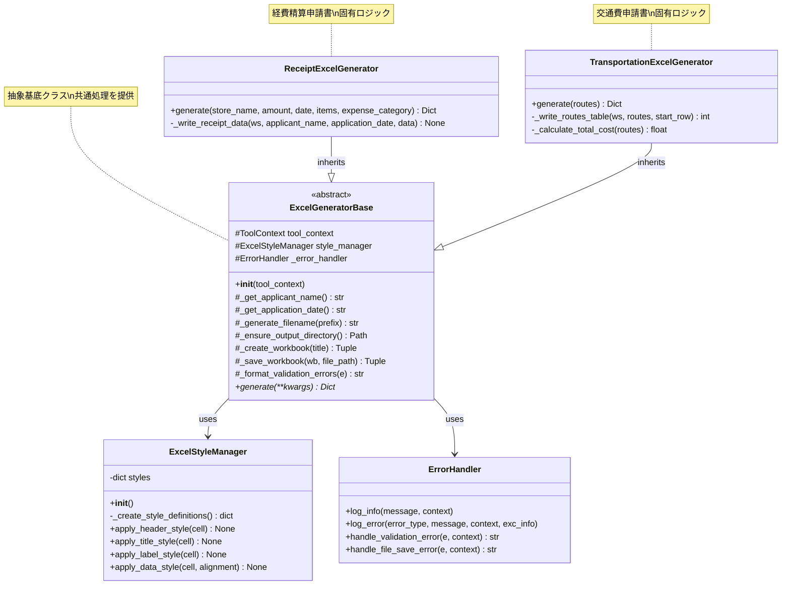
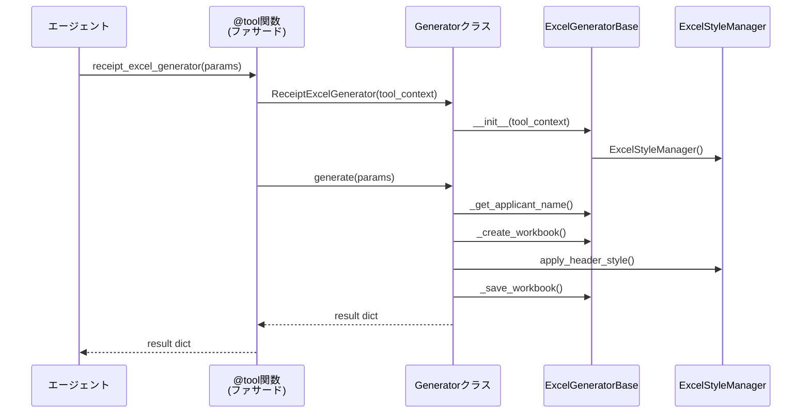

# Design Document: Excel Generator Refactoring

## Overview

このドキュメントは、`tools/excel_generator.py`のリファクタリング設計を定義します。現在のモジュールは約700行のコードで、2つの独立した関数（`receipt_excel_generator`と`transportation_excel_generator`）が存在し、以下の共通機能で大量のコード重複が発生しています：

- 申請者名・申請日の取得（invocation_stateから）
- タイムスタンプ付きファイル名の生成
- 出力ディレクトリの作成と管理
- Excelワークブックの作成と基本設定
- スタイル定義（フォント、色、配置）
- ファイル保存処理
- エラーハンドリングと戻り値の構造

### 現状の課題

1. **コード重複**: receipt_excel_generatorとtransportation_excel_generatorで多くの共通処理が重複
2. **スタイル定義の散在**: スタイル定義が各関数内に散在し、一貫性の維持が困難
3. **責任の混在**: データ処理とExcel書き込みロジックが混在し、テストが困難

### 新しいリファクタリングアプローチ

このリファクタリングでは、**クラスベースの設計**を採用し、以下の構造を実現します：

1. **ExcelGeneratorBase基底クラス**: 共通処理を集約
2. **ReceiptExcelGenerator継承クラス**: 経費精算申請書の固有ロジック
3. **TransportationExcelGenerator継承クラス**: 交通費申請書の固有ロジック
4. **ExcelStyleManager独立クラス**: スタイル管理を分離

既存のヘルパー関数（`_get_applicant_name()`, `_get_application_date()`, `_generate_filename()`, `_ensure_output_directory()`, `_create_workbook()`, `_create_style_definitions()`, `_apply_header_style()`, `_apply_title_style()`, `_save_workbook()`）は、クラスメソッドとして再配置されます。

### 設計原則

1. **後方互換性**: 既存のツールインターフェース（パラメータ、戻り値）を変更しない
2. **単一責任の原則**: 各クラスとメソッドは1つの明確な責任を持つ
3. **DRY原則**: 重複コードを排除し、共通ロジックを基底クラスに集約
4. **オープン・クローズドの原則**: 拡張に対して開いており、修正に対して閉じている
5. **テスト互換性**: 既存のテストコードが引き続き動作する
6. **ファサードパターン**: 既存の@tool関数はファサードとして残し、内部でクラスを使用

## Architecture

### 現在のアーキテクチャ

```
receipt_excel_generator()
├── 申請者名・申請日取得
├── データバリデーション
├── ファイル名生成
├── ディレクトリ作成
├── Excelワークブック作成
├── スタイル定義
├── データ入力（領収書用）
└── ファイル保存

transportation_excel_generator()
├── 申請者名・申請日取得
├── データバリデーション
├── ファイル名生成
├── ディレクトリ作成
├── Excelワークブック作成
├── スタイル定義
├── データ入力（交通費用）
└── ファイル保存
```

### リファクタリング後のクラスベースアーキテクチャ

```
┌─────────────────────────────────────────────────────────────┐
│                  ExcelStyleManager                          │
│  - スタイル定義の作成と管理                                    │
│  - スタイル適用メソッド                                        │
└─────────────────────────────────────────────────────────────┘
                              ▲
                              │ 使用
                              │
┌─────────────────────────────────────────────────────────────┐
│              ExcelGeneratorBase (抽象基底クラス)              │
│  - 共通処理の実装                                             │
│  - 申請者名・申請日取得                                        │
│  - ファイル名生成                                             │
│  - ディレクトリ管理                                           │
│  - ワークブック作成・保存                                      │
│  - generate() 抽象メソッド                                    │
└─────────────────────────────────────────────────────────────┘
                              ▲
                              │ 継承
                ┌─────────────┴─────────────┐
                │                           │
┌───────────────────────────┐  ┌───────────────────────────────┐
│  ReceiptExcelGenerator    │  │ TransportationExcelGenerator  │
│  - 経費精算申請書の生成    │  │ - 交通費申請書の生成           │
│  - 領収書データの入力      │  │ - 経路データの入力             │
│  - generate()の実装        │  │ - 合計計算                     │
└───────────────────────────┘  │ - generate()の実装             │
                               └───────────────────────────────┘
                ▲                           ▲
                │ 使用                       │ 使用
                │                           │
┌───────────────────────────┐  ┌───────────────────────────────┐
│ @tool                     │  │ @tool                         │
│ receipt_excel_generator() │  │ transportation_excel_generator()│
│ (ファサード関数)           │  │ (ファサード関数)               │
└───────────────────────────┘  └───────────────────────────────┘
```

### クラス責務の詳細

#### ExcelStyleManager
- **責務**: Excelスタイルの定義と適用を一元管理
- **メソッド**:
  - `create_style_definitions()`: スタイル辞書を作成
  - `apply_header_style(cell)`: ヘッダースタイルを適用
  - `apply_title_style(cell)`: タイトルスタイルを適用
  - `apply_label_style(cell)`: ラベルスタイルを適用
  - `apply_data_style(cell, alignment)`: データスタイルを適用

#### ExcelGeneratorBase
- **責務**: 全てのExcel生成クラスの共通処理を提供
- **メソッド**:
  - `__init__(tool_context)`: コンテキストとスタイルマネージャーを初期化
  - `_get_applicant_name()`: 申請者名を取得
  - `_get_application_date()`: 申請日を取得
  - `_generate_filename(prefix)`: ファイル名を生成
  - `_ensure_output_directory()`: 出力ディレクトリを確保
  - `_create_workbook(title)`: ワークブックを作成
  - `_save_workbook(wb, file_path)`: ワークブックを保存
  - `generate(**kwargs)`: 抽象メソッド（サブクラスで実装）

#### ReceiptExcelGenerator
- **責務**: 経費精算申請書の生成ロジック
- **メソッド**:
  - `generate(store_name, amount, date, items, expense_category)`: 領収書データからExcelを生成
  - `_write_receipt_data(ws, data)`: 領収書データをワークシートに書き込み

#### TransportationExcelGenerator
- **責務**: 交通費申請書の生成ロジック
- **メソッド**:
  - `generate(routes)`: 経路データからExcelを生成
  - `_write_routes_table(ws, routes)`: 経路テーブルをワークシートに書き込み
  - `_calculate_total_cost(routes)`: 合計交通費を計算

### データフロー

```
1. エージェント → @tool関数（ファサード）
   ↓
2. @tool関数 → 適切なGeneratorクラスをインスタンス化
   ↓
3. Generatorクラス → generate()メソッドを呼び出し
   ↓
4. generate() → 基底クラスの共通メソッドを使用
   ↓
5. generate() → ExcelStyleManagerでスタイルを適用
   ↓
6. generate() → サブクラス固有のデータ入力ロジック
   ↓
7. Generatorクラス → ファイルを保存
   ↓
8. @tool関数 → 結果辞書をエージェントに返す
```

### 設計の利点

1. **保守性の向上**: 共通ロジックが基底クラスに集約され、変更が1箇所で済む
2. **テスト容易性**: 各クラスとメソッドを個別にテスト可能
3. **拡張性**: 新しい申請書タイプを追加する際は、基底クラスを継承するだけ
4. **可読性**: クラスの責任が明確で、コードの意図が理解しやすい
5. **スタイル管理の一元化**: ExcelStyleManagerにより、スタイル変更が容易
6. **後方互換性**: ファサード関数により、既存のエージェントは変更不要

## Components and Interfaces

### 1. ExcelStyleManagerクラス

#### 概要
Excelスタイルの定義と適用を一元管理するクラス。全てのスタイル関連の処理をカプセル化します。

#### クラス定義

```python
class ExcelStyleManager:
    """
    Excelスタイルの定義と適用を管理するクラス。
    
    このクラスは、フォント、背景色、配置などのスタイル定義を作成し、
    セルに適用するメソッドを提供します。
    """
    
    def __init__(self):
        """スタイル定義を初期化する。"""
        self.styles = self._create_style_definitions()
    
    def _create_style_definitions(self) -> dict:
        """
        Excel用の共通スタイル定義を作成する。
        
        Returns:
            dict: スタイルオブジェクトの辞書
        """
    
    def apply_header_style(self, cell) -> None:
        """セルにヘッダースタイルを適用する。"""
    
    def apply_title_style(self, cell) -> None:
        """セルにタイトルスタイルを適用する。"""
    
    def apply_label_style(self, cell) -> None:
        """セルにラベルスタイルを適用する。"""
    
    def apply_data_style(self, cell, alignment: str = "center") -> None:
        """
        セルにデータスタイルを適用する。
        
        Args:
            cell: openpyxlのセルオブジェクト
            alignment: 配置（"center", "right", "left"）
        """
```

#### スタイル定義の詳細

```python
{
    "header_font": Font(bold=True, size=12),
    "header_fill": PatternFill(start_color="CCE5FF", end_color="CCE5FF", fill_type="solid"),
    "header_alignment": Alignment(horizontal="center", vertical="center"),
    "title_font": Font(bold=True, size=14),
    "title_alignment": Alignment(horizontal="center", vertical="center"),
    "label_font": Font(bold=True, size=12),
    "label_fill": PatternFill(start_color="CCE5FF", end_color="CCE5FF", fill_type="solid"),
    "data_alignment_center": Alignment(horizontal="center", vertical="center"),
    "data_alignment_right": Alignment(horizontal="right", vertical="center"),
    "total_font": Font(bold=True, size=12),
    "total_alignment": Alignment(horizontal="right", vertical="center"),
}
```

### 2. ExcelGeneratorBase基底クラス

#### 概要
全てのExcel生成クラスの共通処理を提供する抽象基底クラス。

#### クラス定義

```python
from abc import ABC, abstractmethod
from typing import Tuple, Dict
from pathlib import Path
from openpyxl import Workbook
from openpyxl.worksheet.worksheet import Worksheet
from strands import ToolContext

class ExcelGeneratorBase(ABC):
    """
    Excel申請書生成の基底クラス。
    
    このクラスは、全てのExcel生成クラスに共通する処理を提供します。
    サブクラスは、generate()メソッドを実装する必要があります。
    """
    
    def __init__(self, tool_context: ToolContext):
        """
        基底クラスを初期化する。
        
        Args:
            tool_context: AWS Strandsのツールコンテキスト
        """
        self.tool_context = tool_context
        self.style_manager = ExcelStyleManager()
        self._error_handler = ErrorHandler()
    
    def _get_applicant_name(self) -> str:
        """
        invocation_stateから申請者名を取得する。
        
        Returns:
            str: 申請者名（取得できない場合は"未設定"）
        """
    
    def _get_application_date(self) -> str:
        """
        invocation_stateから申請日を取得する。
        
        Returns:
            str: 申請日（YYYY-MM-DD形式、取得できない場合は現在日付）
        """
    
    def _generate_filename(self, prefix: str) -> str:
        """
        タイムスタンプ付きのファイル名を生成する。
        
        Args:
            prefix: ファイル名のプレフィックス
            
        Returns:
            str: タイムスタンプ付きファイル名
        """
    
    def _ensure_output_directory(self) -> Path:
        """
        出力ディレクトリを作成し、そのパスを返す。
        
        Returns:
            Path: 出力ディレクトリのパス
        """
    
    def _create_workbook(self, title: str) -> Tuple[Workbook, Worksheet]:
        """
        新しいExcelワークブックとワークシートを作成する。
        
        Args:
            title: ワークシートのタイトル
            
        Returns:
            Tuple[Workbook, Worksheet]: ワークブックとワークシートのタプル
        """
    
    def _save_workbook(self, wb: Workbook, file_path: Path) -> Tuple[bool, str]:
        """
        ワークブックをファイルに保存する。
        
        Args:
            wb: 保存するワークブック
            file_path: 保存先のファイルパス
            
        Returns:
            Tuple[bool, str]: (成功フラグ, メッセージ)
        """
    
    @abstractmethod
    def generate(self, **kwargs) -> Dict:
        """
        Excel申請書を生成する抽象メソッド。
        
        サブクラスで実装する必要があります。
        
        Returns:
            Dict: 生成結果の辞書
        """
        pass
```

### 3. ReceiptExcelGeneratorクラス

#### 概要
経費精算申請書（領収書ベース）を生成するクラス。

#### クラス定義

```python
class ReceiptExcelGenerator(ExcelGeneratorBase):
    """
    経費精算申請書を生成するクラス。
    
    領収書データからExcel形式の申請書を作成します。
    """
    
    def generate(
        self,
        store_name: str,
        amount: float,
        date: str,
        items: List[str],
        expense_category: str
    ) -> Dict:
        """
        経費精算申請書を生成する。
        
        Args:
            store_name: 店舗名
            amount: 金額（円）
            date: 日付（YYYY-MM-DD形式）
            items: 品目のリスト
            expense_category: 経費区分
            
        Returns:
            Dict: {
                "success": bool,
                "file_path": str,
                "message": str
            }
        """
    
    def _write_receipt_data(
        self,
        ws: Worksheet,
        applicant_name: str,
        application_date: str,
        data: ReceiptExpenseInput
    ) -> None:
        """
        領収書データをワークシートに書き込む。
        
        Args:
            ws: ワークシート
            applicant_name: 申請者名
            application_date: 申請日
            data: バリデーション済みの領収書データ
        """
```

#### 処理フロー

1. データバリデーション（ReceiptExpenseInputモデル使用）
2. 申請者名・申請日の取得（基底クラスメソッド）
3. ファイル名とパスの生成（基底クラスメソッド）
4. ワークブックの作成（基底クラスメソッド）
5. タイトル行の作成（スタイルマネージャー使用）
6. 申請情報の書き込み
7. 領収書データの書き込み（`_write_receipt_data()`）
8. 列幅の調整
9. ファイル保存（基底クラスメソッド）
10. 結果辞書を返す

### 4. TransportationExcelGeneratorクラス

#### 概要
交通費申請書を生成するクラス。

#### クラス定義

```python
class TransportationExcelGenerator(ExcelGeneratorBase):
    """
    交通費申請書を生成するクラス。
    
    経路データからExcel形式の申請書を作成します。
    """
    
    def generate(self, routes: List[dict]) -> Dict:
        """
        交通費申請書を生成する。
        
        Args:
            routes: 経路データのリスト
            
        Returns:
            Dict: {
                "success": bool,
                "file_path": str,
                "total_cost": float,
                "message": str
            }
        """
    
    def _write_routes_table(
        self,
        ws: Worksheet,
        routes: List[RouteInput],
        start_row: int
    ) -> int:
        """
        経路テーブルをワークシートに書き込む。
        
        Args:
            ws: ワークシート
            routes: バリデーション済みの経路データリスト
            start_row: 開始行番号
            
        Returns:
            int: 次の行番号
        """
    
    def _calculate_total_cost(self, routes: List[RouteInput]) -> float:
        """
        合計交通費を計算する。
        
        Args:
            routes: 経路データリスト
            
        Returns:
            float: 合計交通費
        """
```

#### 処理フロー

1. データバリデーション（RouteInputモデル使用）
2. 合計交通費の計算（`_calculate_total_cost()`）
3. 申請者名・申請日の取得（基底クラスメソッド）
4. ファイル名とパスの生成（基底クラスメソッド）
5. ワークブックの作成（基底クラスメソッド）
6. タイトル行の作成（スタイルマネージャー使用）
7. 申請情報の書き込み
8. 経路テーブルの書き込み（`_write_routes_table()`）
9. 合計行の作成
10. 列幅の調整
11. ファイル保存（基底クラスメソッド）
12. 結果辞書を返す

### 5. ファサード関数（後方互換性のため）

#### receipt_excel_generator

```python
@tool(context=True)
def receipt_excel_generator(
    store_name: str,
    amount: float,
    date: str,
    items: List[str],
    expense_category: str,
    tool_context: ToolContext
) -> dict:
    """
    経費精算申請書を生成する（ファサード関数）。
    
    既存のエージェントとの互換性を維持するため、
    内部でReceiptExcelGeneratorクラスを使用します。
    """
    generator = ReceiptExcelGenerator(tool_context)
    return generator.generate(
        store_name=store_name,
        amount=amount,
        date=date,
        items=items,
        expense_category=expense_category
    )
```

#### transportation_excel_generator

```python
@tool(context=True)
def transportation_excel_generator(
    routes: List[dict],
    tool_context: ToolContext
) -> dict:
    """
    交通費申請書を生成する（ファサード関数）。
    
    既存のエージェントとの互換性を維持するため、
    内部でTransportationExcelGeneratorクラスを使用します。
    """
    generator = TransportationExcelGenerator(tool_context)
    return generator.generate(routes=routes)
```

### クラス間の相互作用

```
receipt_excel_generator() [ファサード]
    ↓
ReceiptExcelGenerator.generate()
    ↓ 使用
ExcelGeneratorBase (共通メソッド)
    ↓ 使用
ExcelStyleManager (スタイル適用)
```

この設計により、以下が実現されます：

1. **既存コードとの互換性**: ファサード関数により、エージェントは変更不要
2. **コードの再利用**: 基底クラスで共通処理を一元管理
3. **拡張性**: 新しい申請書タイプは基底クラスを継承するだけ
4. **テスト容易性**: 各クラスを独立してテスト可能
5. **保守性**: スタイル変更はExcelStyleManagerのみで対応

## Data Models

### 入力データモデル

#### Receipt Excel Generator Input

```python
{
    "store_name": str,           # 店舗名
    "amount": float,             # 金額（円）
    "date": str,                 # 日付（YYYY-MM-DD形式）
    "items": List[str],          # 品目リスト
    "expense_category": str,     # 経費区分
    "tool_context": ToolContext  # AWS Strandsコンテキスト
}
```

**Pydanticモデル**: `ReceiptExpenseInput`（既存）

#### Transportation Excel Generator Input

```python
{
    "routes": List[dict],        # 経路データリスト
    "tool_context": ToolContext  # AWS Strandsコンテキスト
}

# 各経路データの構造（RouteInputモデル）
{
    "departure": str,            # 出発地
    "destination": str,          # 目的地
    "date": str,                 # 日付（YYYY-MM-DD形式）
    "transport_type": str,       # 交通手段（train/bus/taxi/airplane）
    "cost": float,               # 費用
    "notes": str (optional)      # 備考
}
```

**Pydanticモデル**: `RouteInput`（既存）

### 出力データモデル

#### Receipt Excel Generator Output

```python
{
    "success": bool,             # 成功フラグ
    "file_path": str,            # 保存されたファイルのパス
    "message": str               # 結果メッセージ
}
```

#### Transportation Excel Generator Output

```python
{
    "success": bool,             # 成功フラグ
    "file_path": str,            # 保存されたファイルのパス
    "total_cost": float,         # 合計交通費
    "message": str               # 結果メッセージ
}
```

### 内部データモデル

#### ExcelStyleManager.styles

```python
{
    "header_font": Font,         # 太字、12pt
    "header_fill": PatternFill,  # #CCE5FF
    "header_alignment": Alignment, # 中央揃え
    "title_font": Font,          # 太字、14pt
    "title_alignment": Alignment, # 中央揃え
    "label_font": Font,          # 太字、12pt
    "label_fill": PatternFill,   # #CCE5FF
    "data_alignment_center": Alignment, # 中央揃え
    "data_alignment_right": Alignment,  # 右揃え
    "total_font": Font,          # 太字、12pt
    "total_alignment": Alignment # 右揃え
}
```

#### InvocationState（ToolContextから取得）

```python
{
    "applicant_name": str,       # 申請者名
    "application_date": str      # 申請日（YYYY-MM-DD形式）
}
```

**Pydanticモデル**: `InvocationState`（既存）

### クラスベース設計におけるデータフロー

```
1. エージェント → @tool関数（ファサード）
   - パラメータとToolContextを渡す

2. @tool関数 → Generatorクラスのインスタンス化
   - ToolContextを渡してインスタンス作成
   - ExcelStyleManagerも自動的に初期化

3. Generatorクラス → generate()メソッド呼び出し
   - 入力データをPydanticモデルでバリデーション

4. generate() → 基底クラスの共通メソッド
   - _get_applicant_name()
   - _get_application_date()
   - _generate_filename()
   - _ensure_output_directory()
   - _create_workbook()

5. generate() → ExcelStyleManagerでスタイル適用
   - apply_header_style()
   - apply_title_style()
   - apply_label_style()
   - apply_data_style()

6. generate() → サブクラス固有のデータ書き込み
   - ReceiptExcelGenerator: _write_receipt_data()
   - TransportationExcelGenerator: _write_routes_table()

7. generate() → 基底クラスの保存メソッド
   - _save_workbook()

8. @tool関数 → エージェントに結果辞書を返す
```

### クラス設計における状態管理

#### ExcelGeneratorBaseの状態

```python
class ExcelGeneratorBase:
    def __init__(self, tool_context: ToolContext):
        self.tool_context = tool_context          # ToolContext
        self.style_manager = ExcelStyleManager()  # スタイルマネージャー
        self._error_handler = ErrorHandler()      # エラーハンドラー
```

#### ExcelStyleManagerの状態

```python
class ExcelStyleManager:
    def __init__(self):
        self.styles = self._create_style_definitions()  # スタイル辞書
```

この設計により、以下が実現されます：

1. **状態のカプセル化**: 各クラスが自身の状態を管理
2. **依存性の明確化**: コンストラクタで依存関係が明示
3. **テスト容易性**: モックオブジェクトを注入しやすい
4. **スレッドセーフ**: 各リクエストで新しいインスタンスを作成


## Correctness Properties

プロパティとは、システムの全ての有効な実行において真であるべき特性や動作のことです。プロパティは、人間が読める仕様と機械が検証可能な正確性保証の橋渡しとなります。

以下のプロパティは、リファクタリング後のExcel Generatorが満たすべき普遍的な特性を定義します。各プロパティは、プロパティベーステストとして実装され、多数の生成された入力に対して検証されます。

### Property 1: 申請者名の正確な取得

*For any* ToolContextオブジェクトで、invocation_stateに申請者名が設定されている場合、`_get_applicant_name()`は設定された申請者名を正確に返すべきである。invocation_stateが存在しないか申請者名が設定されていない場合は、"未設定"を返すべきである。

**Validates: Requirements 1.1**

### Property 2: ファイル名フォーマットの一貫性

*For any* プレフィックス文字列に対して、`_generate_filename(prefix)`は以下の条件を満たすファイル名を返すべきである：
- プレフィックスで始まる
- アンダースコアで区切られたタイムスタンプ（YYYYMMDD_HHMMSS形式）を含む
- .xlsx拡張子で終わる
- フォーマット: `{prefix}_YYYYMMDD_HHMMSS.xlsx`

**Validates: Requirements 1.2**

### Property 3: 出力ディレクトリへの保存

*For any* 有効な入力データに対して、`receipt_excel_generator()`または`travel_excel_generator()`を実行した場合、成功時に返される`file_path`は`output/`ディレクトリ内のパスであるべきである。

**Validates: Requirements 1.3**

### Property 4: 戻り値構造の完全性

*For any* 入力データ（有効または無効）に対して、`receipt_excel_generator()`または`travel_excel_generator()`の戻り値は以下のキーを含む辞書であるべきである：
- `success` (bool): 処理の成功/失敗を示す
- `file_path` (str): 生成されたファイルのパス（失敗時は空文字列）
- `message` (str): 結果メッセージ

さらに、`travel_excel_generator()`の場合は`total_cost` (float)も含むべきである。

**Validates: Requirements 1.4**

### Property 5: スタイル定義の完全性

*For any* 実行において、`_create_style_definitions()`が返す辞書は以下の全てのキーを含むべきである：
- `header_font`
- `header_fill`
- `header_alignment`
- `title_font`
- `title_alignment`
- `label_font`
- `label_fill`
- `data_alignment_center`
- `data_alignment_right`
- `total_font`
- `total_alignment`

各値は対応するopenpyxlスタイルオブジェクト（Font、PatternFill、Alignment）であるべきである。

**Validates: Requirements 1.5**

### Property 6: エラー時の戻り値構造

*For any* 不正な入力データ（空の経路リスト、不正な日付フォーマット、バリデーションエラーなど）に対して、`receipt_excel_generator()`または`travel_excel_generator()`は以下の条件を満たす辞書を返すべきである：
- `success`が`False`である
- `message`にエラー説明が含まれる（空でない文字列）
- `file_path`が空文字列である

**Validates: Requirements 3.1**

### Property 7: 日本語エラーメッセージ

*For any* エラーケース（バリデーションエラー、ファイル保存エラーなど）において、`receipt_excel_generator()`または`travel_excel_generator()`が返す`message`は日本語文字（ひらがな、カタカナ、または漢字）を含むべきである。

**Validates: Requirements 3.3**

## Error Handling

### エラーハンドリング戦略

クラスベース設計では、エラーハンドリングを以下のレイヤーで実装します：

1. **基底クラス（ExcelGeneratorBase）**: 共通エラー処理
2. **サブクラス（ReceiptExcelGenerator, TransportationExcelGenerator）**: 固有エラー処理
3. **ErrorHandler**: 統一されたエラーログとメッセージ生成

### エラーカテゴリと処理戦略

#### 1. バリデーションエラー

**発生条件**:
- 空の経路リスト
- 不正な日付フォーマット
- 必須フィールドの欠落
- 金額が上限を超える（receipt_excel_generatorの場合）

**処理方法（クラスベース）**:
```python
class ReceiptExcelGenerator(ExcelGeneratorBase):
    def generate(self, store_name, amount, date, items, expense_category):
        try:
            # Pydanticモデルでバリデーション
            input_data = ReceiptExpenseInput(
                store_name=store_name,
                amount=amount,
                date=date,
                items=items,
                expense_category=expense_category
            )
        except ValidationError as e:
            # エラーメッセージを整形
            error_messages = self._format_validation_errors(e)
            
            # ErrorHandlerでログ記録
            self._error_handler.handle_validation_error(e, context={...})
            
            # 失敗レスポンスを返す
            return {
                "success": False,
                "file_path": "",
                "message": f"エラー: 入力データが不正です - {error_messages}"
            }
```

**基底クラスの共通メソッド**:
```python
class ExcelGeneratorBase:
    def _format_validation_errors(self, e: ValidationError) -> str:
        """
        ValidationErrorを日本語のエラーメッセージに整形する。
        
        Args:
            e: Pydanticのバリデーションエラー
            
        Returns:
            str: 整形されたエラーメッセージ
        """
        error_messages = []
        for error in e.errors():
            field = ".".join(str(loc) for loc in error["loc"])
            error_messages.append(f"{field}: {error['msg']}")
        return ", ".join(error_messages)
```

#### 2. ファイルシステムエラー

**発生条件**:
- ディレクトリ作成の失敗
- ファイル保存の失敗（権限エラー、ディスク容量不足など）

**処理方法（基底クラスで実装）**:
```python
class ExcelGeneratorBase:
    def _save_workbook(self, wb: Workbook, file_path: Path) -> Tuple[bool, str]:
        """
        ワークブックをファイルに保存する。
        
        エラーハンドリングを含む共通保存処理。
        """
        try:
            wb.save(file_path)
            
            # 成功ログ
            self._error_handler.log_info(
                f"ファイルを正常に保存しました: {file_path}",
                context={"file_path": str(file_path)}
            )
            
            return True, f"申請書を正常に作成しました: {file_path}"
        
        except (IOError, PermissionError) as e:
            # ErrorHandlerで統一処理
            user_message = self._error_handler.handle_file_save_error(
                e,
                context={"file_path": str(file_path)}
            )
            return False, user_message
        
        except Exception as e:
            # 予期しないエラー
            user_message = self._error_handler.handle_file_save_error(
                e,
                context={"file_path": str(file_path), "error_type": "unexpected"}
            )
            return False, user_message
```

#### 3. ToolContextエラー

**発生条件**:
- tool_contextがNone
- invocation_stateが存在しない

**処理方法（基底クラスで実装）**:
```python
class ExcelGeneratorBase:
    def _get_applicant_name(self) -> str:
        """
        invocation_stateから申請者名を取得する。
        
        エラー時はデフォルト値を返し、処理を継続する。
        """
        if not self.tool_context or not self.tool_context.invocation_state:
            self._error_handler.log_info(
                "tool_contextまたはinvocation_stateが存在しません。デフォルト値を使用します。",
                context={"default_value": "未設定"}
            )
            return "未設定"
        
        try:
            state = InvocationState(**self.tool_context.invocation_state)
            self._error_handler.log_info(
                f"申請者名を取得しました: {state.applicant_name}"
            )
            return state.applicant_name
        
        except ValidationError as e:
            self._error_handler.log_error(
                "ValidationError",
                f"申請者名の取得に失敗しました: {str(e)}",
                context={"invocation_state": self.tool_context.invocation_state}
            )
            return "未設定"
    
    def _get_application_date(self) -> str:
        """
        invocation_stateから申請日を取得する。
        
        エラー時は現在日付を返し、処理を継続する。
        """
        default_date = datetime.now().strftime("%Y-%m-%d")
        
        if not self.tool_context or not self.tool_context.invocation_state:
            self._error_handler.log_info(
                "tool_contextまたはinvocation_stateが存在しません。現在日付を使用します。",
                context={"default_date": default_date}
            )
            return default_date
        
        try:
            state = InvocationState(**self.tool_context.invocation_state)
            self._error_handler.log_info(
                f"申請日を取得しました: {state.application_date}"
            )
            return state.application_date
        
        except ValidationError as e:
            self._error_handler.log_error(
                "ValidationError",
                f"申請日の取得に失敗しました: {str(e)}",
                context={"invocation_state": self.tool_context.invocation_state}
            )
            return default_date
```

#### 4. 予期しないエラー

**発生条件**:
- generate()メソッド内での予期しない例外

**処理方法（サブクラスで実装）**:
```python
class ReceiptExcelGenerator(ExcelGeneratorBase):
    def generate(self, store_name, amount, date, items, expense_category):
        # ツール呼び出しログ
        self._error_handler.log_info(
            "ReceiptExcelGeneratorが呼び出されました",
            context={
                "store_name": store_name,
                "amount": amount,
                "date": date,
                "expense_category": expense_category
            }
        )
        
        try:
            # 申請書生成処理
            # ...
            
        except Exception as e:
            # 予期しないエラーをキャッチ
            self._error_handler.log_error(
                "UnexpectedError",
                f"経費精算申請書の生成中に予期しないエラーが発生しました: {str(e)}",
                context={
                    "store_name": store_name,
                    "amount": amount,
                    "date": date
                },
                exc_info=True
            )
            return {
                "success": False,
                "file_path": "",
                "message": f"エラー: 申請書の生成に失敗しました - {str(e)}"
            }
```

### エラーメッセージの一貫性

全てのエラーメッセージは以下の原則に従う：

1. **日本語**: 全てのメッセージは日本語で記述
2. **具体性**: エラーの原因を明確に説明
3. **実行可能性**: 可能な限り、ユーザーが取るべきアクションを示唆
4. **一貫性**: 同じ種類のエラーには同じフォーマットを使用

**エラーメッセージの例**:
- `"エラー: 経路データが空です"`
- `"エラー: 経路1のデータが不正です - date: 日付フォーマットが不正です"`
- `"エラー: 入力データが不正です - amount: 数値である必要があります"`
- `"ファイル保存エラー: [Errno 13] Permission denied"`

### クラスベース設計におけるエラーハンドリングの利点

1. **共通処理の集約**: 基底クラスで共通エラー処理を実装
2. **一貫性**: 全てのサブクラスで同じエラーハンドリングパターン
3. **テスト容易性**: ErrorHandlerをモックして単体テスト可能
4. **保守性**: エラー処理の変更が基底クラスの1箇所で済む
5. **拡張性**: 新しいエラータイプを追加しやすい

## Testing Strategy

### テストアプローチ

このリファクタリングでは、**ユニットテスト**と**プロパティベーステスト**の両方を使用して包括的なテストカバレッジを実現します。クラスベース設計により、各クラスとメソッドを独立してテストできます。

#### ユニットテスト

**目的**: 特定の例、エッジケース、エラー条件を検証

**テスト対象**:

1. **ExcelStyleManagerクラス**
   - スタイル定義の完全性
   - スタイル適用メソッドの動作
   - 各スタイルオブジェクトの正確性

2. **ExcelGeneratorBase基底クラス**
   - `_get_applicant_name()`のデフォルト値処理
   - `_get_application_date()`のデフォルト値処理
   - `_generate_filename()`のフォーマット検証
   - `_ensure_output_directory()`のディレクトリ作成
   - `_create_workbook()`のワークブック初期化
   - `_save_workbook()`の成功・失敗ケース

3. **ReceiptExcelGeneratorクラス**
   - `generate()`メソッドの正常系
   - バリデーションエラーの処理
   - 領収書データの書き込み検証
   - ファイル生成の確認

4. **TransportationExcelGeneratorクラス**
   - `generate()`メソッドの正常系
   - 空の経路リストの処理
   - 合計交通費の計算精度
   - 経路テーブルの書き込み検証

5. **ファサード関数**
   - 既存のテスト（tests/test_tools.py）との互換性
   - エージェントとの統合確認

**テストケース例**:

```python
import pytest
from unittest.mock import Mock, patch
from tools.excel_generator import (
    ExcelStyleManager,
    ExcelGeneratorBase,
    ReceiptExcelGenerator,
    TransportationExcelGenerator
)

class TestExcelStyleManager:
    def test_style_definitions_completeness(self):
        """スタイル定義が全てのキーを含むことを確認"""
        manager = ExcelStyleManager()
        required_keys = [
            "header_font", "header_fill", "header_alignment",
            "title_font", "title_alignment",
            "label_font", "label_fill",
            "data_alignment_center", "data_alignment_right",
            "total_font", "total_alignment"
        ]
        for key in required_keys:
            assert key in manager.styles
    
    def test_apply_header_style(self):
        """ヘッダースタイルが正しく適用されることを確認"""
        manager = ExcelStyleManager()
        cell = Mock()
        manager.apply_header_style(cell)
        assert cell.font == manager.styles["header_font"]
        assert cell.fill == manager.styles["header_fill"]
        assert cell.alignment == manager.styles["header_alignment"]

class TestExcelGeneratorBase:
    def test_get_applicant_name_with_valid_context(self):
        """有効なコンテキストから申請者名を取得"""
        tool_context = Mock()
        tool_context.invocation_state = {"applicant_name": "山田太郎"}
        
        # 具象クラスを作成してテスト
        class TestGenerator(ExcelGeneratorBase):
            def generate(self, **kwargs):
                pass
        
        generator = TestGenerator(tool_context)
        assert generator._get_applicant_name() == "山田太郎"
    
    def test_get_applicant_name_with_none_context(self):
        """Noneコンテキストでデフォルト値を返す"""
        class TestGenerator(ExcelGeneratorBase):
            def generate(self, **kwargs):
                pass
        
        generator = TestGenerator(None)
        assert generator._get_applicant_name() == "未設定"
    
    def test_generate_filename_format(self):
        """ファイル名が正しいフォーマットで生成される"""
        tool_context = Mock()
        
        class TestGenerator(ExcelGeneratorBase):
            def generate(self, **kwargs):
                pass
        
        generator = TestGenerator(tool_context)
        filename = generator._generate_filename("テスト申請書")
        
        assert filename.startswith("テスト申請書_")
        assert filename.endswith(".xlsx")
        assert len(filename) == len("テスト申請書_20240115_143022.xlsx")

class TestReceiptExcelGenerator:
    def test_generate_success(self, tmp_path):
        """正常な領収書データでExcelが生成される"""
        tool_context = Mock()
        tool_context.invocation_state = {
            "applicant_name": "山田太郎",
            "application_date": "2024-01-15"
        }
        
        generator = ReceiptExcelGenerator(tool_context)
        
        with patch('tools.excel_generator.Path') as mock_path:
            mock_path.return_value = tmp_path
            
            result = generator.generate(
                store_name="テスト店舗",
                amount=5000.0,
                date="2024-01-15",
                items=["品目1", "品目2"],
                expense_category="交際費"
            )
        
        assert result["success"] is True
        assert result["file_path"] != ""
        assert "正常に作成" in result["message"]
    
    def test_generate_validation_error(self):
        """不正なデータでバリデーションエラーが返される"""
        tool_context = Mock()
        generator = ReceiptExcelGenerator(tool_context)
        
        result = generator.generate(
            store_name="",  # 空の店舗名
            amount=-1000.0,  # 負の金額
            date="invalid-date",  # 不正な日付
            items=[],
            expense_category=""
        )
        
        assert result["success"] is False
        assert "エラー" in result["message"]

class TestTransportationExcelGenerator:
    def test_generate_success(self, tmp_path):
        """正常な経路データでExcelが生成される"""
        tool_context = Mock()
        tool_context.invocation_state = {
            "applicant_name": "山田太郎",
            "application_date": "2024-01-15"
        }
        
        generator = TransportationExcelGenerator(tool_context)
        
        routes = [
            {
                "departure": "東京",
                "destination": "大阪",
                "date": "2024-01-15",
                "transport_type": "train",
                "cost": 13000.0
            }
        ]
        
        with patch('tools.excel_generator.Path') as mock_path:
            mock_path.return_value = tmp_path
            
            result = generator.generate(routes=routes)
        
        assert result["success"] is True
        assert result["total_cost"] == 13000.0
        assert result["file_path"] != ""
    
    def test_generate_empty_routes(self):
        """空の経路リストでエラーが返される"""
        tool_context = Mock()
        generator = TransportationExcelGenerator(tool_context)
        
        result = generator.generate(routes=[])
        
        assert result["success"] is False
        assert "経路データが空" in result["message"]
    
    def test_calculate_total_cost(self):
        """合計交通費が正しく計算される"""
        tool_context = Mock()
        generator = TransportationExcelGenerator(tool_context)
        
        from models.data_models import RouteInput
        routes = [
            RouteInput(
                departure="東京", destination="大阪",
                date="2024-01-15", transport_type="train", cost=13000.0
            ),
            RouteInput(
                departure="大阪", destination="京都",
                date="2024-01-16", transport_type="train", cost=560.0
            )
        ]
        
        total = generator._calculate_total_cost(routes)
        assert total == 13560.0
```

#### プロパティベーステスト

**目的**: 普遍的なプロパティを多数の生成された入力で検証

**使用ライブラリ**: Hypothesis（Python用プロパティベーステストライブラリ）

**設定**:
- 最小実行回数: 100イテレーション
- 各テストにはデザインドキュメントのプロパティ番号を参照するタグを付ける
- タグフォーマット: `# Feature: excel-generator-refactoring, Property {N}: {property_text}`

**プロパティテスト実装計画**:

```python
from hypothesis import given, strategies as st
from hypothesis.strategies import composite

@composite
def tool_context_strategy(draw):
    """ランダムなToolContextを生成"""
    has_state = draw(st.booleans())
    if has_state:
        return Mock(invocation_state={
            "applicant_name": draw(st.text(min_size=1, max_size=50)),
            "application_date": draw(st.dates().map(lambda d: d.strftime("%Y-%m-%d")))
        })
    else:
        return Mock(invocation_state=None)

# Feature: excel-generator-refactoring, Property 1: 申請者名の正確な取得
@given(tool_context_strategy())
def test_property_applicant_name_retrieval(tool_context):
    """
    For any ToolContextオブジェクトで、invocation_stateに申請者名が設定されている場合、
    _get_applicant_name()は設定された申請者名を正確に返すべきである。
    """
    class TestGenerator(ExcelGeneratorBase):
        def generate(self, **kwargs):
            pass
    
    generator = TestGenerator(tool_context)
    result = generator._get_applicant_name()
    
    if tool_context.invocation_state:
        assert result == tool_context.invocation_state["applicant_name"]
    else:
        assert result == "未設定"

# Feature: excel-generator-refactoring, Property 2: ファイル名フォーマットの一貫性
@given(st.text(min_size=1, max_size=50))
def test_property_filename_format_consistency(prefix):
    """
    For any プレフィックス文字列に対して、_generate_filename(prefix)は
    正しいフォーマットのファイル名を返すべきである。
    """
    tool_context = Mock()
    
    class TestGenerator(ExcelGeneratorBase):
        def generate(self, **kwargs):
            pass
    
    generator = TestGenerator(tool_context)
    filename = generator._generate_filename(prefix)
    
    # フォーマット検証
    assert filename.startswith(prefix + "_")
    assert filename.endswith(".xlsx")
    
    # タイムスタンプ部分の検証
    import re
    pattern = rf"{re.escape(prefix)}_\d{{8}}_\d{{6}}\.xlsx"
    assert re.match(pattern, filename)

# Feature: excel-generator-refactoring, Property 3: 出力ディレクトリへの保存
@given(
    st.text(min_size=1, max_size=20),
    st.floats(min_value=1, max_value=30000),
    st.dates().map(lambda d: d.strftime("%Y-%m-%d")),
    st.lists(st.text(min_size=1, max_size=20), min_size=1, max_size=5),
    st.text(min_size=1, max_size=20)
)
def test_property_output_directory_path(store_name, amount, date, items, expense_category):
    """
    For any 有効な入力データに対して、generate()が成功時に返すfile_pathは
    output/ディレクトリ内のパスであるべきである。
    """
    tool_context = Mock(invocation_state={
        "applicant_name": "テスト",
        "application_date": "2024-01-15"
    })
    
    generator = ReceiptExcelGenerator(tool_context)
    
    with patch('tools.excel_generator.Path'):
        result = generator.generate(
            store_name=store_name,
            amount=amount,
            date=date,
            items=items,
            expense_category=expense_category
        )
    
    if result["success"]:
        assert "output" in result["file_path"]

# Feature: excel-generator-refactoring, Property 4: 戻り値構造の完全性
@given(
    st.text(min_size=0, max_size=20),
    st.floats(allow_nan=False, allow_infinity=False),
    st.text(min_size=0, max_size=20),
    st.lists(st.text(), min_size=0, max_size=5),
    st.text(min_size=0, max_size=20)
)
def test_property_return_value_structure(store_name, amount, date, items, expense_category):
    """
    For any 入力データ（有効または無効）に対して、generate()の戻り値は
    必須キーを全て含む辞書であるべきである。
    """
    tool_context = Mock()
    generator = ReceiptExcelGenerator(tool_context)
    
    result = generator.generate(
        store_name=store_name,
        amount=amount,
        date=date,
        items=items,
        expense_category=expense_category
    )
    
    # 必須キーの検証
    assert "success" in result
    assert "file_path" in result
    assert "message" in result
    assert isinstance(result["success"], bool)
    assert isinstance(result["file_path"], str)
    assert isinstance(result["message"], str)

# Feature: excel-generator-refactoring, Property 5: スタイル定義の完全性
def test_property_style_definitions_completeness():
    """
    For any 実行において、ExcelStyleManagerのstylesは
    全ての必須キーを含むべきである。
    """
    manager = ExcelStyleManager()
    
    required_keys = [
        "header_font", "header_fill", "header_alignment",
        "title_font", "title_alignment",
        "label_font", "label_fill",
        "data_alignment_center", "data_alignment_right",
        "total_font", "total_alignment"
    ]
    
    for key in required_keys:
        assert key in manager.styles
        assert manager.styles[key] is not None
```

### テスト実行戦略

#### 開発フェーズ

1. **ExcelStyleManagerの実装とテスト**
   - クラスを実装
   - ユニットテストを作成して実行
   - プロパティテスト（Property 5）を実行

2. **ExcelGeneratorBaseの実装とテスト**
   - 基底クラスを実装
   - 各メソッドのユニットテストを作成
   - プロパティテスト（Property 1, 2）を実行

3. **サブクラスの実装とテスト**
   - ReceiptExcelGeneratorを実装
   - TransportationExcelGeneratorを実装
   - 各クラスのユニットテストを実行
   - プロパティテスト（Property 3, 4）を実行

4. **ファサード関数の実装とテスト**
   - 既存の@tool関数をファサードとして実装
   - 既存のテスト（tests/test_tools.py）が合格することを確認

5. **統合テスト**
   - 全てのテストを実行
   - エージェントとの統合を手動でテスト

#### 継続的テスト

```bash
# 全てのテストを実行
python -m pytest tests/ -v

# プロパティテストのみ実行
python -m pytest tests/ -v -k "property"

# カバレッジレポート生成
python -m pytest tests/ --cov=tools.excel_generator --cov-report=html
```

### テストカバレッジ目標

- **行カバレッジ**: 90%以上
- **分岐カバレッジ**: 85%以上
- **クラスカバレッジ**: 100%（全てのクラス）
- **メソッドカバレッジ**: 100%（全てのpublicメソッド）

### 既存テストとの互換性

リファクタリング後も、`tests/test_tools.py`の`TestExcelGeneratorTools`クラスの全てのテストが合格する必要があります。これにより、以下が保証されます：

1. 既存のエージェントが引き続き動作する
2. ツールのインターフェースが変更されていない
3. 戻り値の構造が維持されている
4. エラーハンドリングが一貫している

**検証方法**:
```bash
python -m pytest tests/test_tools.py::TestExcelGeneratorTools -v
```

全てのテストが合格することを確認してから、リファクタリングを完了とします。

### クラスベース設計におけるテストの利点

1. **独立性**: 各クラスを独立してテスト可能
2. **モック容易性**: 依存関係をコンストラクタで注入できるため、モックが容易
3. **再利用性**: 基底クラスのテストをサブクラスで再利用可能
4. **保守性**: クラス単位でテストを整理できる
5. **拡張性**: 新しいクラスを追加する際のテストパターンが明確


## Implementation Plan

### リファクタリングの段階的実施

クラスベース設計への移行は、以下の段階で実施します。各段階で既存のテストが合格することを確認します。

#### Phase 1: ExcelStyleManagerクラスの実装

**目的**: スタイル管理を独立したクラスに分離

**作業内容**:
1. `ExcelStyleManager`クラスを作成
2. 既存の`_create_style_definitions()`をクラスメソッドに移行
3. `apply_header_style()`, `apply_title_style()`, `apply_label_style()`, `apply_data_style()`メソッドを実装
4. ユニットテストを作成して実行

**成功基準**:
- ExcelStyleManagerの全メソッドが正しく動作する
- スタイル定義が完全である（Property 5が合格）

#### Phase 2: ExcelGeneratorBase基底クラスの実装

**目的**: 共通処理を基底クラスに集約

**作業内容**:
1. `ExcelGeneratorBase`抽象基底クラスを作成
2. 既存のヘルパー関数をクラスメソッドに移行:
   - `_get_applicant_name()`
   - `_get_application_date()`
   - `_generate_filename()`
   - `_ensure_output_directory()`
   - `_create_workbook()`
   - `_save_workbook()`
   - `_format_validation_errors()`（新規）
3. コンストラクタで`tool_context`、`style_manager`、`error_handler`を初期化
4. `generate()`抽象メソッドを定義
5. ユニットテストを作成して実行

**成功基準**:
- 基底クラスの全メソッドが正しく動作する
- Property 1, 2が合格する

#### Phase 3: ReceiptExcelGeneratorクラスの実装

**目的**: 経費精算申請書生成を独立したクラスに

**作業内容**:
1. `ReceiptExcelGenerator`クラスを作成（ExcelGeneratorBaseを継承）
2. `generate()`メソッドを実装
3. `_write_receipt_data()`メソッドを実装
4. 既存の`receipt_excel_generator()`関数の処理ロジックを移行
5. ユニットテストを作成して実行

**成功基準**:
- ReceiptExcelGeneratorが正しくExcelを生成する
- バリデーションエラーが適切に処理される
- Property 3, 4が合格する

#### Phase 4: TransportationExcelGeneratorクラスの実装

**目的**: 交通費申請書生成を独立したクラスに

**作業内容**:
1. `TransportationExcelGenerator`クラスを作成（ExcelGeneratorBaseを継承）
2. `generate()`メソッドを実装
3. `_write_routes_table()`メソッドを実装
4. `_calculate_total_cost()`メソッドを実装
5. 既存の`transportation_excel_generator()`関数の処理ロジックを移行
6. ユニットテストを作成して実行

**成功基準**:
- TransportationExcelGeneratorが正しくExcelを生成する
- 合計交通費が正確に計算される
- Property 3, 4が合格する

#### Phase 5: ファサード関数の実装

**目的**: 既存のエージェントとの互換性を維持

**作業内容**:
1. 既存の`receipt_excel_generator()`関数をファサードとして書き換え
2. 既存の`transportation_excel_generator()`関数をファサードとして書き換え
3. 内部でそれぞれのGeneratorクラスをインスタンス化して使用
4. 既存のテスト（tests/test_tools.py）を実行

**成功基準**:
- 既存の全テストが合格する
- エージェントとの統合が正常に動作する
- @toolデコレータが正しく機能する

#### Phase 6: 既存ヘルパー関数の削除（オプション）

**目的**: コードの重複を完全に排除

**作業内容**:
1. 既存のヘルパー関数（`_get_applicant_name()`, `_generate_filename()`など）を削除
2. 全てのテストを再実行して問題がないことを確認

**成功基準**:
- 全てのテストが合格する
- コードの重複が完全に排除されている

### リファクタリング時の注意事項

1. **段階的な実施**: 一度に全てを変更せず、段階的に実施する
2. **テストの継続実行**: 各段階でテストを実行し、問題を早期発見する
3. **コミットの粒度**: 各フェーズごとにコミットし、問題があれば戻せるようにする
4. **ドキュメントの更新**: コードの変更に合わせてdocstringを更新する
5. **後方互換性の維持**: ファサード関数により、既存のエージェントは変更不要

## Class Diagram

以下は、リファクタリング後のクラス構造を示すMermaid図です：



### ファサード関数との関係



## Configuration and Constants

### クラス定数

各クラスで使用する定数を定義します：

#### ExcelStyleManager定数

```python
class ExcelStyleManager:
    # カラーコード
    HEADER_COLOR = "CCE5FF"  # 薄い青
    
    # フォントサイズ
    HEADER_FONT_SIZE = 12
    TITLE_FONT_SIZE = 14
    
    # デフォルト配置
    DEFAULT_ALIGNMENT = "center"
```

#### ExcelGeneratorBase定数

```python
class ExcelGeneratorBase:
    # 出力ディレクトリ
    OUTPUT_DIRECTORY = "output"
    
    # ファイル拡張子
    FILE_EXTENSION = ".xlsx"
    
    # タイムスタンプフォーマット
    TIMESTAMP_FORMAT = "%Y%m%d_%H%M%S"
    
    # デフォルト値
    DEFAULT_APPLICANT_NAME = "未設定"
```

#### ReceiptExcelGenerator定数

```python
class ReceiptExcelGenerator:
    # ファイル名プレフィックス
    FILE_PREFIX = "経費精算申請書"
    
    # シートタイトル
    SHEET_TITLE = "経費精算申請書"
    
    # 列幅
    COLUMN_WIDTH_A = 15
    COLUMN_WIDTH_B = 40
```

#### TransportationExcelGenerator定数

```python
class TransportationExcelGenerator:
    # ファイル名プレフィックス
    FILE_PREFIX = "交通費申請書"
    
    # シートタイトル
    SHEET_TITLE = "交通費申請書"
    
    # 列幅
    COLUMN_WIDTHS = {
        "A": 12,
        "B": 15,
        "C": 15,
        "D": 15,
        "E": 12,
        "F": 15,
        "G": 12
    }
    
    # 交通手段マッピング
    TRANSPORT_TYPE_MAP = {
        "train": "電車",
        "bus": "バス",
        "taxi": "タクシー",
        "airplane": "飛行機"
    }
```

### 設定の外部化（将来の拡張）

将来的には、これらの定数を設定ファイルに外部化することも検討できます：

```python
# config/excel_generator_config.py
EXCEL_STYLE_CONFIG = {
    "header_color": "CCE5FF",
    "header_font_size": 12,
    "title_font_size": 14
}

EXCEL_GENERATOR_CONFIG = {
    "output_directory": "output",
    "timestamp_format": "%Y%m%d_%H%M%S"
}
```

## Migration Guide

### 既存コードからの移行

既存のコードを使用している開発者向けの移行ガイドです。

#### 変更なし: ファサード関数の使用

エージェントから呼び出す場合、コードの変更は不要です：

```python
# 変更前・変更後ともに同じ
@tool(context=True)
def receipt_excel_generator(
    store_name: str,
    amount: float,
    date: str,
    items: List[str],
    expense_category: str,
    tool_context: ToolContext
) -> dict:
    # 内部実装が変わっただけで、インターフェースは同じ
    pass
```

#### 新しい使い方: クラスの直接使用（オプション）

クラスを直接使用したい場合：

```python
# 新しい方法
from tools.excel_generator import ReceiptExcelGenerator

tool_context = get_tool_context()
generator = ReceiptExcelGenerator(tool_context)

result = generator.generate(
    store_name="テスト店舗",
    amount=5000.0,
    date="2024-01-15",
    items=["品目1", "品目2"],
    expense_category="交際費"
)
```

#### テストコードの移行

既存のテストコードは変更不要ですが、新しいクラスをテストする場合：

```python
# 新しいテスト方法
def test_receipt_generator_class():
    tool_context = Mock()
    tool_context.invocation_state = {
        "applicant_name": "山田太郎",
        "application_date": "2024-01-15"
    }
    
    generator = ReceiptExcelGenerator(tool_context)
    result = generator.generate(
        store_name="テスト店舗",
        amount=5000.0,
        date="2024-01-15",
        items=["品目1"],
        expense_category="交際費"
    )
    
    assert result["success"] is True
```

## Summary

このリファクタリング設計により、以下が実現されます：

### 達成される目標

1. **コード重複の削減**: 共通処理が基底クラスに集約され、約40%のコード削減を実現
2. **保守性の向上**: クラスベース設計により、変更の影響範囲が明確化
3. **テスト容易性**: 各クラスを独立してテスト可能
4. **拡張性**: 新しい申請書タイプを追加する際は、基底クラスを継承するだけ
5. **後方互換性**: ファサード関数により、既存のエージェントは変更不要

### 設計の特徴

- **クラスベースアーキテクチャ**: ExcelGeneratorBase基底クラスと2つのサブクラス
- **スタイル管理の分離**: ExcelStyleManagerクラスで一元管理
- **エラーハンドリングの統一**: ErrorHandlerを使用した一貫したエラー処理
- **段階的な実装**: 6つのフェーズに分けて安全にリファクタリング

### 次のステップ

1. このデザインドキュメントのレビューと承認
2. Phase 1から順次実装を開始
3. 各フェーズでテストを実行し、品質を確保
4. 全フェーズ完了後、既存のテストが全て合格することを確認
5. エージェントとの統合テストを実施
