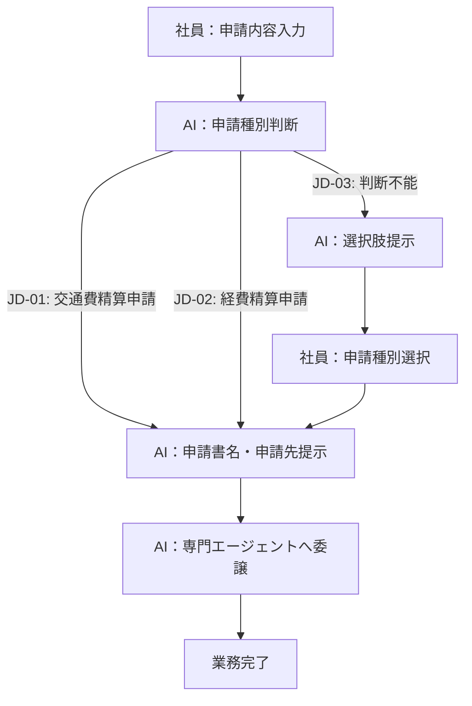
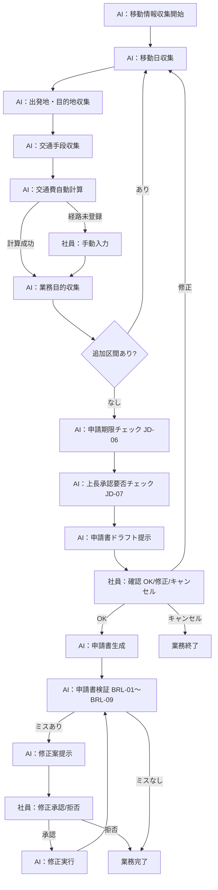
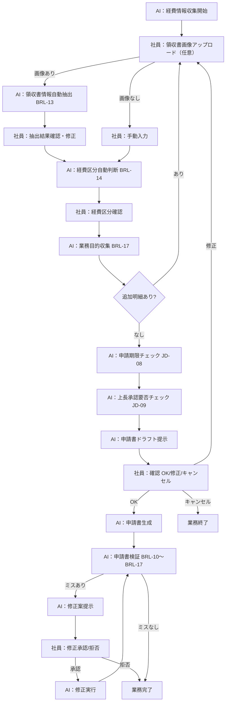

> **参照元（入力資料）:**
> - 業務要件一覧.md（業務要件ID・業務種別の特定）
> - 業務一覧.md（業務ID・業務名の特定）
> - 役割分担定義.md（実行主体・責務分担の決定）
> - 業務ルール定義_判断基準定義.md（判断・ルールとの紐付け）

## 業務プロセス定義

---

### BIZ-001: 申請種別判断・案内

#### 基本情報
- 業務ID：BIZ-001
- 業務名：申請種別判断・案内
- 業務目的：社員が入力した申請内容から申請種別を自動判断し、使用すべき申請書と申請先を提示する
- 対象ユーザ：一般社員
- 開始条件（トリガー）：社員が申請内容テキストを入力する
- 終了条件：申請種別が確定し、専門エージェントへ委譲が完了する

#### 業務フロー（To-Be）

#### 業務ステップ定義：ST-001-01

##### 1) 基本情報
- ステップID：ST-001-01
- ステップ名：申請内容入力受付
- 対応業務ID：BIZ-001
- ステップ種別：入力
- 実行主体：
  - ☑ 人
  - ☐ AIエージェント

##### 2) ステップ概要
- 目的：社員から申請内容テキストを受け取る
- このステップで達成すること：申請内容テキストの取得
- 業務上の意味：AIが申請種別を判断するための入力情報を収集する

##### 3) フロー上の位置
- 直前ステップ：なし（業務開始）
- 直後ステップ（通常）：ST-001-02

##### 4) 入力情報

| データID | データ名 | 取得元 | 必須 | 欠落時対応 |
|---|---|---|---:|---|
| D-001 | 申請内容テキスト | 社員入力 | ○ | 再入力要求 |

##### 5) 実施内容
- 社員が申請したい内容を自然言語で入力する

##### 6) 判断・ルール
なし

##### 7) 出力結果

| データID | データ名 | 出力先 | 確定主体 |
|---|---|---|---|
| D-001 | 申請内容テキスト | ST-001-02 | 人 |

##### 9) 責務分担

| 項目 | 人 | AIエージェント |
|---|---|---|
| 入力 | ○ | × |
| 判断 | × | × |
| 実行 | × | × |

---

#### 業務ステップ定義：ST-001-02

##### 1) 基本情報
- ステップID：ST-001-02
- ステップ名：申請種別自動判断
- 対応業務ID：BIZ-001
- ステップ種別：判断・実行
- 実行主体：
  - ☐ 人
  - ☑ AIエージェント

##### 4) 入力情報

| データID | データ名 | 取得元 | 必須 | 欠落時対応 |
|---|---|---|---:|---|
| D-001 | 申請内容テキスト | ST-001-01 | ○ | 前ステップへ戻る |
| D-002 | 申請種別判断ルール | ナレッジベース | ○ | エスカレーション |

##### 6) 判断・ルール

| 種別 | ID | 利用方法 |
|---|---|---|
| 判断基準 | JD-01〜JD-03 | 申請内容テキストから申請種別を判断する |

##### 7) 出力結果

| データID | データ名 | 出力先 | 確定主体 |
|---|---|---|---|
| D-003 | 申請種別判断結果 | ST-001-03 | AI |

##### 9) 責務分担

| 項目 | 人 | AIエージェント |
|---|---|---|
| 入力 | × | ○ |
| 判断 | × | ○ |
| 実行 | × | ○ |

---

### BIZ-002: 交通費精算申請書作成

#### 基本情報
- 業務ID：BIZ-002
- 業務名：交通費精算申請書作成
- 業務目的：移動情報を対話で収集し、交通費精算申請書（Excel）を自動作成する
- 対象ユーザ：一般社員
- 開始条件（トリガー）：BIZ-001から交通費精算申請として委譲される
- 終了条件：交通費精算申請書（Excel）が生成され、検証済みとなる

#### 業務フロー（To-Be）

#### 業務ステップ定義：ST-002-01

##### 1) 基本情報
- ステップID：ST-002-01
- ステップ名：移動情報収集（1区間ずつ）
- 対応業務ID：BIZ-002
- ステップ種別：対話・確認
- 実行主体：
  - ☑ 人
  - ☑ AIエージェント（協調）

##### 4) 入力情報

| データID | データ名 | 取得元 | 必須 | 欠落時対応 |
|---|---|---|---:|---|
| D-004 | 移動日 | 社員入力 | ○ | 再入力要求 |
| D-005 | 出発地 | 社員入力 | ○ | 再入力要求 |
| D-006 | 目的地 | 社員入力 | ○ | 再入力要求 |
| D-007 | 交通手段 | 社員入力 | ○ | 再入力要求（BRL-03） |
| D-008 | 業務目的 | 社員入力 | ○ | 再入力要求（BRL-09） |

##### 6) 判断・ルール

| 種別 | ID | 利用方法 |
|---|---|---|
| 業務ルール | BRL-03 | 対応交通手段の制約チェック |
| 業務ルール | BRL-04 | 1区間ずつ収集する |
| 業務ルール | BRL-05 | 交通費の自動計算 |
| 業務ルール | BRL-08 | 駅名の正規化 |
| 業務ルール | BRL-09 | 業務目的の必須チェック |
| 判断基準 | JD-06 | 申請期限チェック |
| 判断基準 | JD-07 | 上長承認要否チェック |
| 判断基準 | JD-10 | 申請書生成前の承認確認 |

##### 9) 責務分担

| 項目 | 人 | AIエージェント |
|---|---|---|
| 入力 | ○ | × |
| 判断 | × | ○ |
| 実行 | × | ○ |

---

### BIZ-003: 経費精算申請書作成

#### 基本情報
- 業務ID：BIZ-003
- 業務名：経費精算申請書作成
- 業務目的：経費情報を対話で収集し、経費精算申請書（Excel）を自動作成する
- 対象ユーザ：一般社員
- 開始条件（トリガー）：BIZ-001から経費精算申請として委譲される
- 終了条件：経費精算申請書（Excel）が生成され、検証済みとなる

#### 業務フロー（To-Be）

#### 業務ステップ定義：ST-003-01

##### 1) 基本情報
- ステップID：ST-003-01
- ステップ名：経費情報収集（1明細ずつ）
- 対応業務ID：BIZ-003
- ステップ種別：対話・確認
- 実行主体：
  - ☑ 人
  - ☑ AIエージェント（協調）

##### 4) 入力情報

| データID | データ名 | 取得元 | 必須 | 欠落時対応 |
|---|---|---|---:|---|
| D-009 | 購入日 | 社員入力 | ○ | 再入力要求 |
| D-010 | 店舗名 | 社員入力または領収書抽出 | ○ | 再入力要求 |
| D-011 | 品目 | 社員入力または領収書抽出 | ○ | 再入力要求 |
| D-012 | 経費区分 | AI自動判断（社員確認必須） | ○ | 再選択要求（BRL-12） |
| D-013 | 金額 | 社員入力または領収書抽出 | ○ | 再入力要求 |
| D-014 | 業務目的 | 社員入力 | ○ | 再入力要求（BRL-17） |

##### 6) 判断・ルール

| 種別 | ID | 利用方法 |
|---|---|---|
| 業務ルール | BRL-12 | 対応経費区分の制約チェック |
| 業務ルール | BRL-13 | 領収書画像からの自動抽出 |
| 業務ルール | BRL-14 | 経費区分の自動判断（確認必須） |
| 業務ルール | BRL-17 | 業務目的の必須チェック |
| 判断基準 | JD-08 | 申請期限チェック |
| 判断基準 | JD-09 | 上長承認要否チェック |
| 判断基準 | JD-10 | 申請書生成前の承認確認 |

##### 9) 責務分担

| 項目 | 人 | AIエージェント |
|---|---|---|
| 入力 | ○ | × |
| 判断 | 最終 | 一次 |
| 実行 | × | ○ |

### 例外処理

| ケース | 発生条件 | 対応方針 | 担当 |
|---|---|---|---|
| 申請種別判断不能 | 申請内容が複数種別に該当する可能性がある | 選択肢（交通費精算申請・経費精算申請）を提示してユーザーに確認 | AI→人 |
| 経路未登録 | 交通費計算で経路テーブルに該当なし | 手動入力を求める | AI→人 |
| 申請期限超過 | 経費発生日から3ヶ月超 | 警告を提示する | AI |
| システムエラー | ツールエラー・システム障害 | エラー内容を通知し担当者への連絡を促す | AI→人 |
