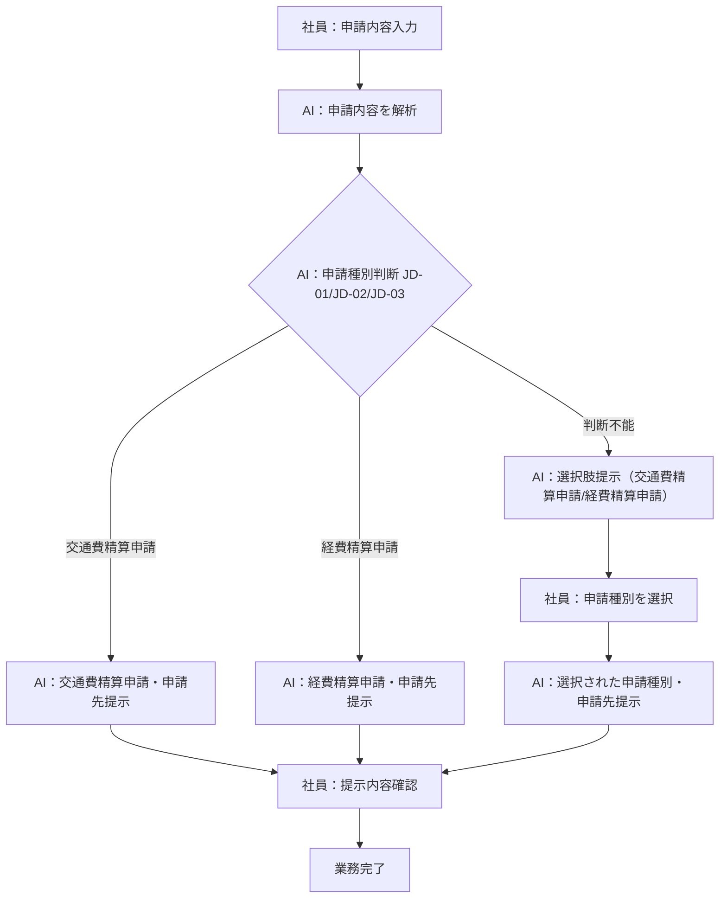
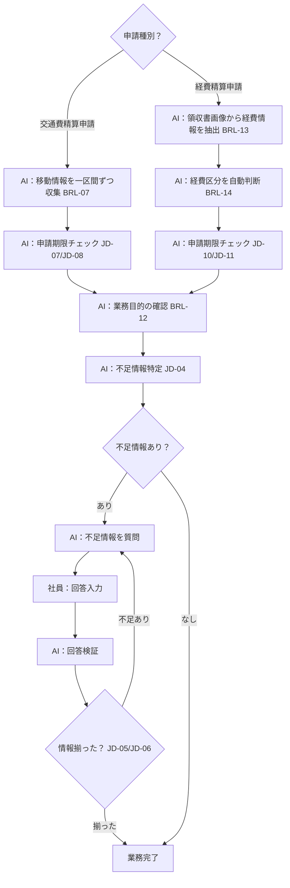
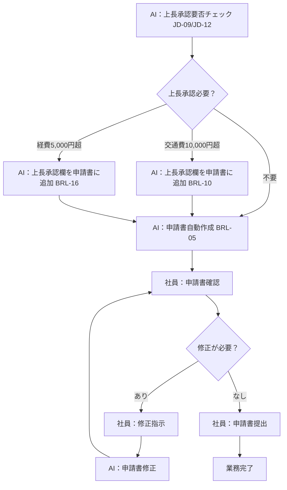

> **参照元（入力資料）:**
> - 業務要件一覧.md（業務要件ID・業務種別の特定）
> - 業務一覧.md（業務ID・業務名の特定）
> - 役割分担定義.md（実行主体・責務分担の決定）
> - 業務ルール定義_判断基準定義.md（判断・ルールとの紐付け）

## 業務プロセス定義

---

### BIZ-01: 申請種別案内

#### 基本情報
- 業務ID：BIZ-01
- 業務名：申請種別案内
- 業務目的：社員の申請内容から交通費精算申請・経費精算申請のいずれかを判断して申請書・申請先を提示する
- 対象ユーザ：一般社員
- 開始条件（トリガー）：社員が申請内容（目的・状況）を入力する
- 終了条件：申請種別・申請先が社員に提示される

#### 業務フロー（To-Be）

#### 業務ステップ定義：ST-BIZ01

##### ST-BIZ01-01: 申請内容入力

###### 1) 基本情報
- ステップID：ST-BIZ01-01
- ステップ名：申請内容入力
- 対応業務ID：BIZ-01
- ステップ種別：入力
- 実行主体：
  - ☑ 人
  - ☐ AIエージェント
  - ☐ 人＋AI（協調）

###### 2) ステップ概要
- 目的：申請種別判断に必要な申請内容を収集する
- このステップで達成すること：社員が申請の目的・状況を入力する
- 業務上の意味：AIが申請種別（交通費精算申請・経費精算申請）を判断するための起点となる

###### 3) フロー上の位置
- 直前ステップ：なし（開始）
- 直後ステップ（通常）：ST-BIZ01-02

###### 4) 入力情報

| データID | データ名 | 取得元 | 必須 | 欠落時対応 |
|---|---|---|---:|---|
| D-001 | 申請内容（目的・状況） | 社員入力 | 必須 | 再入力要求 |

###### 5) 実施内容
- 実施する業務処理：社員が申請の目的・状況をテキストで入力する

###### 6) 判断・ルール

| 種別 | ID | 利用方法 |
|---|---|---|
| 業務ルール | BRL-01 | 申請内容を入力として受け付ける |

###### 7) 出力結果

| データID | データ名 | 出力先 | 確定主体 |
|---|---|---|---|
| D-001 | 申請内容（目的・状況） | ST-BIZ01-02 | 人 |

###### 8) 例外処理

| ケース | 発生条件 | 対応 | 遷移先 |
|---|---|---|---|
| 入力が空 | 申請内容が未入力 | 再入力を促す | ST-BIZ01-01 |

###### 9) 責務分担

| 項目 | 人 | AIエージェント |
|---|---|---|
| 入力 | ○ | × |
| 判断 | × | × |
| 実行 | ○ | × |

###### 10) 完了条件
- 正常終了条件：申請内容が入力された
- 未完了・中断条件：入力が空のまま

---

##### ST-BIZ01-02: 申請種別判断

###### 1) 基本情報
- ステップID：ST-BIZ01-02
- ステップ名：申請種別判断
- 対応業務ID：BIZ-01
- ステップ種別：判断・実行
- 実行主体：
  - ☐ 人
  - ☑ AIエージェント
  - ☐ 人＋AI（協調）

###### 2) ステップ概要
- 目的：申請内容から交通費精算申請・経費精算申請のいずれかを特定する
- このステップで達成すること：申請種別を判断する。判断できない場合はユーザーに選択肢を提示する
- 業務上の意味：社員が正しい申請種別を把握できるようにする

###### 3) フロー上の位置
- 直前ステップ：ST-BIZ01-01
- 直後ステップ（通常）：ST-BIZ01-03
- 分岐先ステップ（条件付き）：ST-BIZ01-02b（判断不能時）

###### 4) 入力情報

| データID | データ名 | 取得元 | 必須 | 欠落時対応 |
|---|---|---|---:|---|
| D-001 | 申請内容（目的・状況） | ST-BIZ01-01 | 必須 | ST-BIZ01-01へ戻る |
| D-002 | 社内申請ルール | ナレッジベース | 必須 | エスカレーション |

###### 5) 実施内容
- 実施する業務処理：申請内容を解析し、交通費精算申請・経費精算申請のいずれかを判断する。判断できない場合は選択肢を提示してユーザーに確認する

###### 6) 判断・ルール

| 種別 | ID | 利用方法 |
|---|---|---|
| 業務ルール | BRL-01 | 申請ルール参照による申請種別判断 |
| 業務ルール | BRL-02 | 判断不能時の選択肢提示・ユーザー確認 |
| 判断基準 | JD-01 | 交通費精算申請の特定 |
| 判断基準 | JD-02 | 経費精算申請の特定 |
| 判断基準 | JD-03 | 申請種別判断不能時の対応 |

###### 7) 出力結果

| データID | データ名 | 出力先 | 確定主体 |
|---|---|---|---|
| D-003 | 申請種別（交通費精算申請または経費精算申請） | ST-BIZ01-03 | AI（または社員選択） |

###### 8) 例外処理

| ケース | 発生条件 | 対応 | 遷移先 |
|---|---|---|---|
| 判断不能 | 申請内容から申請種別を判断できない | 「交通費精算申請」「経費精算申請」の選択肢を提示してユーザーに確認（BRL-02） | ST-BIZ01-02b |

###### 9) 責務分担

| 項目 | 人 | AIエージェント |
|---|---|---|
| 入力 | × | ○ |
| 判断 | × | ○ |
| 実行 | × | ○ |

###### 10) 完了条件
- 正常終了条件：申請種別（交通費精算申請または経費精算申請）が特定された
- 未完了・中断条件：ユーザーが選択肢への回答を中断した

---

##### ST-BIZ01-02b: 申請種別確認（判断不能時）

###### 1) 基本情報
- ステップID：ST-BIZ01-02b
- ステップ名：申請種別確認（判断不能時）
- 対応業務ID：BIZ-01
- ステップ種別：対話・確認
- 実行主体：
  - ☐ 人
  - ☐ AIエージェント
  - ☑ 人＋AI（協調）

###### 2) ステップ概要
- 目的：AIが申請種別を判断できない場合に、ユーザーに選択肢を提示して申請種別を確定する
- このステップで達成すること：ユーザーが「交通費精算申請」「経費精算申請」から選択する
- 業務上の意味：AIが判断できないケースでも正しい申請フローへ誘導する

###### 3) フロー上の位置
- 直前ステップ：ST-BIZ01-02（判断不能時）
- 直後ステップ（通常）：ST-BIZ01-03

###### 4) 入力情報

| データID | データ名 | 取得元 | 必須 | 欠落時対応 |
|---|---|---|---:|---|
| D-001 | 申請内容（目的・状況） | ST-BIZ01-01 | 必須 | ST-BIZ01-01へ戻る |
| D-013 | ユーザーの申請種別選択 | 社員入力 | 必須 | 再選択を促す |

###### 5) 実施内容
- 実施する業務処理：AIが「交通費精算申請」「経費精算申請」の選択肢を提示し、ユーザーの選択を受け付ける

###### 6) 判断・ルール

| 種別 | ID | 利用方法 |
|---|---|---|
| 業務ルール | BRL-02 | 判断不能時の選択肢提示・ユーザー確認 |
| 判断基準 | JD-03 | 申請種別判断不能時の対応 |

###### 7) 出力結果

| データID | データ名 | 出力先 | 確定主体 |
|---|---|---|---|
| D-003 | 申請種別（ユーザー選択） | ST-BIZ01-03 | 人 |

###### 8) 例外処理

| ケース | 発生条件 | 対応 | 遷移先 |
|---|---|---|---|
| 選択なし | ユーザーが選択肢を選ばない | 再選択を促す | ST-BIZ01-02b |

###### 9) 責務分担

| 項目 | 人 | AIエージェント |
|---|---|---|
| 入力 | ○（選択） | ○（選択肢提示） |
| 判断 | ○（最終） | × |
| 実行 | ○ | ○（提示） |

###### 10) 完了条件
- 正常終了条件：ユーザーが申請種別を選択した
- 未完了・中断条件：ユーザーが選択を中断した

---

##### ST-BIZ01-03: 申請種別・申請先提示

###### 1) 基本情報
- ステップID：ST-BIZ01-03
- ステップ名：申請種別・申請先提示
- 対応業務ID：BIZ-01
- ステップ種別：案内
- 実行主体：
  - ☐ 人
  - ☑ AIエージェント
  - ☐ 人＋AI（協調）

###### 2) ステップ概要
- 目的：社員に必要な申請種別・申請書・申請先を提示する
- このステップで達成すること：社員が何をどこに申請すべきかを把握できる
- 業務上の意味：申請ミスを防止する

###### 3) フロー上の位置
- 直前ステップ：ST-BIZ01-02 または ST-BIZ01-02b
- 直後ステップ（通常）：BIZ-02（申請情報収集）へ

###### 4) 入力情報

| データID | データ名 | 取得元 | 必須 | 欠落時対応 |
|---|---|---|---:|---|
| D-003 | 申請種別 | ST-BIZ01-02 または ST-BIZ01-02b | 必須 | ST-BIZ01-02へ戻る |
| D-002 | 社内申請ルール（申請先情報） | ナレッジベース | 必須 | エスカレーション |

###### 5) 実施内容
- 実施する業務処理：申請種別（交通費精算申請書または経費精算申請書）・申請先を社員に提示する

###### 6) 判断・ルール

| 種別 | ID | 利用方法 |
|---|---|---|
| 業務ルール | BRL-03 | 申請先の特定・提示 |

###### 7) 出力結果

| データID | データ名 | 出力先 | 確定主体 |
|---|---|---|---|
| D-005 | 申請種別・申請書・申請先の提示結果 | 社員 | AI |

###### 8) 例外処理

| ケース | 発生条件 | 対応 | 遷移先 |
|---|---|---|---|
| 申請先情報なし | ナレッジに申請先が未定義 | エスカレーション案内 | 業務終了 |

###### 9) 責務分担

| 項目 | 人 | AIエージェント |
|---|---|---|
| 入力 | × | ○ |
| 判断 | × | ○ |
| 実行 | ○（確認） | ○（提示） |

###### 10) 完了条件
- 正常終了条件：申請種別・申請先が社員に提示された
- 未完了・中断条件：申請先情報が取得できない

#### 例外処理（BIZ-01 共通）

| ケース | 発生条件 | 対応方針 | 担当 |
|---|---|---|---|
| 申請種別判断不能 | 申請内容から交通費精算申請・経費精算申請のいずれかを判断できない | 選択肢（「交通費精算申請」「経費精算申請」）を提示してユーザーに確認する | AI |
| ナレッジ参照失敗 | 社内申請ルールが参照できない | エラーを通知し、申請管理部門への問い合わせを案内する | AI |

---

### BIZ-02: 申請情報収集

#### 基本情報
- 業務ID：BIZ-02
- 業務名：申請情報収集
- 業務目的：申請書作成に必要な情報を対話で収集する
- 対象ユーザ：一般社員
- 開始条件（トリガー）：申請種別が確定し、申請書作成に必要な情報が不足している
- 終了条件：申請書作成に必要なすべての情報が収集される

#### 業務フロー（To-Be）

#### 業務ステップ定義：ST-BIZ02

##### ST-BIZ02-01: 申請種別別情報収集

###### 1) 基本情報
- ステップID：ST-BIZ02-01
- ステップ名：申請種別別情報収集
- 対応業務ID：BIZ-02
- ステップ種別：判断・実行
- 実行主体：
  - ☐ 人
  - ☐ AIエージェント
  - ☑ 人＋AI（協調）

###### 2) ステップ概要
- 目的：申請種別に応じた方法で申請情報を収集する
- このステップで達成すること：交通費精算申請は移動情報を一区間ずつ、経費精算申請は領収書画像から経費情報を収集する
- 業務上の意味：申請種別ごとの業務ルールに従った情報収集を行う

###### 3) フロー上の位置
- 直前ステップ：BIZ-01完了後
- 直後ステップ（通常）：ST-BIZ02-02

###### 4) 入力情報

| データID | データ名 | 取得元 | 必須 | 欠落時対応 |
|---|---|---|---:|---|
| D-003 | 申請種別 | BIZ-01 | 必須 | BIZ-01へ戻る |
| D-014 | 移動情報（交通費精算申請の場合） | 社員入力 | 条件付き必須 | 再入力要求 |
| D-015 | 領収書画像（経費精算申請の場合） | 社員入力 | 条件付き必須 | 再入力要求 |

###### 5) 実施内容
- 実施する業務処理（交通費精算申請）：移動情報（移動日、出発地、目的地、交通手段、費用、業務目的）を一区間ずつ収集する。駅名を正規化し（BRL-11）、運賃データから交通費を自動計算する（BRL-08）
- 実施する業務処理（経費精算申請）：領収書画像から経費情報（購入日、店舗名、品目、金額）を品目ごとに自動抽出し（BRL-13）、品目から経費区分を自動判断する（BRL-14）

###### 6) 判断・ルール

| 種別 | ID | 利用方法 |
|---|---|---|
| 業務ルール | BRL-07 | 交通費精算申請：移動情報を一区間ずつ収集 |
| 業務ルール | BRL-08 | 交通費精算申請：運賃データから交通費を自動計算 |
| 業務ルール | BRL-11 | 交通費精算申請：駅名の正規化 |
| 業務ルール | BRL-13 | 経費精算申請：領収書画像から経費情報を自動抽出 |
| 業務ルール | BRL-14 | 経費精算申請：品目から経費区分を自動判断 |

###### 7) 出力結果

| データID | データ名 | 出力先 | 確定主体 |
|---|---|---|---|
| D-007 | 収集済み情報（申請種別別） | ST-BIZ02-02 | AI＋人 |

###### 8) 例外処理

| ケース | 発生条件 | 対応 | 遷移先 |
|---|---|---|---|
| 領収書画像の読み取り失敗 | 画像から経費情報を抽出できない | 手動入力を促す | ST-BIZ02-01 |
| 経費区分の判断不能 | 品目から経費区分を判断できない | ユーザーに経費区分を確認する | ST-BIZ02-01 |

###### 9) 責務分担

| 項目 | 人 | AIエージェント |
|---|---|---|
| 入力 | ○（移動情報・領収書画像） | ○（質問・抽出） |
| 判断 | × | ○（経費区分・運賃計算） |
| 実行 | ○（入力） | ○（抽出・計算） |

###### 10) 完了条件
- 正常終了条件：申請種別に応じた基本情報が収集された
- 未完了・中断条件：社員が入力を中断した

---

##### ST-BIZ02-02: 申請期限・業務目的の確認

###### 1) 基本情報
- ステップID：ST-BIZ02-02
- ステップ名：申請期限・業務目的の確認
- 対応業務ID：BIZ-02
- ステップ種別：判断・実行
- 実行主体：
  - ☐ 人
  - ☑ AIエージェント
  - ☐ 人＋AI（協調）

###### 2) ステップ概要
- 目的：申請期限の適否を確認し、業務目的の記載を確認する
- このステップで達成すること：申請期限内であること・業務目的が記載されていることを確認する
- 業務上の意味：申請ルール違反を事前に検出して申請ミスを防止する

###### 3) フロー上の位置
- 直前ステップ：ST-BIZ02-01
- 直後ステップ（通常）：ST-BIZ02-03

###### 4) 入力情報

| データID | データ名 | 取得元 | 必須 | 欠落時対応 |
|---|---|---|---:|---|
| D-007 | 収集済み情報 | ST-BIZ02-01 | 必須 | ST-BIZ02-01へ戻る |

###### 5) 実施内容
- 実施する業務処理：経費発生日から申請日までの期間を確認し、3ヶ月以内であることを確認する（BRL-09/BRL-15）。業務目的が記載されていることを確認する（BRL-12）

###### 6) 判断・ルール

| 種別 | ID | 利用方法 |
|---|---|---|
| 業務ルール | BRL-09 | 交通費精算申請：申請期限（3ヶ月以内）の確認 |
| 業務ルール | BRL-12 | 業務目的の記載確認 |
| 業務ルール | BRL-15 | 経費精算申請：申請期限（3ヶ月以内）の確認 |
| 判断基準 | JD-07 | 交通費精算申請：申請期限の確認 |
| 判断基準 | JD-08 | 交通費精算申請：申請期限超過 |
| 判断基準 | JD-10 | 経費精算申請：申請期限の確認 |
| 判断基準 | JD-11 | 経費精算申請：申請期限超過 |

###### 7) 出力結果

| データID | データ名 | 出力先 | 確定主体 |
|---|---|---|---|
| D-007 | 収集済み情報（検証済み） | ST-BIZ02-03 | AI |

###### 8) 例外処理

| ケース | 発生条件 | 対応 | 遷移先 |
|---|---|---|---|
| 申請期限超過 | 経費発生日から3ヶ月を超えている | 申請期限超過として申請不可を案内する | 業務終了 |
| 業務目的未記載 | 業務目的が入力されていない | 業務目的の入力を促す | ST-BIZ02-01 |

###### 9) 責務分担

| 項目 | 人 | AIエージェント |
|---|---|---|
| 入力 | × | ○ |
| 判断 | × | ○ |
| 実行 | × | ○ |

###### 10) 完了条件
- 正常終了条件：申請期限内であり、業務目的が記載されている
- 未完了・中断条件：申請期限超過（業務終了）

---

##### ST-BIZ02-03: 不足情報の対話確認

###### 1) 基本情報
- ステップID：ST-BIZ02-03
- ステップ名：不足情報の対話確認
- 対応業務ID：BIZ-02
- ステップ種別：対話・確認
- 実行主体：
  - ☐ 人
  - ☐ AIエージェント
  - ☑ 人＋AI（協調）

###### 2) ステップ概要
- 目的：不足情報を対話で収集する
- このステップで達成すること：申請書作成に必要なすべての情報が揃う
- 業務上の意味：申請書の記載漏れ・誤りを防止する

###### 3) フロー上の位置
- 直前ステップ：ST-BIZ02-02
- 直後ステップ（通常）：BIZ-03（情報が揃った場合）
- 分岐先ステップ（条件付き）：ST-BIZ02-03（情報が不足の場合、繰り返し）

###### 4) 入力情報

| データID | データ名 | 取得元 | 必須 | 欠落時対応 |
|---|---|---|---:|---|
| D-008 | 不足情報リスト | ST-BIZ02-02 | 必須 | ST-BIZ02-02へ戻る |
| D-009 | 社員の回答 | 社員入力 | 必須 | 再入力要求 |

###### 5) 実施内容
- 実施する業務処理：不足情報を1件ずつ質問し、社員の回答を収集・検証する。情報が揃うまで繰り返す

###### 6) 判断・ルール

| 種別 | ID | 利用方法 |
|---|---|---|
| 業務ルール | BRL-04 | 不足情報の確認（繰り返し） |
| 判断基準 | JD-04 | 不足情報の特定 |
| 判断基準 | JD-05 | 申請書作成可否（情報揃い） |
| 判断基準 | JD-06 | 申請書作成可否（情報不足） |

###### 7) 出力結果

| データID | データ名 | 出力先 | 確定主体 |
|---|---|---|---|
| D-007 | 収集済み情報（更新） | BIZ-03 | 人＋AI |

###### 8) 例外処理

| ケース | 発生条件 | 対応 | 遷移先 |
|---|---|---|---|
| 回答が不明確 | 社員の回答が申請書の要件を満たさない | 再質問・補足説明を提示 | ST-BIZ02-03 |

###### 9) 責務分担

| 項目 | 人 | AIエージェント |
|---|---|---|
| 入力 | ○（回答） | ○（質問） |
| 判断 | × | ○（回答検証） |
| 実行 | ○（回答） | ○（質問・検証） |

###### 10) 完了条件
- 正常終了条件：申請書作成に必要なすべての情報が収集された
- 未完了・中断条件：社員が回答を中断した

#### 例外処理（BIZ-02 共通）

| ケース | 発生条件 | 対応方針 | 担当 |
|---|---|---|---|
| 申請期限超過 | 経費発生日から3ヶ月を超えている | 申請期限超過として申請不可を案内する | AI |
| 情報収集の中断 | 社員が対話を中断する | 収集済み情報を保持し、再開可能な状態にする | AI |
| 回答が繰り返し不明確 | 同一項目への回答が複数回不明確 | 申請管理部門への問い合わせを案内する | AI |

---

### BIZ-03: 申請書自動作成

#### 基本情報
- 業務ID：BIZ-03
- 業務名：申請書自動作成
- 業務目的：収集した情報をもとに申請書（交通費精算申請書または経費精算申請書）を自動作成する
- 対象ユーザ：一般社員
- 開始条件（トリガー）：申請書作成に必要なすべての情報が収集された
- 終了条件：申請書が作成され、社員が確認する

#### 業務フロー（To-Be）

#### 業務ステップ定義：ST-BIZ03

##### ST-BIZ03-01: 上長承認要否チェック

###### 1) 基本情報
- ステップID：ST-BIZ03-01
- ステップ名：上長承認要否チェック
- 対応業務ID：BIZ-03
- ステップ種別：判断・実行
- 実行主体：
  - ☐ 人
  - ☑ AIエージェント
  - ☐ 人＋AI（協調）

###### 2) ステップ概要
- 目的：申請金額に基づいて上長承認が必要かどうかを判断する
- このステップで達成すること：交通費が10,000円超または経費が5,000円超の場合に上長承認欄を申請書に追加する
- 業務上の意味：申請ルールに従った承認フローを確保する

###### 3) フロー上の位置
- 直前ステップ：BIZ-02完了後
- 直後ステップ（通常）：ST-BIZ03-02

###### 4) 入力情報

| データID | データ名 | 取得元 | 必須 | 欠落時対応 |
|---|---|---|---:|---|
| D-007 | 収集済み情報 | BIZ-02 | 必須 | BIZ-02へ戻る |

###### 5) 実施内容
- 実施する業務処理（交通費精算申請）：交通費合計が10,000円を超える場合は上長承認欄を申請書に追加する（BRL-10）
- 実施する業務処理（経費精算申請）：経費合計が5,000円を超える場合は上長承認欄を申請書に追加する（BRL-16）

###### 6) 判断・ルール

| 種別 | ID | 利用方法 |
|---|---|---|
| 業務ルール | BRL-10 | 交通費精算申請：10,000円超の場合に上長承認欄を追加 |
| 業務ルール | BRL-16 | 経費精算申請：5,000円超の場合に上長承認欄を追加 |
| 判断基準 | JD-09 | 交通費精算申請：上長承認要否 |
| 判断基準 | JD-12 | 経費精算申請：上長承認要否 |

###### 7) 出力結果

| データID | データ名 | 出力先 | 確定主体 |
|---|---|---|---|
| D-016 | 上長承認要否フラグ | ST-BIZ03-02 | AI |

###### 8) 例外処理

| ケース | 発生条件 | 対応 | 遷移先 |
|---|---|---|---|
| 金額情報なし | 収集済み情報に金額が含まれない | BIZ-02へ戻り金額を再収集 | BIZ-02 |

###### 9) 責務分担

| 項目 | 人 | AIエージェント |
|---|---|---|
| 入力 | × | ○ |
| 判断 | × | ○ |
| 実行 | × | ○ |

###### 10) 完了条件
- 正常終了条件：上長承認要否が判断された
- 未完了・中断条件：金額情報が取得できない

---

##### ST-BIZ03-02: 申請書自動作成

###### 1) 基本情報
- ステップID：ST-BIZ03-02
- ステップ名：申請書自動作成
- 対応業務ID：BIZ-03
- ステップ種別：参照・実行
- 実行主体：
  - ☐ 人
  - ☑ AIエージェント
  - ☐ 人＋AI（協調）

###### 2) ステップ概要
- 目的：収集した情報を申請書テンプレートに反映して申請書を作成する
- このステップで達成すること：交通費精算申請書または経費精算申請書が自動作成される
- 業務上の意味：申請書の記載ミスを防止し、申請作業を効率化する

###### 3) フロー上の位置
- 直前ステップ：ST-BIZ03-01
- 直後ステップ（通常）：ST-BIZ03-03

###### 4) 入力情報

| データID | データ名 | 取得元 | 必須 | 欠落時対応 |
|---|---|---|---:|---|
| D-007 | 収集済み情報 | BIZ-02 | 必須 | BIZ-02へ戻る |
| D-006 | 申請書テンプレート | ナレッジベース | 必須 | エスカレーション |
| D-016 | 上長承認要否フラグ | ST-BIZ03-01 | 必須 | ST-BIZ03-01へ戻る |

###### 5) 実施内容
- 実施する業務処理：収集済み情報を申請書テンプレート（交通費精算申請書または経費精算申請書）に反映して申請書ファイルを生成する。上長承認が必要な場合は承認欄を追加する

###### 6) 判断・ルール

| 種別 | ID | 利用方法 |
|---|---|---|
| 業務ルール | BRL-05 | 申請書の自動作成 |
| 判断基準 | JD-05 | 申請書作成可否の確認 |

###### 7) 出力結果

| データID | データ名 | 出力先 | 確定主体 |
|---|---|---|---|
| D-010 | 申請書（ファイル） | ST-BIZ03-03 | AI |

###### 8) 例外処理

| ケース | 発生条件 | 対応 | 遷移先 |
|---|---|---|---|
| テンプレート取得失敗 | 申請書テンプレートが参照できない | エラー通知・エスカレーション案内 | 業務終了 |
| 情報不足 | 必須項目が未収集 | BIZ-02へ戻る | BIZ-02 |

###### 9) 責務分担

| 項目 | 人 | AIエージェント |
|---|---|---|
| 入力 | × | ○ |
| 判断 | × | ○ |
| 実行 | × | ○ |

###### 10) 完了条件
- 正常終了条件：申請書が生成された
- 未完了・中断条件：テンプレートが取得できない、または必須情報が不足

---

##### ST-BIZ03-03: 申請書確認・修正

###### 1) 基本情報
- ステップID：ST-BIZ03-03
- ステップ名：申請書確認・修正
- 対応業務ID：BIZ-03
- ステップ種別：対話・確認
- 実行主体：
  - ☐ 人
  - ☐ AIエージェント
  - ☑ 人＋AI（協調）

###### 2) ステップ概要
- 目的：社員が申請書の内容を確認し、必要に応じて修正する
- このステップで達成すること：申請書の内容が確定する
- 業務上の意味：申請ミス・差し戻しを防止する

###### 3) フロー上の位置
- 直前ステップ：ST-BIZ03-02
- 直後ステップ（通常）：ST-BIZ03-04（確認完了）
- 分岐先ステップ（条件付き）：ST-BIZ03-03（修正後、再確認）

###### 4) 入力情報

| データID | データ名 | 取得元 | 必須 | 欠落時対応 |
|---|---|---|---:|---|
| D-010 | 申請書（ファイル） | ST-BIZ03-02 | 必須 | ST-BIZ03-02へ戻る |
| D-011 | 修正指示 | 社員入力 | 任意 | 修正なしとして扱う |

###### 5) 実施内容
- 実施する業務処理：社員が申請書を確認し、修正が必要な場合は修正指示を入力する。AIが修正を反映する

###### 6) 判断・ルール

| 種別 | ID | 利用方法 |
|---|---|---|
| 業務ルール | BRL-06 | 申請書提出は人が実行する |

###### 7) 出力結果

| データID | データ名 | 出力先 | 確定主体 |
|---|---|---|---|
| D-010 | 申請書（確定版） | ST-BIZ03-04 | 人 |

###### 8) 例外処理

| ケース | 発生条件 | 対応 | 遷移先 |
|---|---|---|---|
| 修正が繰り返し発生 | 同一箇所の修正が複数回発生 | 申請管理部門への問い合わせを案内する | 業務終了 |

###### 9) 責務分担

| 項目 | 人 | AIエージェント |
|---|---|---|
| 入力 | ○（確認・修正指示） | × |
| 判断 | ○（最終） | △（補助） |
| 実行 | × | ○（修正反映） |

###### 10) 完了条件
- 正常終了条件：社員が申請書の内容を確認・承認した
- 未完了・中断条件：社員が確認を中断した

---

##### ST-BIZ03-04: 申請書提出

###### 1) 基本情報
- ステップID：ST-BIZ03-04
- ステップ名：申請書提出
- 対応業務ID：BIZ-03
- ステップ種別：実行
- 実行主体：
  - ☑ 人
  - ☐ AIエージェント
  - ☐ 人＋AI（協調）

###### 2) ステップ概要
- 目的：確定した申請書を申請先に提出する
- このステップで達成すること：申請が完了する
- 業務上の意味：申請の最終実行は必ず人が行う

###### 3) フロー上の位置
- 直前ステップ：ST-BIZ03-03
- 直後ステップ（通常）：業務完了

###### 4) 入力情報

| データID | データ名 | 取得元 | 必須 | 欠落時対応 |
|---|---|---|---:|---|
| D-010 | 申請書（確定版） | ST-BIZ03-03 | 必須 | ST-BIZ03-03へ戻る |
| D-005 | 申請先情報 | BIZ-01 | 必須 | BIZ-01へ戻る |

###### 5) 実施内容
- 実施する業務処理：社員が申請書（交通費精算申請書または経費精算申請書）を申請先に提出する

###### 6) 判断・ルール

| 種別 | ID | 利用方法 |
|---|---|---|
| 業務ルール | BRL-06 | 申請書の提出は人が実行する |

###### 7) 出力結果

| データID | データ名 | 出力先 | 確定主体 |
|---|---|---|---|
| D-012 | 提出済み申請書 | 申請先 | 人 |

###### 8) 例外処理

| ケース | 発生条件 | 対応 | 遷移先 |
|---|---|---|---|
| 提出先不明 | 申請先情報が不明 | BIZ-01へ戻り申請先を再確認 | BIZ-01 |

###### 9) 責務分担

| 項目 | 人 | AIエージェント |
|---|---|---|
| 入力 | ○ | × |
| 判断 | ○ | × |
| 実行 | ○ | × |

###### 10) 完了条件
- 正常終了条件：申請書が申請先に提出された
- 未完了・中断条件：社員が提出を中断した

#### 例外処理（BIZ-03 共通）

| ケース | 発生条件 | 対応方針 | 担当 |
|---|---|---|---|
| 申請書生成失敗 | テンプレートエラー等で申請書が生成できない | エラー通知・申請管理部門への問い合わせを案内する | AI |
| 修正繰り返し | 同一箇所の修正が繰り返し発生する | 申請管理部門への問い合わせを案内する | AI |
