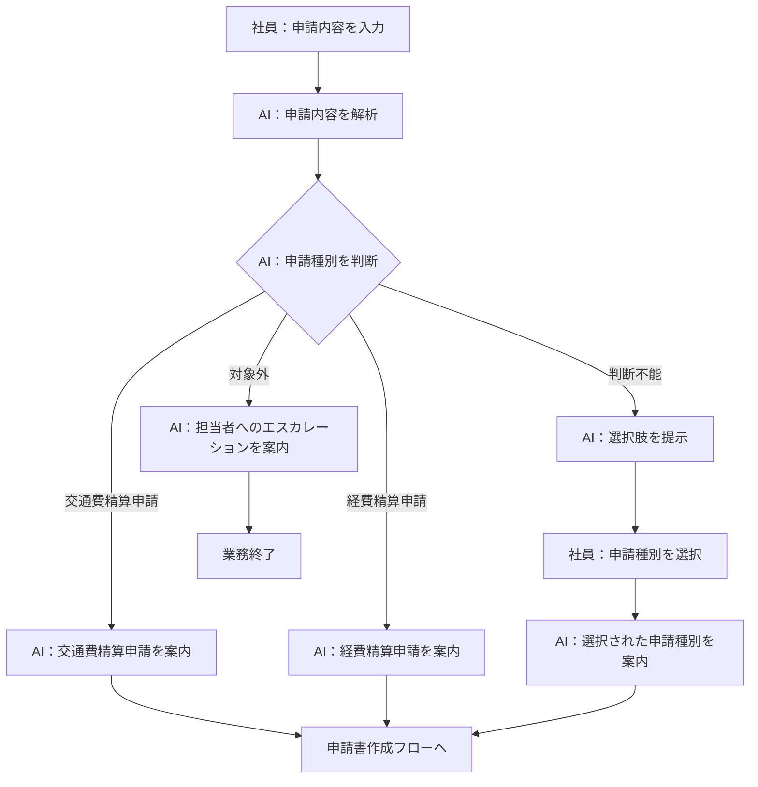
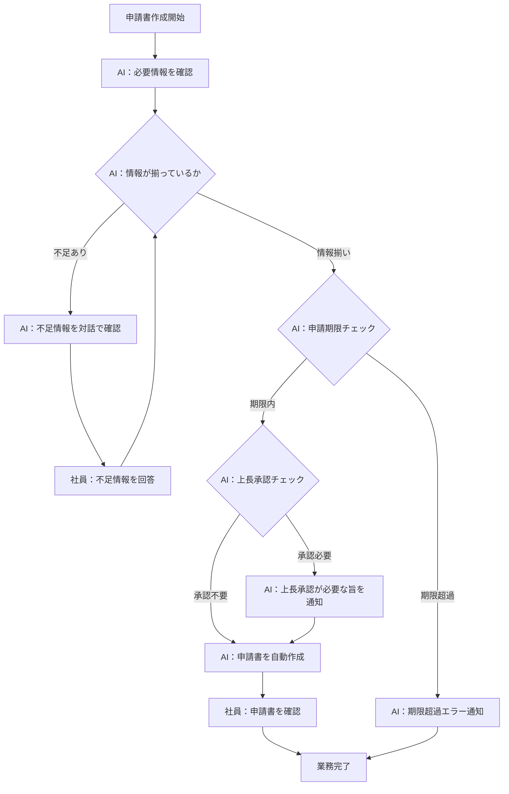

> **参照元（入力資料）:**
> - 業務要件一覧.md（業務要件ID・業務種別の特定）
> - 業務一覧.md（業務ID・業務名の特定）
> - 役割分担定義.md（実行主体・責務分担の決定）
> - 業務ルール定義_判断基準定義.md（判断・ルールとの紐付け）

## 業務プロセス定義

---

### 業務プロセス：BIZ-001 申請種別判断・案内

#### 基本情報
- 業務ID：BIZ-001
- 業務名：申請種別判断・案内
- 業務目的：社員が入力した申請内容から必要な申請種別（交通費精算申請・経費精算申請）を判断して提示する。判断できない場合はユーザーに選択肢を提示して確認する
- 対象ユーザ：一般社員
- 開始条件（トリガー）：社員が申請内容を入力する
- 終了条件：申請種別が確定し、対応する申請書作成フローへ誘導される

#### 業務フロー（To-Be）

---

## 業務ステップ定義：ST-001

### 1) 基本情報
- ステップID：ST-001-01
- ステップ名：申請内容の入力受付
- 対応業務ID：BIZ-001
- 対応プロセスID：ST-001
- ステップ種別：入力
- 実行主体：
  - ☑ 人
  - ☐ AIエージェント
  - ☐ 人＋AI（協調）

### 2) ステップ概要
- 目的：社員が申請したい内容を自然言語で入力する
- このステップで達成すること：申請内容テキストの取得
- 業務上の意味：AIが申請種別を判断するための起点となる情報を収集する

### 3) フロー上の位置
- 直前ステップ：なし（業務開始）
- 直後ステップ（通常）：ST-001-02
- 分岐先ステップ（条件付き）：なし

### 4) 入力情報

| データID | データ名 | 取得元 | 必須 | 欠落時対応 |
|---|---|---|---:|---|
| D-001 | 申請内容テキスト | 社員入力 | ○ | 再入力要求 |

### 5) 実施内容

#### 5.1 処理概要
- 社員が申請したい内容を自然言語で入力する

#### 5.2 処理詳細（業務粒度）
1. AIエージェントが申請内容の入力を促すメッセージを表示する
2. 社員が申請内容を自然言語で入力する
3. AIエージェントが入力内容を受け付ける

### 6) 判断・ルール

| 種別 | ID | 利用方法 |
|---|---|---|
| 業務ルール | BRL-04 | 入力内容が空の場合は再入力を要求する |

### 7) 出力結果

| データID | データ名 | 出力先 | 確定主体 |
|---|---|---|---|
| D-001 | 申請内容テキスト | ST-001-02 | 人 |

### 8) 例外処理

| ケース | 発生条件 | 対応 | 遷移先 |
|---|---|---|---|
| 入力が空 | 申請内容テキストが空 | 再入力を促すメッセージを表示 | ST-001-01（再実行） |

### 9) 責務分担

| 項目 | 人 | AIエージェント |
|---|---|---|
| 入力 | ○ | × |
| 判断 | × | × |
| 実行 | × | △（入力促進） |

### 10) 完了条件
- 正常終了条件：申請内容テキストが入力された
- 未完了・中断条件：社員が入力を中断した

---

## 業務ステップ定義：ST-002

### 1) 基本情報
- ステップID：ST-001-02
- ステップ名：申請種別の判断
- 対応業務ID：BIZ-001
- 対応プロセスID：ST-001
- ステップ種別：判断・実行
- 実行主体：
  - ☐ 人
  - ☑ AIエージェント
  - ☐ 人＋AI（協調）

### 2) ステップ概要
- 目的：入力された申請内容から必要な申請種別を判断する
- このステップで達成すること：申請種別の特定（交通費精算申請・経費精算申請）、または判断不能の判定
- 業務上の意味：社員が適切な申請を行えるよう、AIが申請ルールを参照して判断する

### 3) フロー上の位置
- 直前ステップ：ST-001-01
- 直後ステップ（通常）：ST-001-03
- 分岐先ステップ（条件付き）：ST-001-04（判断不能時）、ST-001-05（対象外時）

### 4) 入力情報

| データID | データ名 | 取得元 | 必須 | 欠落時対応 |
|---|---|---|---:|---|
| D-001 | 申請内容テキスト | ST-001-01 | ○ | ST-001-01へ戻る |
| D-002 | 申請ルール（ナレッジ） | ナレッジベース | ○ | エスカレーション |

### 5) 実施内容

#### 5.1 処理概要
- AIが申請ルールを参照して申請内容から申請種別を判断する

#### 5.2 処理詳細（業務粒度）
1. AIが申請内容テキストを解析する
2. AIが申請ルール（ナレッジ）を参照する
3. AIが各申請種別（交通費精算申請・経費精算申請）への該当可否を判断する
4. 判断結果に応じて次ステップへ分岐する

### 6) 判断・ルール

| 種別 | ID | 利用方法 |
|---|---|---|
| 業務ルール | BRL-01 | 交通費精算申請の該当判断 |
| 業務ルール | BRL-02 | 経費精算申請の該当判断 |
| 業務ルール | BRL-03 | 判断不能時のユーザー確認 |
| 業務ルール | BRL-05 | 対象外時のエスカレーション判断 |
| 判断基準 | JD-01 | 交通費精算申請が必要かの判断 |
| 判断基準 | JD-02 | 経費精算申請が必要かの判断 |
| 判断基準 | JD-03 | 申請種別を判断できるかの判断 |
| 判断基準 | JD-04 | 対象外の申請かの判断 |

### 7) 出力結果

| データID | データ名 | 出力先 | 確定主体 |
|---|---|---|---|
| D-003 | 申請種別判断結果 | ST-001-03 / ST-001-04 / ST-001-05 | AI |

### 8) 例外処理

| ケース | 発生条件 | 対応 | 遷移先 |
|---|---|---|---|
| 申請ルール参照失敗 | ナレッジベースへのアクセス失敗 | エラーメッセージを表示し担当者へ案内 | 業務終了 |

### 9) 責務分担

| 項目 | 人 | AIエージェント |
|---|---|---|
| 入力 | × | ○ |
| 判断 | × | ○ |
| 実行 | × | ○ |

### 10) 完了条件
- 正常終了条件：申請種別判断結果が確定した
- 未完了・中断条件：申請ルール参照に失敗した

---

## 業務ステップ定義：ST-003

### 1) 基本情報
- ステップID：ST-001-03
- ステップ名：申請種別・申請書・申請先の提示
- 対応業務ID：BIZ-001
- 対応プロセスID：ST-001
- ステップ種別：案内
- 実行主体：
  - ☐ 人
  - ☑ AIエージェント
  - ☐ 人＋AI（協調）

### 2) ステップ概要
- 目的：判断した申請種別・使用すべき申請書・申請先を社員に提示する
- このステップで達成すること：社員への申請案内の完了
- 業務上の意味：社員が正しい申請を行えるよう必要な情報を提供する

### 3) フロー上の位置
- 直前ステップ：ST-001-02
- 直後ステップ（通常）：申請書作成業務（BIZ-002〜003）
- 分岐先ステップ（条件付き）：なし

### 4) 入力情報

| データID | データ名 | 取得元 | 必須 | 欠落時対応 |
|---|---|---|---:|---|
| D-003 | 申請種別判断結果 | ST-001-02 | ○ | ST-001-02へ戻る |
| D-002 | 申請ルール（申請先情報） | ナレッジベース | ○ | エスカレーション |

### 5) 実施内容

#### 5.1 処理概要
- AIが申請種別・申請書・申請先を社員に提示する

#### 5.2 処理詳細（業務粒度）
1. AIが申請種別判断結果を整形する
2. AIが申請書名・申請先を申請ルールから取得する
3. AIが申請種別・申請書・申請先を社員に提示する
4. 社員が内容を確認する

### 6) 判断・ルール

| 種別 | ID | 利用方法 |
|---|---|---|
| 業務ルール | BRL-06 | 交通費精算申請の申請先を提示 |
| 業務ルール | BRL-07 | 経費精算申請の申請先を提示 |

### 7) 出力結果

| データID | データ名 | 出力先 | 確定主体 |
|---|---|---|---|
| D-004 | 申請種別案内結果 | 社員（画面表示） | AI |

### 8) 例外処理

| ケース | 発生条件 | 対応 | 遷移先 |
|---|---|---|---|
| 申請先情報取得失敗 | ナレッジベースへのアクセス失敗 | エラーメッセージを表示し担当者へ案内 | 業務終了 |

### 9) 責務分担

| 項目 | 人 | AIエージェント |
|---|---|---|
| 入力 | × | ○ |
| 判断 | × | ○ |
| 実行 | △（確認） | ○ |

### 10) 完了条件
- 正常終了条件：申請種別・申請書・申請先が社員に提示された
- 未完了・中断条件：申請先情報の取得に失敗した

---

## 業務ステップ定義：ST-004

### 1) 基本情報
- ステップID：ST-001-04
- ステップ名：申請種別の選択肢提示・ユーザー確認
- 対応業務ID：BIZ-001
- 対応プロセスID：ST-001
- ステップ種別：確認
- 実行主体：
  - ☐ 人
  - ☐ AIエージェント
  - ☑ 人＋AI（協調）

### 2) ステップ概要
- 目的：申請種別を判断できない場合にユーザーに選択肢を提示し、申請種別を確定する
- このステップで達成すること：ユーザーの選択による申請種別の確定
- 業務上の意味：AIが判断できないケースでもユーザーが迷わず申請を進められる

### 3) フロー上の位置
- 直前ステップ：ST-001-02（判断不能時）
- 直後ステップ（通常）：ST-001-03
- 分岐先ステップ（条件付き）：なし

### 4) 入力情報

| データID | データ名 | 取得元 | 必須 | 欠落時対応 |
|---|---|---|---:|---|
| D-001 | 申請内容テキスト | ST-001-01 | ○ | ST-001-01へ戻る |

### 5) 実施内容

#### 5.1 処理概要
- AIが「交通費精算申請」「経費精算申請」の選択肢を提示し、ユーザーが選択する

#### 5.2 処理詳細（業務粒度）
1. AIが申請種別を判断できない旨を社員に説明する
2. AIが「交通費精算申請」「経費精算申請」の選択肢を提示する
3. 社員が申請種別を選択する
4. AIが選択結果を申請種別判断結果として確定する

### 6) 判断・ルール

| 種別 | ID | 利用方法 |
|---|---|---|
| 業務ルール | BRL-03 | 判断不能時にユーザーに選択肢を提示する |

### 7) 出力結果

| データID | データ名 | 出力先 | 確定主体 |
|---|---|---|---|
| D-003 | 申請種別判断結果 | ST-001-03 | 人 |

### 8) 例外処理

| ケース | 発生条件 | 対応 | 遷移先 |
|---|---|---|---|
| 社員が選択を中断 | 社員が応答しない | 中断メッセージを表示し業務を終了 | 業務終了 |

### 9) 責務分担

| 項目 | 人 | AIエージェント |
|---|---|---|
| 入力 | ○（選択） | × |
| 判断 | ○（最終決定） | △（選択肢提示） |
| 実行 | × | ○（選択肢表示） |

### 10) 完了条件
- 正常終了条件：社員が申請種別を選択し、判断結果が確定した
- 未完了・中断条件：社員が選択を中断した

---

## 業務プロセス定義

### 業務プロセス：BIZ-002〜003 申請書作成（共通フロー）

#### 基本情報
- 業務ID：BIZ-002（経費精算）/ BIZ-003（交通費精算）
- 業務名：各申請書作成
- 業務目的：対話で不足情報を確認しながら申請書を自動作成する
- 対象ユーザ：一般社員
- 開始条件（トリガー）：申請種別が確定し、申請書作成が開始される
- 終了条件：申請書（Excel）が作成され、社員に提示される

#### 業務フロー（To-Be）

---

## 業務ステップ定義：ST-005

### 1) 基本情報
- ステップID：ST-002-01
- ステップ名：申請情報の収集（対話）
- 対応業務ID：BIZ-002 / BIZ-003
- 対応プロセスID：ST-002
- ステップ種別：対話・確認
- 実行主体：
  - ☐ 人
  - ☐ AIエージェント
  - ☑ 人＋AI（協調）

### 2) ステップ概要
- 目的：申請書作成に必要な情報を対話で収集する
- このステップで達成すること：申請書の必須項目がすべて揃った状態にする
- 業務上の意味：不足情報を確認することで申請ミスを防止する

### 3) フロー上の位置
- 直前ステップ：BIZ-001完了後（申請種別確定）
- 直後ステップ（通常）：ST-002-02
- 分岐先ステップ（条件付き）：なし

### 4) 入力情報

| データID | データ名 | 取得元 | 必須 | 欠落時対応 |
|---|---|---|---:|---|
| D-005 | 申請者名 | 社員入力 | ○ | 再入力要求 |
| D-006 | 申請日 | 社員入力 | ○ | 再入力要求 |
| D-007 | 申請種別固有情報 | 社員入力（対話） | ○ | 再入力要求 |

### 5) 実施内容

#### 5.1 処理概要
- AIが申請書の必須項目を確認し、不足情報を対話で収集する

#### 5.2 処理詳細（業務粒度）
1. AIが申請種別に応じた必須項目を特定する
2. AIが不足している項目を社員に質問する
3. 社員が回答する
4. 全必須項目が揃うまで2〜3を繰り返す
5. AIが申請期限チェック（経費発生日から3ヶ月以内か）を実施する
6. AIが上長承認チェック（金額閾値超過か）を実施する

### 6) 判断・ルール

| 種別 | ID | 利用方法 |
|---|---|---|
| 業務ルール | BRL-04 | 不足情報がある場合は対話で確認する |
| 業務ルール | BRL-08 | 交通費精算申請の申請期限チェック |
| 業務ルール | BRL-09 | 経費精算申請の申請期限チェック |
| 業務ルール | BRL-10 | 交通費の上長承認閾値チェック |
| 業務ルール | BRL-11 | 経費の上長承認閾値チェック |
| 業務ルール | BRL-16 | 業務目的の必須チェック |
| 業務ルール | BRL-17 | 交通費精算の一区間ずつの情報収集 |
| 判断基準 | JD-05 | 申請書作成に必要な情報が揃っているかの判断 |
| 判断基準 | JD-06 | 申請期限内かの判断 |
| 判断基準 | JD-07 | 上長承認が必要か（交通費）の判断 |
| 判断基準 | JD-08 | 上長承認が必要か（経費）の判断 |

### 7) 出力結果

| データID | データ名 | 出力先 | 確定主体 |
|---|---|---|---|
| D-008 | 申請書作成用情報（完全） | ST-002-02 | 人＋AI |

### 8) 例外処理

| ケース | 発生条件 | 対応 | 遷移先 |
|---|---|---|---|
| 社員が回答を中断 | 対話中に社員が応答しない | 中断メッセージを表示し業務を終了 | 業務終了 |
| 申請期限超過 | 経費発生日から3ヶ月を超過 | 期限超過のエラーを通知 | 業務終了 |

### 9) 責務分担

| 項目 | 人 | AIエージェント |
|---|---|---|
| 入力 | ○ | × |
| 判断 | × | ○（不足項目の特定・期限チェック・承認チェック） |
| 実行 | × | ○（質問の生成・提示） |

### 10) 完了条件
- 正常終了条件：申請書の全必須項目が揃い、申請期限内であることが確認された
- 未完了・中断条件：社員が対話を中断した、または申請期限を超過した

---

## 業務ステップ定義：ST-006

### 1) 基本情報
- ステップID：ST-002-02
- ステップ名：申請書の自動作成
- 対応業務ID：BIZ-002 / BIZ-003
- 対応プロセスID：ST-002
- ステップ種別：参照・実行
- 実行主体：
  - ☐ 人
  - ☑ AIエージェント
  - ☐ 人＋AI（協調）

### 2) ステップ概要
- 目的：収集した情報をもとに申請書（Excel）を自動作成する
- このステップで達成すること：申請書ファイルの生成
- 業務上の意味：申請書の手動作成を不要にし、記入ミスを防止する

### 3) フロー上の位置
- 直前ステップ：ST-002-01
- 直後ステップ（通常）：業務完了
- 分岐先ステップ（条件付き）：なし

### 4) 入力情報

| データID | データ名 | 取得元 | 必須 | 欠落時対応 |
|---|---|---|---:|---|
| D-008 | 申請書作成用情報（完全） | ST-002-01 | ○ | ST-002-01へ戻る |
| D-009 | 申請書テンプレート | テンプレートファイル | ○ | エラー通知 |

### 5) 実施内容

#### 5.1 処理概要
- AIが申請書テンプレートに収集した情報を入力し、申請書ファイルを生成する

#### 5.2 処理詳細（業務粒度）
1. AIが申請種別に対応するテンプレートを選択する
2. AIが収集した情報をテンプレートの各項目に入力する
3. AIが申請書ファイル（Excel）を生成・保存する
4. AIが生成した申請書を社員に提示する

### 6) 判断・ルール

| 種別 | ID | 利用方法 |
|---|---|---|
| 判断基準 | JD-05 | 情報が揃っていることを確認してから申請書を作成する |

### 7) 出力結果

| データID | データ名 | 出力先 | 確定主体 |
|---|---|---|---|
| D-010 | 申請書ファイル（Excel） | 社員（ダウンロード・確認） | AI |

### 8) 例外処理

| ケース | 発生条件 | 対応 | 遷移先 |
|---|---|---|---|
| テンプレート取得失敗 | テンプレートファイルが存在しない | エラーメッセージを表示し担当者へ案内 | 業務終了 |
| ファイル生成失敗 | ファイル書き込みエラー | エラーメッセージを表示し担当者へ案内 | 業務終了 |

### 9) 責務分担

| 項目 | 人 | AIエージェント |
|---|---|---|
| 入力 | × | ○ |
| 判断 | × | ○ |
| 実行 | △（確認・提出） | ○（作成） |

### 10) 完了条件
- 正常終了条件：申請書ファイルが生成され社員に提示された
- 未完了・中断条件：テンプレート取得またはファイル生成に失敗した

---

### 例外処理（業務全体共通）

| ケース | 発生条件 | 対応方針 | 担当 |
|---|---|---|---|
| 申請種別判断不能 | 交通費精算・経費精算のいずれか判断できない | ユーザーに選択肢を提示して確認する | AI＋人 |
| 対象外の申請 | 交通費精算・経費精算のいずれにも該当しない | 担当者へのエスカレーションを案内する | AI |
| ナレッジベース参照失敗 | ナレッジベースへのアクセスエラー | エラーメッセージを表示し担当者へ案内する | AI |
| 対話中断 | 社員が対話を途中で中断する | 中断メッセージを表示し業務を終了する | AI |
| 申請書生成失敗 | ファイル生成エラー | エラーメッセージを表示し担当者へ案内する | AI |
| 申請期限超過 | 経費発生日から3ヶ月を超過 | 期限超過のエラーを通知する | AI |
