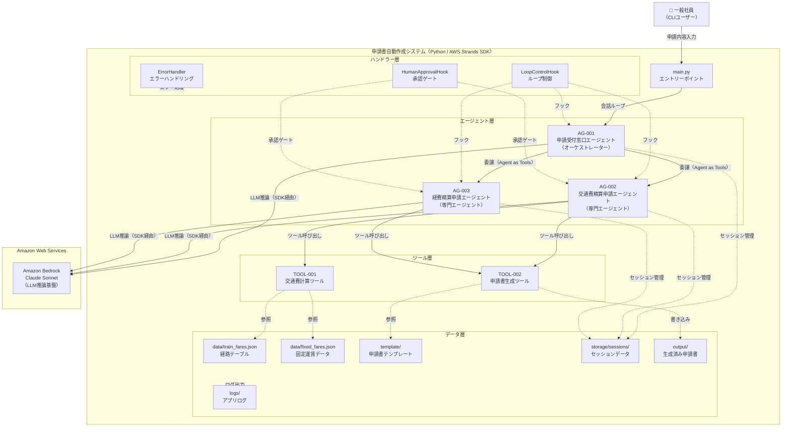

# システム構成図

> **参照元（業務要件定義資料）:**
> - 業務一覧.md（システム化対象業務の特定）
> - 業務プロセス定義.md（システム構成要素の役割・責務）
> - ユースケース定義.md（システム利用者・利用シーン）
> - 役割分担定義.md（システムと人の分担）

## システム全体構成図

## 凡例
- 実線矢印（→）：処理の委譲・呼び出し
- 破線矢印（-.->）：データの参照・取得・フック
