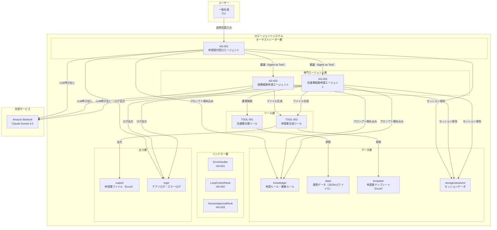

# システム基本情報

> **参照元（システム要件定義資料）:**
> - エージェント一覧.md（エージェント一覧・役割の特定）
> - 機能ツール一覧.md（ツール一覧・目的の特定）
> - システム構成図.md、システム構成図の構成要素一覧.md（システム構成図・アーキテクチャ概要）
> - 機能要件一覧.md（主な機能の特定）
> - データ一覧.md（データストアの特定）
> - 外部システム機能一覧.md（外部サービスの特定）

> 文書ID：`SYS-INFO-001`
> 文書名：システム基本情報
> 版数：`v1.0`
> 作成日：2026-05-17


---

## 1. システム概要

### 1.1 システム名称

**システム名**: 経費・交通費精算申請支援システム

**英語名**: Expense and Transportation Reimbursement Application Support System

**略称**: 精算申請支援システム

### 1.2 システムの目的・役割

**目的**:
- 社員が自然言語で申請内容を入力するだけで、申請種別を自動判断し適切な申請書（Excel）を自動生成する
- 領収書画像からの情報自動抽出・運賃データからの交通費自動計算により、申請業務の手作業を削減する
- Human-in-the-Loop による申請書生成前確認を設け、誤申請を防止する

**役割**:
- 申請者名（アプリ起動時に取得）と申請内容を受け付け、交通費精算申請・経費精算申請のいずれかを判断して専門エージェントへ振り分ける
- 領収書画像から経費情報を自動抽出し、経費区分を自動判断して経費精算申請書（Excel）を生成する
- 移動情報を対話収集し、運賃データから交通費を自動計算して交通費精算申請書（Excel）を生成する
- 申請期限チェック・上長承認チェックを自動実施し、申請ルールへの準拠を支援する


---

## 2. システム構成図

### 2.1 アーキテクチャ概要

本システムは、Agent as Tools パターンによる階層型マルチエージェントアーキテクチャを採用しています。

**階層構造**:
1. オーケストレーター層：申請受付窓口エージェント（AG-001）が申請種別を判断し専門エージェントへ委譲
2. 専門エージェント層：経費精算申請エージェント（AG-002）・交通費精算申請エージェント（AG-003）が業務処理を実行
3. ツール層：交通費計算ツール（TOOL-001）・申請書生成ツール（TOOL-002）が具体的な処理を担当


### 2.2 システム構成図（Mermaid）



### 2.3 コンポーネント間の依存関係

| 依存元 | 依存先 | 依存種別 |
|--------|--------|----------|
| AG-001 | AG-002, AG-003 | Agent as Tool（委譲） |
| AG-001 | Amazon Bedrock | LLM推論 |
| AG-001 | knowledge/ | プロンプト埋め込み |
| AG-001 | storage/sessions/ | セッション永続化 |
| AG-002 | TOOL-002 | ツール呼び出し |
| AG-002 | Amazon Bedrock | LLM推論 |
| AG-002 | knowledge/ | プロンプト埋め込み |
| AG-002 | storage/sessions/ | セッション永続化 |
| AG-003 | TOOL-001, TOOL-002 | ツール呼び出し |
| AG-003 | Amazon Bedrock | LLM推論 |
| AG-003 | knowledge/ | プロンプト埋め込み |
| AG-003 | storage/sessions/ | セッション永続化 |
| TOOL-001 | data/ | 運賃データ参照 |
| TOOL-002 | template/ | テンプレート参照 |
| TOOL-002 | output/ | ファイル出力 |

---

## 3. 技術スタック

### 3.1 開発環境

| 項目 | 内容 |
|-----|------|
| OS | Windows / Linux / macOS |
| 言語 | Python 3.10以上 |
| エントリーポイント | main.py |

### 3.2 LLM

| 項目 | 内容 |
|-----|------|
| LLMサービス | Amazon Bedrock |
| モデル | jp.anthropic.claude-sonnet-4-5-20250929-v1:0 |
| 認証 | AWS認証情報（アクセスキー / IAMロール） |
| リージョン | ap-northeast-1（設定可能） |


### 3.3 フレームワーク・ライブラリ

| 項目 | バージョン要件 | 用途 |
|-----|------|------|
| strands-agents | >= 0.1.0 | マルチエージェント・オーケストレーションフレームワーク |
| strands-agents-tools | >= 0.1.0 | エージェントツール |
| strands-agents-builder | >= 0.1.0 | エージェントビルダー |
| boto3 | >= 1.34.0 | Bedrockアクセス用AWS SDK |
| pydantic | >= 2.0.0 | データバリデーション |
| pydantic-settings | >= 2.0.0 | 設定管理 |
| openpyxl | >= 3.1.0 | 申請書Excelファイル生成 |
| Pillow | — | 領収書読み取り用画像処理（strands_tools の image_reader が内部使用） |
| python-dotenv | >= 1.0.0 | 環境変数管理 |
| python-dateutil | >= 2.8.2 | 日付解析 |
| strands-agents-evals | >= 0.1.0 | エージェント評価フレームワーク |
| pytest | >= 7.4.0 | テストフレームワーク |
| pytest-cov | >= 4.1.0 | カバレッジ計測 |

### 3.4 外部サービス

| サービス | 用途 |
|---------|------|
| Amazon Bedrock | LLM推論基盤（Claude Sonnet 4.5） |

---

## 4. ディレクトリ構造

```
expense_reimbursement_system/
├── main.py                        # アプリケーションエントリーポイント
├── pyproject.toml                 # Python依存パッケージ定義・テスト設定
├── README.md                      # プロジェクト概要・セットアップ手順
├── .env.template                  # 環境変数テンプレート
├── .gitignore                     # Git除外設定
├── config/                        # 設定管理
│   ├── __init__.py
│   ├── model_config.py            # LLMモデル設定
│   └── settings.py                # エージェント動作パラメータ
├── models/                        # データモデル定義
│   ├── __init__.py
│   └── data_models.py             # Pydanticモデル定義
├── agents/                        # エージェント定義
│   ├── __init__.py
│   ├── base_agent.py              # エージェント共通ユーティリティ
│   ├── orchestrator_agent.py      # 申請受付窓口エージェント（AG-001）
│   ├── expense_agent.py           # 経費精算申請エージェント（AG-002）
│   └── transport_agent.py         # 交通費精算申請エージェント（AG-003）
├── guardrails/
│   └── guardrails_cloudformation.yaml
├── handlers/                      # 横断的関心事
│   ├── __init__.py
│   ├── error_handler.py           # エラーハンドリング（HD-001）
│   ├── loop_control_hook.py       # ReActループ制御フック（HD-002）
│   └── human_approval_hook.py     # Human-in-the-Loop承認フック（HD-003）
├── tools/                         # エージェントが利用するツール関数
│   ├── __init__.py
│   ├── transport_tools.py         # 交通費計算ツール（TOOL-001）
│   └── output_generator.py        # 申請書生成ツール（TOOL-002）
├── prompt/                        # システムプロンプト
│   ├── __init__.py
│   ├── prompt_orchestrator.py     # 申請受付窓口エージェントのプロンプト
│   ├── prompt_expense.py          # 経費精算申請エージェントのプロンプト
│   └── prompt_transport.py        # 交通費精算申請エージェントのプロンプト
├── knowledge/                     # ビジネスルール・ポリシー
│   ├── __init__.py
│   ├── application_policies.py    # 申請ルール・申請種別判断ポリシー
│   └── expense_policies.py        # 経費・交通費業務ルールポリシー
├── session/                       # セッション管理
│   ├── __init__.py
│   └── session_manager.py         # FileSessionManagerラッパー（SM-001）
├── storage/                       # セッションデータ永続化先
│   └── sessions/
├── data/                          # 静的マスタデータ
│   ├── train_routes.json          # 電車経路・運賃データ（DATA-001）
│   └── fixed_fares.json           # 固定運賃データ（DATA-001-2）
├── template/                      # 申請書テンプレート
│   ├── 交通費精算申請書_template.xlsx
│   └── 経費精算申請書_template.xlsx
├── sample/                        # サンプルデータ（テスト・デモ用）
├── output/                        # 生成申請書ファイル出力先
├── logs/                          # ログファイル出力先
├── evals/                         # エージェント評価
│   ├── __init__.py
│   └── eval_reimbursement.py
├── docs/
└── tests/
    ├── unit/
    └── integration/
```


---

## 5. エージェント一覧

| エージェントID | エージェント名 | 役割 | 基本設計書 |
|--------------|--------------|------|-----------|
| AG-001 | 申請受付窓口エージェント | 申請内容受付、申請種別判断、専門エージェントへの振り分け | artifacts/04_basic-design/outputs/申請受付窓口エージェント基本設計.md |
| AG-002 | 経費精算申請エージェント | 領収書情報自動抽出、経費区分判断、不足情報収集、申請書生成 | artifacts/04_basic-design/outputs/経費精算申請エージェント基本設計.md |
| AG-003 | 交通費精算申請エージェント | 移動情報収集、駅名正規化、交通費自動計算、申請書生成 | artifacts/04_basic-design/outputs/交通費精算申請エージェント基本設計.md |

**詳細**: 各エージェントの詳細仕様は基本設計書を参照してください。

---

## 6. ツール一覧

| ツールID | ツール名 | 目的 | 基本設計書 |
|---------|---------|------|-----------|
| TOOL-001 | 交通費計算ツール | 運賃データを検索し、出発地・目的地・交通手段に基づいて交通費を計算する | artifacts/04_basic-design/outputs/交通費計算ツール基本設計.md |
| TOOL-002 | 申請書生成ツール | 申請書テンプレート（Excel）に収集した情報を入力し、申請書ファイルを生成・保存する | artifacts/04_basic-design/outputs/申請書生成ツール基本設計.md |

**詳細**: 各ツールの詳細仕様は基本設計書を参照してください。

---

## 7. 共通コンポーネント一覧

| コンポーネントID | コンポーネント名 | 目的 | 基本設計書 |
|----------------|----------------|------|-----------|
| HD-001 | ErrorHandler | エラー検知とユーザー向けメッセージ生成 | artifacts/04_basic-design/outputs/ErrorHandlerハンドラー基本設計.md |
| HD-002 | LoopControlHook | ReActループの回数制御・無限ループ防止 | artifacts/04_basic-design/outputs/LoopControlHookハンドラー基本設計.md |
| HD-003 | HumanApprovalHook | 申請書生成前の人間承認ゲート（OK/修正/キャンセル） | artifacts/04_basic-design/outputs/HumanApprovalHookハンドラー基本設計.md |
| SM-001 | SessionManager | FileSessionManagerラッパー、会話履歴の永続化・復元 | artifacts/04_basic-design/outputs/セッションマネージャ基本設計.md |
| DM-001 | InvocationState | エージェント間で共有する状態データ（辞書リテラル） | artifacts/04_basic-design/outputs/データモデル基本設計.md |

**詳細**: 各コンポーネントの詳細仕様は基本設計書を参照してください。

---

## 8. データストア

### 8.1 データファイル

| ファイル名 | 内容 | 形式 | パス |
|----------|------|------|------|
| train_routes.json | 電車経路・運賃マスタデータ（DATA-001） | JSON | data/train_routes.json |
| fixed_fares.json | バス・タクシー・飛行機の固定運賃マスタデータ（DATA-001-2） | JSON | data/fixed_fares.json |
| 交通費精算申請書_template.xlsx | 交通費精算申請書テンプレート（DATA-002） | Excel | template/交通費精算申請書_template.xlsx |
| 経費精算申請書_template.xlsx | 経費精算申請書テンプレート（DATA-003） | Excel | template/経費精算申請書_template.xlsx |
| application_policies.py | 申請ルール・ナレッジ（DATA-008） | Python（テキスト定数） | knowledge/application_policies.py |

### 8.2 出力ファイル

| ディレクトリ | 内容 | 形式 | パス |
|------------|------|------|------|
| output/ | 生成された申請書ファイル（DATA-004） | Excel | output/{申請種別}_{YYYYMMDD_HHMMSS}.xlsx |

### 8.3 ストレージ

| ディレクトリ | 内容 | 形式 | パス |
|------------|------|------|------|
| storage/sessions/ | セッションデータ（DATA-005） | JSON | storage/sessions/session_{セッションID}/ |
| logs/ | アプリケーションログ（DATA-006） | テキスト | logs/app.log |
| logs/ | エラーログ（DATA-007） | テキスト | logs/error.log |

---

## 9. ターゲットユーザー

**主要ユーザー**: 一般社員（経費・交通費の精算申請を行う社員）

**ユーザー特性**:
- CLIを通じて自然言語で申請内容を入力する
- 領収書画像を提供できる（経費精算申請の場合）
- 申請書の内容を確認・承認する（Human-in-the-Loop）

---

## 10. 主な機能

### 10.1 申請種別判断・案内機能

1. 申請内容の受付（FR-001）（※申請者名はアプリ起動時に取得）
2. 申請種別の自動判断（FR-002）
3. 申請種別・申請書・申請先の提示（FR-003）
4. 判断不能時の選択肢提示（FR-004）
5. 対象外申請のエスカレーション案内（FR-005）

### 10.2 経費精算申請書作成機能

1. 領収書画像からの経費情報自動抽出（FR-006）
2. 経費区分の自動判断（FR-007）
3. 不足情報の対話収集（FR-008）
4. 申請期限チェック（FR-012）
5. 上長承認チェック（FR-013）
6. 経費精算申請書の自動生成（FR-014）

### 10.3 交通費精算申請書作成機能

1. 移動情報の対話収集（FR-009）
2. 駅名正規化（FR-010）
3. 交通費の自動計算（FR-011）
4. 申請期限チェック（FR-012）
5. 上長承認チェック（FR-013）
6. 交通費精算申請書の自動生成（FR-015）

### 10.4 共通機能

1. ユーザー入力文字数制限（500文字）（FR-016）
2. 対話回数上限制御（30回）（FR-017）
3. 申請書生成前の人間承認ゲート（CAP-GOV-001）
4. エラーハンドリング（CAP-OPS-001）
5. ループ制御（CAP-OPS-002）

---

## 11. 技術的特徴

### 11.1 実行環境

- ローカルPC上でCLIを使用してエージェントと対話する
- データはPCの所定のフォルダにファイルで格納する（data/、storage/、output/、logs/）

### 11.2 Agent as Tools パターン

- オーケストレーター（AG-001）が専門エージェント（AG-002, AG-003）をツールとして呼び出す階層型構成
- invocation_state によりセッションID・申請者名（applicant_name）・申請日（application_date）をエージェント間で共有（LLMコンテキスト非消費）
- invocation_state は辞書リテラルで渡す（専用の Pydantic モデルは定義しない）

### 11.3 申請者情報の取得タイミング

- 申請者名はアプリケーション起動時（対話ループ開始前）に取得し、エージェントの初期化パラメータとして渡す
- 申請日はユーザーとの対話で収集するのではなく、システム日付（実行時の日付、YYYY-MM-DD形式）を自動取得する

### 11.4 Human-in-the-Loop

- 申請書生成前に HumanApprovalHook が発火し、ユーザーの OK/修正/キャンセルを確認
- ユーザーが OK を選択した場合のみ申請書ファイルを生成する

### 11.5 ナレッジ埋め込み方式

- 申請ルールはRAGを使用せず、システムプロンプトに直接埋め込む方式を採用
- knowledge/ 配下の Python ファイルにテキスト定数として管理

---

## 12. 制約事項

### 12.1 技術的制約

- CLIインターフェースのみ対応（Web/Slack等のUIは対象外）
- 申請書フォーマットは固定テンプレート（Excel）に依存
- 運賃データはローカルJSONファイルに依存（リアルタイム運賃検索API不使用）

### 12.2 業務的制約

- 対応申請種別は交通費精算申請・経費精算申請の2種類のみ
- 申請書の提出（申請システムへの登録）は本システムのスコープ外
- 申請期限は経費発生日から3ヶ月以内（BRL-08, BRL-09）
- 上長承認閾値：交通費10,000円超、経費5,000円超（BRL-10, BRL-11）

### 12.3 運用的制約

- ユーザー入力は500文字以内（FR-016）
- 対話回数は30回以内（FR-017）
- ReActループは最大10回（共通設定値）

---

## 13. 今後の拡張予定

### 13.1 機能拡張

- 申請種別の追加（出張申請、備品購入申請等）
- 申請システムへの自動登録連携

### 13.2 技術的拡張

- Web/Slack等のUIインターフェース対応
- 運賃データのリアルタイム取得API連携

---

## 14. 関連ドキュメント

| ドキュメント名 | パス |
|-------------|------|
| 基本設計書（エージェント） | artifacts/04_basic-design/outputs/ |
| 基本設計書（ツール） | artifacts/04_basic-design/outputs/ |
| 基本設計書（ハンドラー） | artifacts/04_basic-design/outputs/ |
| 基本設計書（セッションマネージャ） | artifacts/04_basic-design/outputs/ |
| 詳細設計書 | artifacts/05_detailed-design/outputs/ |
| システム要件定義書 | artifacts/02_system-requirements/outputs/ |

---

## 15. 変更履歴

| 日付 | 版 | 変更内容 | 担当 |
|-----|---|---------|------|
| 2026-05-17 | v1.0 | 初版作成 | - |

---
