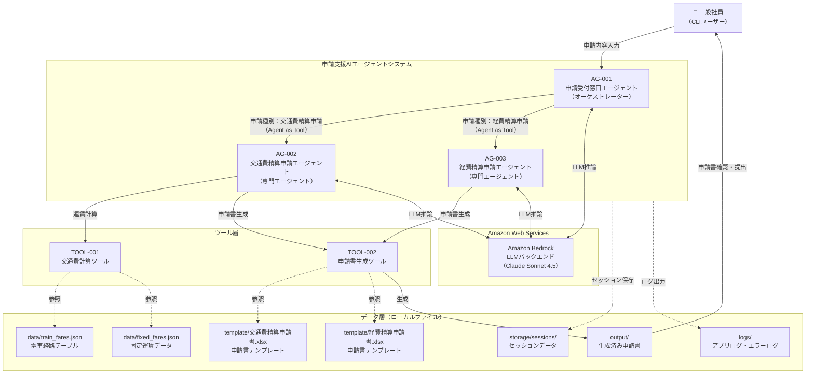

# システム基本情報

> **参照元（システム要件定義資料）:**
> - エージェント一覧.md（エージェント一覧・役割の特定）
> - 機能ツール一覧.md（ツール一覧・目的の特定）
> - システム構成図.md、システム構成図の構成要素一覧.md（システム構成図・アーキテクチャ概要）
> - 機能要件一覧.md（主な機能の特定）
> - データ一覧.md、テーブル一覧.md（データストアの特定）
> - 外部システム機能一覧.md（外部サービスの特定）

> 文書ID：`SYS-INFO-001`
> 文書名：システム基本情報
> 版数：`v1.0`
> 作成日：2026-05-21


---

## 1. システム概要

### 1.1 システム名称

**システム名**: 申請支援AIエージェントシステム

**英語名**: Application Support AI Agent System

**略称**: ASAAS

### 1.2 システムの目的・役割

**目的**:
- 社員の交通費精算申請・経費精算申請の手続きをAIエージェントが対話形式で支援し、申請書作成の工数を削減する
- 申請ルールの自動適用（期限チェック・上長承認要否判断）により、申請ミスを防止する
- 領収書画像からの情報自動抽出・運賃自動計算により、手入力の負担を軽減する

**役割**:
- ユーザーの自然文入力から申請種別（交通費精算申請・経費精算申請）を判断し、適切な専門エージェントへ委譲する
- 申請に必要な情報を対話形式で収集し、申請書テンプレートに反映してExcelファイルを生成する
- 申請ルール（期限・上長承認要否・業務目的）を自動チェックし、結果を根拠とともに提示する
- 生成した申請書の確認・修正を支援する（提出は人が実行）


---

## 2. システム構成図

### 2.1 アーキテクチャ概要

本システムは、階層型マルチエージェント構成（Agent as Tools パターン）を採用しています。

**階層構造**:
1. プレゼンテーション層：CLIインタフェース（main.py）
2. アプリケーション層：オーケストレーターエージェント（AG-001）＋専門エージェント（AG-002, AG-003）＋ツール（TOOL-001, TOOL-002）
3. データ層：ローカルファイルシステム（data/, template/, output/, storage/, logs/）
4. 外部連携層：Amazon Bedrock（LLMバックエンド）


### 2.2 システム構成図（Mermaid）



### 2.3 コンポーネント間の依存関係

| 送信元 | 送信先 | 連携方式 | 備考 |
|---|---|---|---|
| main.py | AG-001 | 標準入出力 | CLIユーザー入力の受け渡し |
| AG-001 | AG-002 | Agent as Tool（同期） | 交通費精算申請時 |
| AG-001 | AG-003 | Agent as Tool（同期） | 経費精算申請時 |
| AG-002 | TOOL-001 | Python関数呼び出し | 運賃計算 |
| AG-002, AG-003 | TOOL-002 | Python関数呼び出し | 申請書生成 |
| 全エージェント | Amazon Bedrock | HTTPS（AWS SDK） | LLM推論 |
| 全エージェント | storage/sessions/ | FileSessionManager | セッション永続化 |

---

## 3. 技術スタック

### 3.1 開発環境

| 項目 | 内容 |
|-----|------|
| OS | Windows / macOS / Linux |
| 実行環境 | ローカルPC上でCLIを使用してエージェントと対話する |
| 言語 | Python 3.10以上 |
| エントリーポイント | main.py |

### 3.2 LLM

| 項目 | 内容 |
|-----|------|
| LLMサービス | Amazon Bedrock |
| モデル | jp.anthropic.claude-sonnet-4-5-20250929-v1:0 |
| 認証 | AWS認証情報（IAM）、環境変数（AWS_ACCESS_KEY_ID, AWS_SECRET_ACCESS_KEY） |
| リージョン | ap-northeast-1（AWS_DEFAULT_REGION） |


### 3.3 フレームワーク・ライブラリ

| 項目 | 内容 | 用途 |
|-----|------|------|
| strands-agents >= 0.1.0 | AWS Strands SDK | マルチエージェント・オーケストレーション |
| strands-agents-tools >= 0.1.0 | AWS Strands Tools | エージェントツール |
| strands-agents-builder >= 0.1.0 | AWS Strands Builder | エージェントビルダー |
| strands-agents-evals >= 0.1.0 | AWS Strands Evals | エージェント評価フレームワーク |
| boto3 >= 1.34.0 | AWS SDK | Amazon Bedrockアクセス |
| pydantic >= 2.0.0 | Pydantic | データバリデーション |
| pydantic-settings >= 2.0.0 | pydantic-settings | 設定管理 |
| openpyxl >= 3.1.0 | openpyxl | Excelファイル生成 |
| python-dotenv >= 1.0.0 | python-dotenv | 環境変数管理 |
| python-dateutil >= 2.8.2 | python-dateutil | 日付解析 |
| Pillow | Pillow | 領収書画像処理（strands_tools image_reader の間接依存） |
| pytest >= 7.4.0 | pytest | テストフレームワーク |
| pytest-cov >= 4.1.0 | pytest-cov | カバレッジ計測 |

### 3.4 外部サービス

| サービス | 用途 |
|---------|------|
| Amazon Bedrock | LLMバックエンド（Claude Sonnet 4.5）。全エージェントの推論に使用 |

---

## 4. ディレクトリ構造

```
申請支援AIエージェントシステム/
├── main.py                        # アプリケーションエントリーポイント
├── pyproject.toml                 # Python依存パッケージ定義・テスト設定
├── README.md                      # プロジェクト概要・セットアップ手順
├── .env.template                  # 環境変数テンプレート
├── .gitignore                     # Git除外設定
├── config/                        # 設定管理
│   ├── __init__.py
│   ├── model_config.py            # LLMモデル設定（BedrockModel）
│   └── settings.py                # エージェント動作パラメータ（pydantic-settings）
├── models/                        # データモデル定義
│   ├── __init__.py
│   └── data_models.py             # Pydanticモデル定義（ツール入出力モデル・マスタデータモデル等）
├── agents/                        # エージェント定義
│   ├── __init__.py
│   ├── base_agent.py              # エージェント共通ユーティリティ
│   ├── orchestrator_agent.py      # AG-001: 申請受付窓口エージェント
│   ├── transportation_expense_agent.py  # AG-002: 交通費精算申請エージェント
│   └── general_expense_agent.py   # AG-003: 経費精算申請エージェント
├── guardrails/                    # ガードレール
│   └── guardrails_cloudformation.yaml
├── handlers/                      # 横断的関心事
│   ├── __init__.py
│   ├── error_handler.py           # エラーハンドリング
│   ├── loop_control_hook.py       # ReActループ制御フック
│   └── human_approval_hook.py     # Human-in-the-Loop承認フック
├── tools/                         # エージェントツール
│   ├── __init__.py
│   ├── transport_tools.py         # TOOL-001: 交通費計算ツール
│   └── output_generator.py        # TOOL-002: 申請書生成ツール
├── prompt/                        # システムプロンプト
│   ├── __init__.py
│   ├── prompt_orchestrator.py     # AG-001用プロンプト
│   ├── prompt_transportation_expense.py  # AG-002用プロンプト
│   └── prompt_general_expense.py  # AG-003用プロンプト
├── knowledge/                     # ビジネスルール・ポリシー
│   ├── __init__.py
│   ├── transport_policies.py      # 交通費精算申請ルール
│   └── expense_policies.py        # 経費精算申請ルール
├── session/                       # セッション管理
│   ├── __init__.py
│   └── session_manager.py         # FileSessionManagerラッパー
├── storage/                       # 実行時生成：セッションデータ
│   └── sessions/
├── data/                          # 静的データファイル
│   ├── train_fares.json           # 電車経路テーブル
│   └── fixed_fares.json           # 固定運賃データ
├── template/                      # 申請書テンプレート
│   ├── 交通費精算申請書_template.xlsx
│   └── 経費精算申請書_template.xlsx
├── output/                        # 実行時生成：生成済み申請書
├── logs/                          # 実行時生成：ログファイル
├── evals/                         # エージェント評価
│   ├── __init__.py
│   └── eval_{evaluation_name}.py
└── tests/                         # テストコード
    ├── unit/
    └── integration/
```


---

## 5. エージェント一覧

| エージェントID | エージェント名 | エージェントID（コード） | 役割 | 基本設計書 |
|--------------|--------------|----------------------|------|-----------|
| AG-001 | 申請受付窓口エージェント | orchestrator_agent | オーケストレーター。申請内容受付・申請種別判断・専門エージェントへの委譲・申請ルール案内 | artifacts/04_basic-design/outputs/申請受付窓口エージェント基本設計.md |
| AG-002 | 交通費精算申請エージェント | transportation_expense_agent | 専門エージェント。交通費情報収集・運賃計算・申請書生成 | artifacts/04_basic-design/outputs/交通費精算申請エージェント基本設計.md |
| AG-003 | 経費精算申請エージェント | general_expense_agent | 専門エージェント。領収書情報抽出・経費区分判断・申請書生成 | artifacts/04_basic-design/outputs/経費精算申請エージェント基本設計.md |

**詳細**: 各エージェントの詳細仕様は基本設計書を参照してください。

---

## 6. ツール一覧

| ツールID | ツール名 | 目的 | 基本設計書 |
|---------|---------|------|-----------|
| TOOL-001 | 交通費計算ツール | 移動情報から交通費を計算する（電車：経路テーブル検索、バス・タクシー・飛行機：固定運賃参照） | artifacts/04_basic-design/outputs/交通費計算ツール基本設計.md |
| TOOL-002 | 申請書生成ツール | 収集済み情報を申請書テンプレートに反映してExcelファイルを生成する | artifacts/04_basic-design/outputs/申請書生成ツール基本設計.md |

**詳細**: 各ツールの詳細仕様は基本設計書を参照してください。

---

## 7. 共通コンポーネント一覧

| コンポーネントID | コンポーネント名 | 目的 | 基本設計書 |
|----------------|----------------|------|-----------|
| HD-001 | ErrorHandler | エラーハンドリング・ユーザー向けメッセージ生成 | artifacts/04_basic-design/outputs/ErrorHandlerハンドラー基本設計.md |
| HD-002 | LoopControlHook | ReActループ上限制御（最大10回） | artifacts/04_basic-design/outputs/LoopControlHookハンドラー基本設計.md |
| HD-003 | HumanApprovalHook | 申請書生成前の人間承認フック | artifacts/04_basic-design/outputs/HumanApprovalHookハンドラー基本設計.md |
| SM-001 | SessionManager | FileSessionManagerラッパー。会話履歴の永続化 | artifacts/04_basic-design/outputs/セッションマネージャ基本設計.md |

**詳細**: 各コンポーネントの詳細仕様は基本設計書を参照してください。

---

## 8. データストア

### 8.1 データファイル

データはPCの所定のフォルダにファイルで格納する。

| ファイル名 | 内容 | 形式 | パス |
|----------|------|------|------|
| train_fares.json | 電車経路テーブル（出発地・目的地・運賃） | JSON | data/train_fares.json |
| fixed_fares.json | 固定運賃データ（バス・タクシー・飛行機） | JSON | data/fixed_fares.json |
| 交通費精算申請書_template.xlsx | 交通費精算申請書テンプレート | Excel（.xlsx） | template/交通費精算申請書_template.xlsx |
| 経費精算申請書_template.xlsx | 経費精算申請書テンプレート | Excel（.xlsx） | template/経費精算申請書_template.xlsx |

### 8.2 出力ファイル

| ディレクトリ | 内容 | 形式 | パス |
|------------|------|------|------|
| output/ | 生成済み申請書ファイル | Excel（.xlsx） | output/{申請種別}_{YYYYMMDD_HHMMSS}.xlsx |

### 8.3 ストレージ

| ディレクトリ | 内容 | 形式 | パス |
|------------|------|------|------|
| storage/sessions/ | セッションデータ（会話履歴・収集済み情報） | JSON | storage/sessions/session_{セッションID}/ |
| logs/ | アプリケーションログ（INFO以上）・エラーログ（ERROR以上） | テキスト（RotatingFileHandler: 10MB×5世代） | logs/app.log, logs/error.log |

---

## 9. ターゲットユーザー

**主要ユーザー**: 一般社員（交通費精算申請・経費精算申請を行う社員）

**ユーザー特性**:
- CLIを操作できる社員
- 申請ルールの詳細を把握していない場合がある
- 領収書画像をファイルとして提供できる

---

## 10. 主な機能

### 10.1 申請種別案内機能

1. 申請内容受付（FR-001）：ユーザーの自然文入力を受け付ける
2. 申請種別判断（FR-002）：交通費精算申請・経費精算申請のいずれかを判断する（判断不能時はユーザーに確認）
3. 申請先提示（FR-003）：申請種別に応じた申請書名・申請先を提示する
4. 申請ルール案内（FR-014）：申請ルール・方法が不明な利用者に案内する

### 10.2 交通費精算申請機能

1. 交通費情報収集（FR-004）：移動情報を一括収集する（駅名正規化含む）
2. 交通費自動計算（FR-005）：運賃データから交通費を自動計算する
3. 申請期限チェック（FR-008）：経費発生日から3ヶ月以内であることを確認する
4. 業務目的確認（FR-009）：業務目的の記載を確認する
5. 不足情報対話収集（FR-010）：必須項目の不足情報を対話で収集する
6. 上長承認要否判断（FR-011）：交通費10,000円超の場合に上長承認必要と判断する
7. 申請書自動生成（FR-012）：交通費精算申請書Excelファイルを生成する
8. 申請書確認・修正（FR-013）：修正指示に基づいて申請書を修正する

### 10.3 経費精算申請機能

1. 領収書情報抽出（FR-006）：領収書画像から経費情報を自動抽出する
2. 経費区分自動判断（FR-007）：品目から経費区分を自動判断する
3. 申請期限チェック（FR-008）：経費発生日から3ヶ月以内であることを確認する
4. 業務目的確認（FR-009）：業務目的の記載を確認する
5. 不足情報対話収集（FR-010）：必須項目の不足情報を対話で収集する
6. 上長承認要否判断（FR-011）：経費5,000円超の場合に上長承認必要と判断する
7. 申請書自動生成（FR-012）：経費精算申請書Excelファイルを生成する
8. 申請書確認・修正（FR-013）：修正指示に基づいて申請書を修正する

### 10.3 共通機能

1. ユーザー入力文字数制限（FR-015）：500文字超過時に再入力を促す
2. 対話回数上限制御（FR-016）：1セッション30回上限でセッション終了・再開案内
3. 会話状態管理（CAP-AG-001）：SlidingWindowConversationManagerによる会話履歴管理
4. エラー処理・エスカレーション（CAP-OPS-001）：エラー発生時の通知・問い合わせ案内

---

## 11. 技術的特徴

### 11.1 階層型マルチエージェント（Agent as Tools）

- AG-001がオーケストレーターとして機能し、AG-002・AG-003を@tool(context=True)でラップしたツールとして呼び出す
- invocation_stateにより、LLMのコンテキストウィンドウを消費せずにセッションID・申請者名・申請日を専門エージェントへ伝播する
- 会話履歴はSlidingWindowConversationManagerで管理し、ウィンドウサイズはエージェント種別により異なる（AG-001: 30、AG-002: 20、AG-003: 15）

### 11.2 セッション永続化

- FileSessionManagerによりセッションデータをローカルファイルシステムに保存する
- セッションIDはstorage/sessions/配下のサブディレクトリで管理する

### 11.3 ガードレール

- Amazon Bedrockガードレールによりコンテンツポリシーを制御する
- ガードレールID・バージョンは環境変数（GUARDRAIL_ID, GUARDRAIL_VERSION）で管理する

---

## 12. 制約事項

### 12.1 技術的制約

- Amazon Bedrockへのアクセスにはインターネット接続とAWS認証情報が必要
- Python 3.10以上が必要（型ヒント・match文対応）
- 申請書テンプレートはExcel形式（.xlsx）のみ対応

### 12.2 業務的制約

- 申請書の提出（申請の実行）はAIが行わず、必ず人が実行する（BRL-06）
- 申請期限は経費発生日から3ヶ月以内（BRL-09, BRL-15）
- 交通費10,000円超・経費5,000円超の場合は上長承認が必要（BRL-10, BRL-16）

### 12.3 運用的制約

- CLIインタフェースのみ対応（GUIなし）
- 1セッションの対話回数上限は30回（FR-016）
- ユーザー入力は500文字以内（FR-015）

---

## 13. 今後の拡張予定

### 13.1 機能拡張

- 申請種別の追加（Agent as Toolパターンにより新規専門エージェントを追加可能）
- GUIインタフェースの追加

### 13.2 技術的拡張

- RAGによる社内申請ルールの動的参照（現在はシステムプロンプト埋め込み方式）
- 外部申請システムとのAPI連携（現在はファイル生成のみ）

---

## 14. 関連ドキュメント

| ドキュメント名 | パス |
|-------------|------|
| 基本設計書（エージェント） | artifacts/04_basic-design/outputs/ |
| 基本設計書（ツール） | artifacts/04_basic-design/outputs/ |
| 基本設計書（ハンドラー） | artifacts/04_basic-design/outputs/ |
| 基本設計書（セッションマネージャ） | artifacts/04_basic-design/outputs/ |
| マルチエージェント連携設計 | artifacts/03_system-design/outputs/マルチエージェント連携設計.md |
| セッション管理方針 | artifacts/03_system-design/outputs/セッション管理方針.md |
| 例外処理方針 | artifacts/03_system-design/outputs/例外処理方針.md |
| 実行制御方針 | artifacts/03_system-design/outputs/実行制御方針.md |
| 共通設定方針 | artifacts/03_system-design/outputs/共通設定方針.md |
| バリデーション方針 | artifacts/03_system-design/outputs/バリデーション方針.md |

---

## 15. 変更履歴

| 日付 | 版 | 変更内容 | 担当 |
|-----|---|---------|------|
| 2026-05-21 | v1.0 | 初版作成 | - |

---
