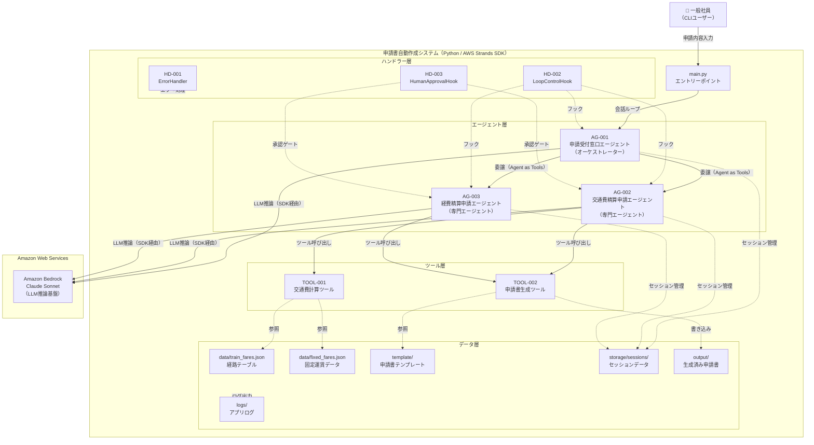

> **参照元（システム要件定義資料）:**
> - エージェント一覧.md（エージェント一覧・役割の特定）
> - 機能ツール一覧.md（ツール一覧・目的の特定）
> - システム構成図.md、システム構成図の構成要素一覧.md（システム構成図・アーキテクチャ概要）
> - 機能要件一覧.md（主な機能の特定）
> - データ一覧.md、テーブル一覧.md（データストアの特定）
> - 外部システム機能一覧.md（外部サービスの特定）

> 文書ID：`SYS-INFO-001`
> 文書名：システム基本情報
> 版数：`v1.0`
> 作成日：2026-05-10


---

## 1. システム概要

### 1.1 システム名称

**システム名**: 申請書自動作成システム

**英語名**: Automated Application Form Generation System

**略称**: AAFGS

### 1.2 システムの目的・役割

**目的**:
- 社員が申請内容をテキストで入力するだけで、交通費精算申請書・経費精算申請書を自動生成する
- 申請種別の自動判断・情報収集・計算・書類生成を一貫して自動化し、申請業務の工数を削減する
- 申請ルールの自動適用により、申請書の記載ミスや申請漏れを防止する

**役割**:
- CLIを通じた社員との対話による申請情報の収集
- 申請種別（交通費精算・経費精算）の自動判断と専門エージェントへの委譲
- 経路テーブル・固定運賃データを参照した交通費の自動計算
- Excelテンプレートへの書き込みによる申請書ファイルの生成・保存
- 申請書生成前のユーザー承認ゲートによるHuman-in-the-Loop制御


---

## 2. システム構成図

### 2.1 アーキテクチャ概要

本システムは、マルチエージェントアーキテクチャ（オーケストレーター＋専門エージェント）を採用しています。

**階層構造**:
1. エントリーポイント層：CLIインタフェース・ログ設定・会話ループ制御（main.py）
2. エージェント層：申請種別判断・情報収集・申請書生成（AG-001〜AG-003）
3. ツール層：交通費計算・申請書ファイル生成（TOOL-001〜TOOL-002）
4. ハンドラー層：エラー処理・ループ制御・承認ゲート（ErrorHandler, LoopControlHook, HumanApprovalHook）
5. データ層：マスタデータ・テンプレート・生成済み申請書・セッションデータ・ログ


### 2.2 システム構成図（Mermaid）



### 2.3 コンポーネント間の依存関係

| 送信元 | 送信先 | 連携方式 | 備考 |
|---|---|---|---|
| AG-001 | AG-002 | Agent as Tools（同期） | 交通費精算申請委譲 |
| AG-001 | AG-003 | Agent as Tools（同期） | 経費精算申請委譲 |
| AG-002 | TOOL-001 | 関数呼び出し | 交通費計算 |
| AG-002, AG-003 | TOOL-002 | 関数呼び出し | 申請書生成 |
| AG-001〜AG-003 | Amazon Bedrock | HTTPS（SDK） | LLM推論 |
| HD-002 | AG-001〜AG-003 | フック | ループ制御 |
| HD-003 | AG-002, AG-003 | フック | 承認ゲート |

---

## 3. 技術スタック

### 3.1 開発環境

| 項目 | 内容 |
|-----|------|
| OS | Windows / macOS / Linux |
| 言語 | Python 3.10以上 |
| 実行形態 | ローカルPC上でCLIを使用してエージェントと対話する |

### 3.2 LLM

| 項目 | 内容 |
|-----|------|
| LLMサービス | Amazon Bedrock |
| モデル | jp.anthropic.claude-sonnet-4-5-20250929-v1:0 |
| 認証 | AWS IAM（AWS_ACCESS_KEY_ID / AWS_SECRET_ACCESS_KEY） |
| リージョン | ap-northeast-1 |


### 3.3 フレームワーク・ライブラリ

| 項目 | 内容 | 用途 |
|-----|------|------|
| strands-agents | >= 0.1.0 | AIエージェントフレームワーク |
| strands-agents-tools | >= 0.1.0 | エージェントツール |
| strands-agents-builder | >= 0.1.0 | エージェントビルダー |
| strands-agents-evals | >= 0.1.0 | エージェント評価フレームワーク |
| boto3 | >= 1.34.0 | Amazon Bedrock接続 |
| pydantic | >= 2.0.0 | データバリデーション |
| pydantic-settings | >= 2.0.0 | 設定管理 |
| pytest | >= 7.4.0 | テストフレームワーク |
| pytest-cov | >= 4.1.0 | カバレッジ計測 |
| python-dotenv | >= 1.0.0 | 環境変数管理 |
| python-dateutil | >= 2.8.2 | 日付処理 |
| openpyxl | >= 3.1.0 | Excel申請書生成 |
| logging | 標準ライブラリ | ログ出力 |

### 3.4 外部サービス

| サービス | 用途 |
|---------|------|
| Amazon Bedrock | LLM推論基盤（Claude Sonnet） |

---

## 4. ディレクトリ構造

```
申請書自動作成システム/
├── main.py                        # アプリケーションエントリーポイント
├── pyproject.toml                 # Python依存パッケージ定義・テスト設定
├── README.md                      # プロジェクト概要・セットアップ手順
├── .env.template                  # 環境変数テンプレート
├── .gitignore                     # Git除外設定
├── config/                        # 設定管理
│   ├── __init__.py
│   ├── model_config.py            # LLMモデル設定
│   └── settings.py                # エージェント動作パラメータ
├── models/                        # データモデル定義
│   ├── __init__.py
│   └── data_models.py             # Pydanticモデル定義
├── agents/                        # エージェント定義
│   ├── __init__.py
│   ├── base_agent.py              # エージェント共通ユーティリティ
│   ├── orchestrator_agent.py      # AG-001 申請受付窓口エージェント
│   ├── transport_agent.py         # AG-002 交通費精算申請エージェント
│   └── expense_agent.py           # AG-003 経費精算申請エージェント
├── guardrails/
│   └── guardrails_cloudformation.yaml
├── handlers/                      # 横断的関心事
│   ├── __init__.py
│   ├── error_handler.py           # HD-001 エラーハンドリング
│   ├── loop_control_hook.py       # HD-002 ReActループ制御フック
│   └── human_approval_hook.py     # HD-003 Human-in-the-Loop承認フック
├── tools/                         # エージェントツール
│   ├── __init__.py
│   ├── transport_tools.py         # TOOL-001 交通費計算ツール
│   └── output_generator.py        # TOOL-002 申請書生成ツール
├── prompt/                        # システムプロンプト
│   ├── __init__.py
│   ├── prompt_orchestrator.py
│   ├── prompt_transport.py
│   └── prompt_expense.py
├── knowledge/                     # ビジネスルール・ポリシー
│   ├── __init__.py
│   ├── transport_policies.py      # 交通費精算申請ルール
│   └── expense_policies.py        # 経費精算申請ルール
├── session/                       # セッション管理
│   ├── __init__.py
│   └── session_manager.py         # SM-001 FileSessionManagerラッパー
├── storage/                       # セッションデータ永続化先（実行時生成）
│   └── sessions/
├── data/                          # 静的マスタデータ
│   ├── train_fares.json           # 経路テーブル（DATA-001）
│   └── fixed_fares.json           # 固定運賃データ（DATA-002）
├── template/                      # 申請書テンプレート
│   ├── 交通費申請書_template.xlsx  # DATA-003
│   └── 経費精算申請書_template.xlsx # DATA-004
├── sample/                        # サンプルデータ
├── output/                        # 生成済み申請書（実行時生成）
├── logs/                          # ログファイル（実行時生成）
├── evals/                         # エージェント評価
│   ├── __init__.py
│   └── eval_{evaluation_name}.py
├── docs/
└── tests/
    ├── unit/
    └── integration/
```


---

## 5. エージェント一覧

| エージェントID | エージェント名 | 役割 | 基本設計書 |
|--------------|--------------|------|-----------|
| AG-001 | 申請受付窓口エージェント | オーケストレーター。申請種別を自動判断し専門エージェントへ委譲する | artifacts/04_basic-design/outputs/申請受付窓口エージェント基本設計.md |
| AG-002 | 交通費精算申請エージェント | 移動情報収集・交通費計算・申請書生成を担う専門エージェント | artifacts/04_basic-design/outputs/交通費精算申請エージェント基本設計.md |
| AG-003 | 経費精算申請エージェント | 経費情報収集・経費区分判断・申請書生成を担う専門エージェント | artifacts/04_basic-design/outputs/経費精算申請エージェント基本設計.md |

**詳細**: 各エージェントの詳細仕様は基本設計書を参照してください。

---

## 6. ツール一覧

| ツールID | ツール名 | 目的 | 基本設計書 |
|---------|---------|------|-----------|
| TOOL-001 | 交通費計算ツール | 経路テーブル・固定運賃データを参照して交通費を計算する | artifacts/04_basic-design/outputs/交通費計算ツール基本設計.md |
| TOOL-002 | 申請書生成ツール | 申請情報をExcelテンプレートに書き込み申請書ファイルを生成する | artifacts/04_basic-design/outputs/申請書生成ツール基本設計.md |

**詳細**: 各ツールの詳細仕様は基本設計書を参照してください。

---

## 7. 共通コンポーネント一覧

| コンポーネントID | コンポーネント名 | 目的 | 基本設計書 |
|----------------|----------------|------|-----------|
| HD-001 | ErrorHandler | エラーハンドリング・ユーザー向けメッセージ生成 | artifacts/04_basic-design/outputs/ErrorHandler基本設計.md |
| HD-002 | LoopControlHook | ReActループ上限制御 | artifacts/04_basic-design/outputs/LoopControlHook基本設計.md |
| HD-003 | HumanApprovalHook | 申請書生成前の承認ゲート | artifacts/04_basic-design/outputs/HumanApprovalHook基本設計.md |
| SM-001 | SessionManager | FileSessionManagerラッパー・セッション永続化 | artifacts/04_basic-design/outputs/セッションマネージャ基本設計.md |
| DM-001 | DataModels | Pydanticデータモデル定義（InvocationState等） | artifacts/04_basic-design/outputs/データモデル基本設計.md |

**詳細**: 各コンポーネントの詳細仕様は基本設計書を参照してください。

---

## 8. データストア

### 8.1 データファイル

| ファイル名 | 内容 | 形式 | パス |
|----------|------|------|------|
| train_fares.json | 電車の経路テーブル（出発地・目的地・運賃） | JSON | data/train_fares.json |
| fixed_fares.json | バス・タクシー・飛行機の固定運賃データ | JSON | data/fixed_fares.json |
| 交通費申請書_template.xlsx | 交通費精算申請書Excelテンプレート | Excel（.xlsx） | template/交通費申請書_template.xlsx |
| 経費精算申請書_template.xlsx | 経費精算申請書Excelテンプレート | Excel（.xlsx） | template/経費精算申請書_template.xlsx |

### 8.2 出力ファイル

| ディレクトリ | 内容 | 形式 | パス |
|------------|------|------|------|
| output/ | 生成済み交通費精算申請書・経費精算申請書 | Excel（.xlsx） | output/{申請種別}_{YYYYMMDD_HHMMSS}.xlsx |

### 8.3 ストレージ

| ディレクトリ | 内容 | 形式 | パス |
|------------|------|------|------|
| storage/sessions/ | エージェント会話セッションデータ | JSON（Strands FileSessionManager） | storage/sessions/session_{セッションID}/ |
| logs/ | アプリケーションログ（INFO以上）・エラーログ（ERROR以上） | テキスト（RotatingFileHandler） | logs/app.log, logs/error.log |

---

## 9. ターゲットユーザー

**主要ユーザー**: 一般社員（交通費精算・経費精算の申請者）

**ユーザー特性**:
- CLIを操作できる社員
- 申請書の手動作成に工数がかかっている社員
- 申請ルールの把握が不十分な社員

---

## 10. 主な機能

### 10.1 申請種別判断・案内機能

1. 申請内容テキストからの申請種別自動判断（FR-001）
2. 申請書名・申請先の提示（FR-002）
3. 専門エージェントへの委譲（FR-003）

### 10.2 交通費精算申請機能

1. 移動情報の対話収集（FR-004）
2. 経路テーブル・固定運賃データを参照した交通費自動計算（FR-005）
3. 申請期限チェック・上長承認要否通知（FR-006, FR-007）
4. 申請書ドラフト提示・承認確認（FR-008）
5. 交通費精算申請書生成（FR-009）
6. 申請書検証（FR-010）

### 10.3 経費精算申請機能

1. 経費情報の対話収集（FR-011）
2. 経費区分自動判断・ユーザー確認（FR-012）
3. 申請期限チェック・上長承認要否通知（FR-013, FR-014）
4. 申請書ドラフト提示・承認確認（FR-015）
5. 経費精算申請書生成（FR-016）
6. 申請書検証（FR-017）

### 10.4 共通機能

1. ユーザー入力文字数制限（500文字）（FR-018）
2. 対話回数上限制御（10回）（FR-019）
3. セッション管理・会話履歴保持
4. エラーハンドリング・ログ出力

---

## 11. 技術的特徴

### 11.1 マルチエージェント（Agent as Tools）パターン

- AG-001がオーケストレーターとして申請種別を判断し、AG-002/AG-003を専門ツールとして呼び出す
- invocation_stateにより申請者名（applicant_name）・申請日（application_date）・セッションID（session_id）をLLMコンテキスト外で安全に受け渡す
- 申請者名はアプリケーション起動時（対話ループ開始前）に取得し、申請日はシステム日付（実行時の日付、YYYY-MM-DD形式）を自動取得する

### 11.2 Human-in-the-Loop制御

- HumanApprovalHookにより申請書生成ツール（TOOL-002）呼び出し前にユーザー承認を必須化
- LoopControlHookによりReActループ上限（10回）到達時に安全停止

### 11.3 ファイルベースセッション永続化

- Strands FileSessionManagerによりセッションデータをローカルファイルに永続化
- セッション情報が存在する場合はresumeによる会話継続が可能

---

## 12. 制約事項

### 12.1 技術的制約

- Amazon BedrockはAWSリージョン ap-northeast-1 で使用する
- ローカルPC上でCLIを使用してエージェントと対話するスタンドアロン実行（Webサーバー・RDB不使用）
- データはPCの所定のフォルダにファイルで格納する（JSONファイル・Excelファイル・テキストログ）

### 12.2 業務的制約

- ユーザー入力文字数上限：500文字
- 対話回数上限：10回（全エージェント共通）
- 申請書生成はユーザーの明示的なOK選択後のみ実行可能
- 経費区分の自動確定禁止（必ずユーザー確認が必要）

### 12.3 運用的制約

- AWS認証情報は .env ファイルで管理し、リポジトリにコミットしない
- ガードレールID・バージョンは設定ファイルで管理する

---

## 13. 今後の拡張予定

### 13.1 機能拡張

- 新しい申請種別（出張申請・備品購入申請等）への対応（専門エージェント追加）
- 申請書の提出先システムとの連携

### 13.2 技術的拡張

- WebUIへの対応（CLIからの移行）
- クラウドストレージへのセッションデータ移行

---

## 14. 関連ドキュメント

| ドキュメント名 | パス |
|-------------|------|
| エージェント基本設計書 | artifacts/04_basic-design/outputs/ |
| ツール基本設計書 | artifacts/04_basic-design/outputs/ |
| ハンドラー基本設計書 | artifacts/04_basic-design/outputs/ |
| セッションマネージャ基本設計書 | artifacts/04_basic-design/outputs/セッションマネージャ基本設計.md |
| データモデル基本設計書 | artifacts/04_basic-design/outputs/データモデル基本設計.md |
| マルチエージェント連携設計 | artifacts/03_system-design/outputs/マルチエージェント連携設計.md |
| セッション管理方針 | artifacts/03_system-design/outputs/セッション管理方針.md |
| 例外処理方針 | artifacts/03_system-design/outputs/例外処理方針.md |
| 実行制御方針 | artifacts/03_system-design/outputs/実行制御方針.md |
| 共通設定方針 | artifacts/03_system-design/outputs/共通設定方針.md |
| バリデーション方針 | artifacts/03_system-design/outputs/バリデーション方針.md |

---

## 15. 変更履歴

| 日付 | 版 | 変更内容 | 担当 |
|-----|---|---------|------|
| 2026-05-10 | v1.0 | 初版作成 | - |

---
