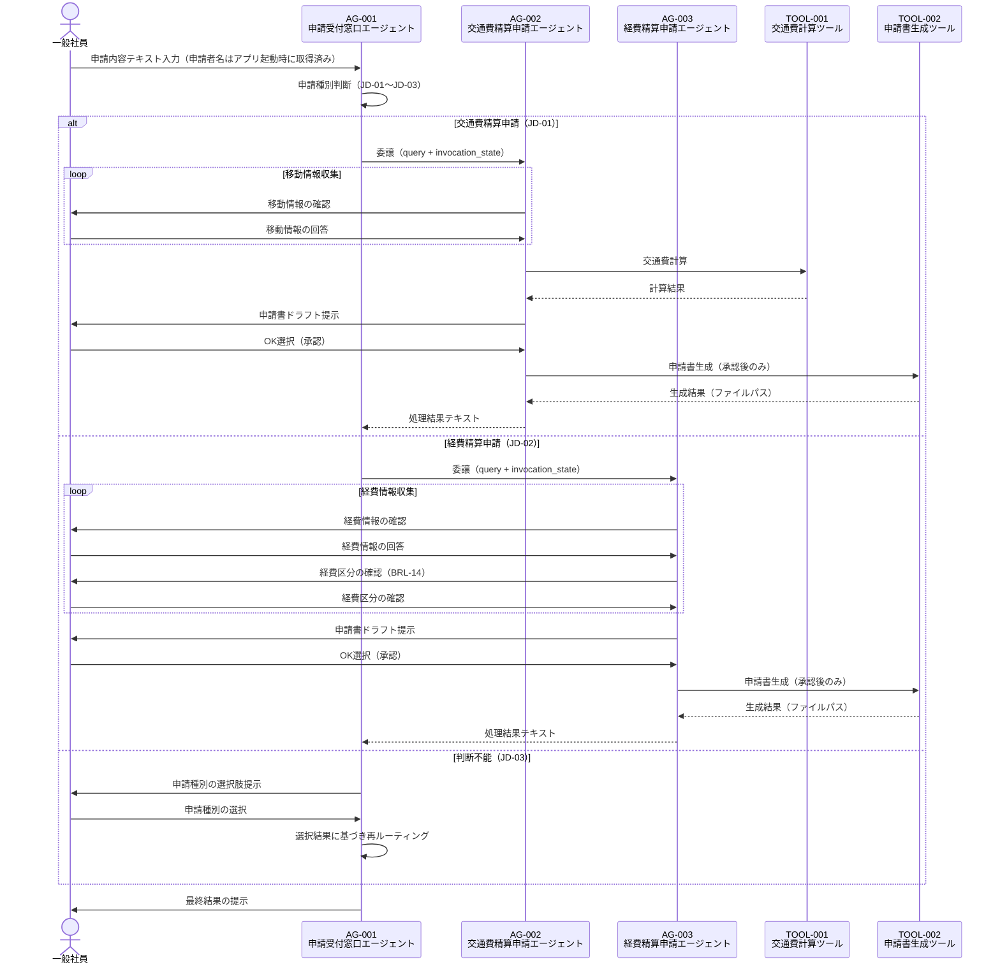

# マルチエージェント連携設計書

> **参照元（システム要件定義資料）:**
> - エージェント一覧.md（エージェント役割・責務・自律度の特定）
> - エージェント間連携定義.md（連携方式・連携ポリシー・連携フロー）
> - 会話フロー一覧.md（連携が発生する会話フロー・タイミング）
> - 機能要件一覧.md（連携が必要な機能の特定）
> - 自律度・権限定義.md（エージェントの権限境界・判断権限）
> - システム基本情報.md（エージェント構成・コンポーネント依存関係）

> 文書ID：`SYS-MA-001`
> 文書名：マルチエージェント連携設計書
> 版数：`v1.0`
> 作成日：2026-05-10


---

## 1. 目的・適用範囲

### 1.1 目的

本設計書では、以下を定義します:
- エージェント間の委譲方式（Agent as Tools）
- ルーティング方式（申請種別に基づく判断基準）
- 通信契約（エージェント間メッセージ・invocation_state）
- 協調パターン（司令塔型）

本設計書では、以下は定義しません（別紙参照）:
- 詳細な例外処理（例外処理方針参照）
- セッション保持（セッション管理方針参照）
- 権限設計（自律度・権限定義参照）

### 1.2 適用範囲

**対象システム**: 申請書自動作成システム

**対象エージェント**:
- AG-001：申請受付窓口エージェント（オーケストレーター）
- AG-002：交通費精算申請エージェント（専門エージェント）
- AG-003：経費精算申請エージェント（専門エージェント）


---

## 2. 用語・前提

### 2.1 用語

| 用語 | 定義 |
|-----|------|
| オーケストレーション | AG-001が申請種別を判断し、適切な専門エージェントへ処理を委譲する制御方式 |
| ルーティング | 申請内容テキストから申請種別を判断し、対応する専門エージェントを選択すること |
| 委譲（Delegation） | AG-001が専門エージェント（AG-002/AG-003）をAgent as Toolsとして呼び出し、タスクを丸投げして結果を受け取ること |
| エージェント間メッセージ | AG-001から専門エージェントへ渡すクエリテキストおよびinvocation_state |
| セッションID | 各エージェントのセッションを一意に識別するID。専門エージェントのFileSessionManager生成に使用する |
| invocation_state | ToolContext経由でツール関数内からのみ参照できる辞書。LLMのコンテキストウィンドウを消費しない |
| Agent as Tools | 専門エージェントを@tool(context=True)でラップし、オーケストレーターのツールとして呼び出すパターン |

### 2.2 前提・制約

**同期/非同期の前提**:
- 全エージェント間連携は同期（リクエスト/レスポンス）で実行する

**外部I/Fの制約**:
- Amazon Bedrock（LLM推論）はStrands SDKが内部管理するため個別実装不要

**運用・監査上の制約**:
- 申請書生成（TOOL-002）はユーザーの明示的なOK選択後のみ実行可能（APR-001）
- 循環呼び出し禁止。最大委譲深度：1（AG-001 → AG-002/AG-003）

---

## 3. 連携アーキテクチャ（協調パターン）

### 3.1 採用する協調パターン

採用パターン：**司令塔（Supervisor/Orchestrator）型**


### 3.2 採用理由・非採用理由

**採用理由**:
- 申請種別の判断はAG-001が一元管理することで、ルーティングロジックを集約できる
- 専門エージェントはそれぞれ独立した業務ドメイン（交通費・経費）を担当するため、責務分離が明確
- Agent as Toolsパターンにより、専門エージェントの追加・変更がオーケストレーターの変更を最小化できる

**非採用理由**:
- ピア（Peer-to-Peer）型：エージェント間の直接通信が発生し、ルーティングロジックが分散するため不採用
- 階層（Manager-Worker）型：本システムは2階層（AG-001 → AG-002/AG-003）のみで十分なため不採用

### 3.3 連携の基本原則（設計ルール）

**単一責任**:
- AG-001は申請種別判断・委譲のみを担当し、申請書生成は行わない
- AG-002は交通費精算申請のみ、AG-003は経費精算申請のみを担当する

**委譲の粒度**:
- 委譲単位は「申請1件分の処理全体」とする（情報収集〜申請書生成まで一括委譲）

**"判断"と"実行"の分離**:
- AG-001は申請種別の判断（提案）のみを行い、申請書生成（実行）は専門エージェントに委譲する
- 申請書生成（TOOL-002）はユーザー承認後のみ実行する（HumanApprovalHookで制御）

**冪等性・再実行可能性**:
- 申請書生成ツール（TOOL-002）は同一入力で複数回実行した場合、タイムスタンプ付きファイル名で別ファイルを生成する

---

## 4. エージェント連携構成

### 4.1 エージェント一覧（連携観点）

| AG-ID | エージェント名 | 役割（連携観点） | 入力 | 出力 | 依存先 |
|-------|--------------|----------------|------|------|-------|
| AG-001 | 申請受付窓口エージェント | オーケストレーター。申請種別を判断し専門エージェントへ委譲する | 申請内容テキスト・申請者名 | 申請種別判断結果・委譲結果 | AG-002（TOOL化）, AG-003（TOOL化） |
| AG-002 | 交通費精算申請エージェント | 専門エージェント。移動情報収集・交通費計算・申請書生成を担う | AG-001からの委譲クエリ・invocation_state | 交通費精算申請書生成結果 | TOOL-001, TOOL-002 |
| AG-003 | 経費精算申請エージェント | 専門エージェント。経費情報収集・経費区分判断・申請書生成を担う | AG-001からの委譲クエリ・invocation_state | 経費精算申請書生成結果 | TOOL-002 |


### 4.2 役割分類と責務

**司令塔（Orchestrator）**:
- **責務**: 申請者名の収集・申請内容テキストの受付・申請種別の自動判断（JD-01〜JD-03）・専門エージェントへの委譲・委譲結果のユーザーへの提示
- **権限境界**: 申請書生成ツール（TOOL-002）の呼び出し不可。最大自律度Lv2

**専門エージェント**:
- **責務**: 委譲されたタスク（申請情報収集・計算・申請書生成）を完結させ結果を返す
- **依頼受付条件**: AG-001から申請種別が確定した状態で委譲されること。invocation_stateにapplicant_name・application_date・session_idが含まれること


---

## 5. ルーティング設計（どのエージェントへ回すか）

### 5.1 ルーティング方式

採用方式：**ルールベース（判断基準表）＋ LLMによる意図分類（ハイブリッド）**

- 申請内容テキストをLLMが解釈し、JD-01〜JD-03の判断基準に従って申請種別を判定する
- 判断不能時はユーザーに選択肢を提示する（フォールバック）

### 5.2 ルーティング判断基準表

| 条件（入力/状態） | ルーティング先 | 例 | 備考 |
|----------------|--------------|---|------|
| 申請内容が交通費・移動・電車・バス・タクシー・飛行機に関連する（JD-01） | AG-002 | 「先週の出張の交通費を申請したい」 | LNK-001 |
| 申請内容が経費・購入・備品・宿泊・資格に関連する（JD-02） | AG-003 | 「事務用品を購入したので経費申請したい」 | LNK-002 |
| 申請内容から申請種別が判断できない（JD-03） | ユーザーへ選択肢提示 | 「申請したい」のみ | フォールバック |


### 5.3 フォールバック方針

**判断不能時の扱い**:
- 申請種別が判断できない場合（JD-03）、「交通費精算申請」「経費精算申請」の選択肢をユーザーに提示し選択を求める

**低信頼時の扱い**:
- LLMが申請種別を判断した場合でも、ユーザーに確認を求めることは行わない（自動判断・自動委譲）
- ただし判断不能（JD-03）の場合のみユーザー選択を求める

---

## 6. 委譲・協調設計（いつ・どう委譲するか）

### 6.1 タスク分割ルール

**分割単位**: 申請種別単位（交通費精算申請1件 または 経費精算申請1件）

**分割の上限**:
- 並列数: 1（同時に1つの専門エージェントのみ呼び出す）
- 深さ: 1（AG-001 → AG-002/AG-003。専門エージェントからの再委譲は禁止）

**依頼テンプレ（エージェント間メッセージ）**:
```
AgentMessage(
  query: AG-001からの指示テキスト（申請内容を含む）,
  invocation_state: {
    applicant_name: 申請者名,
    application_date: 申請日,
    session_id: セッションID
  }
)
```
> ※ エージェント間メッセージで渡す業務コンテキストは上記項目のみとする
> ※ 上記以外の情報はエージェント間メッセージに含めない
> ※ 申請者名はアプリケーション起動時（対話ループ開始前）に取得する。申請日はシステム日付（実行時の日付、YYYY-MM-DD形式）を自動取得する


### 6.2 委譲条件（Delegation Policy）

| 条件 | 委譲先候補 | 優先順位 | 禁止条件 |
|-----|----------|---------|---------|
| 申請種別が「交通費精算申請」と確定（JD-01） | AG-002 | 1 | AG-003への同時委譲禁止 |
| 申請種別が「経費精算申請」と確定（JD-02） | AG-003 | 1 | AG-002への同時委譲禁止 |
| ユーザーが「交通費精算申請」を選択（JD-03フォールバック） | AG-002 | 1 | — |
| ユーザーが「経費精算申請」を選択（JD-03フォールバック） | AG-003 | 1 | — |

### 6.3 並列・逐次の決定ルール

**並列可能条件**: なし（本システムでは並列委譲は行わない）

**逐次必須条件**: 常に逐次。申請種別確定後に1つの専門エージェントへ委譲する

**排他対象**:
- AG-002とAG-003の同時呼び出し禁止
- 専門エージェントからの再委譲禁止

---

## 7. エージェント間通信設計（契約）

### 7.1 メッセージ種別

| 種別 | 目的 | 必須フィールド |
|-----|------|--------------|
| エージェント間メッセージ | AG-001から専門エージェントへのタスク委譲 | query, invocation_state（applicant_name, application_date, session_id） |


### 7.2 エージェント間メッセージスキーマ

**オーケストレーター（AG-001） → 専門エージェント（AG-002/AG-003）**:
```
{
  query: "申請内容を含む指示テキスト",
  invocation_state: {
    applicant_name: "申請者名",
    application_date: "申請日（YYYY-MM-DD）",
    session_id: "セッションID"
  }
}
```

**専門エージェント（AG-002/AG-003） → 子エージェントへの委譲**:
```
（本システムでは専門エージェントからの再委譲は行わない）
```
> ※ 具体的な型・バリデーション制約はデータモデル基本設計書で定義する（本設計書はフィールド構成のみ確定する）


### 7.3 共有コンテキスト設計（連携観点）

**共有する情報**:
- applicant_name（申請者名）：アプリケーション起動時（対話ループ開始前）に取得し、invocation_state経由で専門エージェントへ伝播
- application_date（申請日）：システム日付（実行時の日付、YYYY-MM-DD形式）を自動取得し、invocation_state経由で専門エージェントへ伝播
- session_id（セッションID）：AG-001で生成し、invocation_state経由で専門エージェントへ伝播（専門エージェントのFileSessionManager生成に使用）

**共有しない情報**:
- 会話履歴（各エージェントのSlidingWindowConversationManagerが独立管理）
- 申請書の詳細内容（専門エージェント内で完結）

**参照方法**:
- invocation_stateはtool_context.invocation_state.get("key")で安全に参照する

**更新ルール**:
- invocation_stateはリクエスト単位で有効。セッションをまたがない
- 専門エージェントへ渡す際はsession_idを除いたapplicant_name・application_dateのみを伝播する
- invocation_stateは辞書リテラルで渡す。専用のPydanticモデルは定義しない


---

## 8. 状態引き継ぎ（連携観点）

### 8.1 必須の状態情報（連携に必要）

| 状態キー | 用途 | 更新主体 | 保存期間 |
|---------|------|---------|---------|
| applicant_name | 申請者名。専門エージェントが申請書生成時に使用 | アプリ起動時に取得（対話ループ開始前） | セッション中 |
| application_date | 申請日。専門エージェントが申請書生成時に使用 | システム日付を自動取得（YYYY-MM-DD） | セッション中 |
| session_id | 専門エージェントのFileSessionManager生成に使用 | AG-001（生成） | セッション中 |


### 8.2 再開（Resume）設計

**中断からの再開条件**:
- セッションIDに対応するセッションファイルが storage/sessions/ に存在する場合、FileSessionManagerがセッションを復元する

**再開時の優先順位**:
- 既存セッションが存在する場合は会話履歴を引き継いで再開する
- セッションファイルが存在しない場合は新規セッションとして開始する

---

## 9. 連携フロー定義（ユースケース別）

### 9.1 ユースケース一覧

| UC-ID | 名称 | 主担当（起点） | 参加エージェント | 備考 |
|-------|-----|--------------|----------------|------|
| UC-01 | 申請種別判断・案内 | AG-001 | AG-001 | CF-001に対応 |
| UC-02 | 交通費精算申請書作成 | AG-001 → AG-002 | AG-001, AG-002 | CF-002に対応 |
| UC-03 | 経費精算申請書作成 | AG-001 → AG-003 | AG-001, AG-003 | CF-003に対応 |

### 9.2 連携フロー（Mermaid）



### 9.3 連携フロー（例外系の分岐ポイント）

**失敗しうるステップ**:
1. 申請種別判断（JD-03：判断不能）
2. 交通費計算（TOOL-001：経路未登録）
3. 申請書生成（TOOL-002：テンプレート不存在・ファイル書き込みエラー）
4. ループ上限到達（LoopControlHook：10回超過）
5. LLM呼び出し失敗（ModelRetryStrategy：最大6回リトライ後失敗）

**失敗時の戻り先**:
- 再試行: LLM呼び出し失敗はModelRetryStrategyで自動リトライ（最大6回）
- 再ルーティング: 申請種別判断不能時はユーザーへ選択肢提示
- エスカレーション: ループ上限到達・予期しないエラーはエラーメッセージをユーザーへ通知し処理終了

---

## 10. 依存関係・循環防止ルール

### 10.1 依存関係（DAG）

| From | To | 目的 | 循環禁止ルール |
|------|---|------|--------------|
| AG-001 | AG-002 | 交通費精算申請の委譲 | AG-002からAG-001への呼び出し禁止 |
| AG-001 | AG-003 | 経費精算申請の委譲 | AG-003からAG-001への呼び出し禁止 |
| AG-002 | TOOL-001 | 交通費計算 | — |
| AG-002 | TOOL-002 | 申請書生成 | — |
| AG-003 | TOOL-002 | 申請書生成 | — |

### 10.2 循環防止・暴走防止

**最大委譲深さ**: 1（AG-001 → AG-002/AG-003のみ）

**最大ループ回数**: 10回（全エージェント共通。LoopControlHookで制御）

**タスク再発行のクールダウン**: なし（本システムでは再発行は行わない）

**監視指標**:
- LoopControlHookによるループ回数カウント
- エラーログ（logs/error.log）への例外記録


---

## 11. インタフェース境界（他成果物との切り分け）

### 11.1 本設計書の責務

- エージェント間の委譲方式・ルーティング判断基準の定義
- invocation_stateのフィールド構成の確定
- 連携フロー（正常系・例外系）の定義

### 11.2 他成果物へ委譲する責務（参照）

- 実行制御（再試行、タイムアウト等）: 実行制御方針
- セッション管理: セッション管理方針
- 例外処理: 例外処理方針
- エスカレーション: 例外処理方針
- 権限／承認: 自律度・権限定義
- ガードレール: ガードレール要件定義
- ログ: ログ出力要件定義

---

## 12. 設計上の決定事項（Decision Log）

| ID | 決定事項 | 理由 | 影響範囲 | 代替案 |
|----|---------|------|---------|-------|
| DEC-001 | Agent as Toolsパターンを採用 | Strands SDKの標準パターン。専門エージェントの追加・変更が容易 | AG-001〜AG-003 | 直接呼び出し |
| DEC-002 | invocation_stateでapplicant_name/application_date/session_idを伝播 | LLMコンテキストウィンドウを消費せず機密情報を安全に受け渡せる | AG-001〜AG-003 | システムプロンプトへの埋め込み |
| DEC-003 | 専門エージェントへの委譲はsession_idを除いたapplicant_name・application_dateのみ伝播 | session_idはファクトリ関数で消費済みのため子エージェントへの伝播不要 | AG-002, AG-003 | 全フィールド伝播 |

---

## 13. 未決事項・リスク

| ID | 未決事項/リスク | 影響 | 対応案 | 期限 |
|----|---------------|------|-------|------|
| RISK-001 | LLM呼び出しのタイムアウト値 | 要件上未定義 | ModelRetryStrategyの最大遅延（240秒）で代替 | 要件上未定義 |

---

## 14. 変更履歴

| 日付 | 版 | 変更内容 | 変更者 |
|-----|---|---------|-------|
| 2026-05-10 | v1.0 | 初版作成 | - |

---
