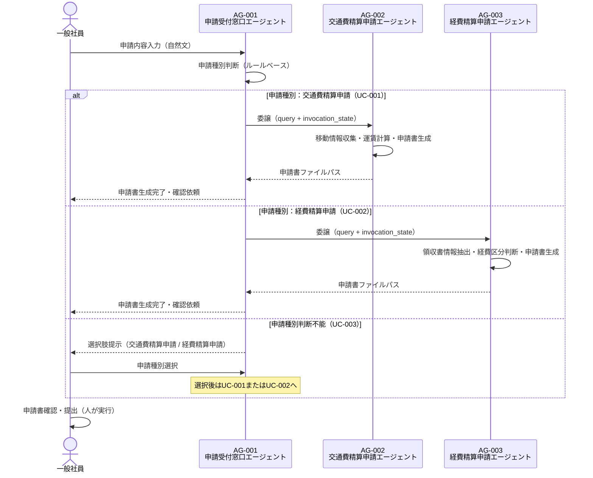

# マルチエージェント連携設計書

> **参照元（システム要件定義資料）:**
> - エージェント一覧.md（エージェント役割・責務・自律度の特定）
> - エージェント間連携定義.md（連携方式・連携ポリシー・連携フロー）
> - 会話フロー一覧.md（連携が発生する会話フロー・タイミング）
> - 機能要件一覧.md（連携が必要な機能の特定）
> - 自律度・権限定義.md（エージェントの権限境界・判断権限）
> - システム基本情報.md（エージェント構成・技術スタック）

> 文書ID：`SYS-MA-001`
> 文書名：マルチエージェント連携設計書
> 版数：`v1.0`
> 作成日：2026-05-21


---

## 1. 目的・適用範囲

### 1.1 目的

本設計書では、以下を定義します:
- エージェント間の委譲方式（Agent as Tools パターン）
- ルーティング方式（申請種別に基づくルールベースルーティング）
- 通信契約（エージェント間メッセージ・invocation_state）
- 協調パターン（司令塔型）

本設計書では、以下は定義しません（別紙参照）:
- 詳細な例外処理（例外処理方針参照）
- セッション保持（セッション管理方針参照）
- 権限設計（自律度・権限定義参照）

### 1.2 適用範囲

**対象システム**: 申請支援AIエージェントシステム

**対象エージェント**:
- AG-001: 申請受付窓口エージェント（オーケストレーター）
- AG-002: 交通費精算申請エージェント（専門エージェント）
- AG-003: 経費精算申請エージェント（専門エージェント）


---

## 2. 用語・前提

### 2.1 用語

| 用語 | 定義 |
|-----|------|
| オーケストレーション | AG-001が申請種別を判断し、適切な専門エージェントへタスクを委譲する制御方式 |
| ルーティング | 申請内容から申請種別を判断し、対応する専門エージェントへ処理を振り分けること |
| 委譲（Delegation） | AG-001が申請種別確定後に、専門エージェント（AG-002またはAG-003）へ処理を丸投げすること |
| エージェント間メッセージ | AG-001から専門エージェントへ渡すクエリ（自然文）とinvocation_state（コンテキスト情報）の組み合わせ |
| invocation_state | LLMのコンテキストウィンドウを消費せずにエージェント間で共有するコンテキスト情報（申請者名・申請日・セッションID） |
| セッションID | セッションデータを識別するための一意のID。FileSessionManagerがセッションデータの保存先ディレクトリ名として使用する |
| Agent as Tools | 専門エージェントを@tool(context=True)でラップし、オーケストレーターのツールとして呼び出すパターン |

### 2.2 前提・制約

**同期/非同期の前提**:
- 全エージェント間連携は同期（リクエスト/レスポンス）方式

**外部I/Fの制約**:
- Amazon Bedrockへのアクセスにはインターネット接続とAWS認証情報が必要

**運用・監査上の制約**:
- 申請書の提出（申請の実行）はAIが行わず、必ず人が実行する（BRL-06）
- 循環呼び出し禁止、最大委譲深度：1（AG-001 → AG-002 または AG-003）

---

## 3. 連携アーキテクチャ（協調パターン）

### 3.1 採用する協調パターン

採用パターン：**司令塔（Supervisor/Orchestrator）型**

AG-001が司令塔として機能し、申請種別を判断して専門エージェント（AG-002またはAG-003）へ委譲する。専門エージェントはAG-001のツールとして実装される（Agent as Tools）。

### 3.2 採用理由・非採用理由

**採用理由**:
- 申請種別（交通費精算申請・経費精算申請）が明確に分離されており、司令塔による振り分けが適切
- Agent as Toolsパターンにより、AWS Strands SDKの標準機能で実装可能
- 申請種別の追加時に新規専門エージェントを追加するだけで拡張可能

**非採用理由**:
- ピア（Peer-to-Peer）型：エージェント間の直接通信が発生し、循環呼び出しのリスクがある
- 並列協調型：申請種別は排他的（交通費精算申請または経費精算申請のいずれか）であり、並列処理は不要

### 3.3 連携の基本原則（設計ルール）

**単一責任**:
- AG-001は申請種別判断・ルーティング・申請ルール案内のみを担当する
- AG-002は交通費精算申請の情報収集・申請書生成のみを担当する
- AG-003は経費精算申請の情報収集・申請書生成のみを担当する

**委譲の粒度**:
- 委譲単位はタスク（申請種別確定後に専門エージェントへ一括委譲）
- 申請種別確定前の処理（申請種別判断・申請ルール案内）はAG-001が担当する

**"判断"と"実行"の分離**:
- AG-001は申請種別の判断・提案のみを行い、実行（申請書生成）は専門エージェントに委譲する
- 申請書の提出（実行）は人が行う（自律度Lv0）

**冪等性・再実行可能性**:
- 申請書生成ツール（TOOL-002）は同一入力に対して同一の申請書を生成する
- セッションIDによりセッションデータを識別し、再開時に前回の状態から継続できる

---

## 4. エージェント連携構成

### 4.1 エージェント一覧（連携観点）

| AG-ID | エージェント名 | エージェントID（コード） | 役割（連携観点） | 入力 | 出力 | 依存先 |
|-------|--------------|----------------------|----------------|------|------|-------|
| AG-001 | 申請受付窓口エージェント | orchestrator_agent | 司令塔。申請種別判断・ルーティング・申請ルール案内 | ユーザー自然文、invocation_state | 申請種別・申請先の提示、専門エージェントへの委譲結果 | AG-002（ツール）、AG-003（ツール） |
| AG-002 | 交通費精算申請エージェント | transportation_expense_agent | 専門エージェント。交通費情報収集・運賃計算・申請書生成 | クエリ（自然文）、invocation_state | 交通費精算申請書ファイルパス | TOOL-001、TOOL-002 |
| AG-003 | 経費精算申請エージェント | general_expense_agent | 専門エージェント。領収書情報抽出・経費区分判断・申請書生成 | クエリ（自然文）、invocation_state | 経費精算申請書ファイルパス | TOOL-002 |


### 4.2 役割分類と責務

**司令塔（Orchestrator）**:
- **責務**: ユーザーの申請内容を受け付け、申請種別（交通費精算申請・経費精算申請）を判断して専門エージェントへ委譲する。申請ルール案内も担当する
- **権限境界**: 申請種別判断（提案）のみ。申請書生成・提出は行わない（最大自律度Lv2）

**専門エージェント**:
- **責務**: 委譲された申請種別に応じた情報収集・申請書生成を担当する。申請期限チェック・上長承認要否判断・業務目的確認も専門エージェントの責務
- **依頼受付条件**: AG-001から申請種別が確定した状態でクエリが渡された場合のみ処理を開始する


---

## 5. ルーティング設計（どのエージェントへ回すか）

### 5.1 ルーティング方式

採用方式：**ルールベース（判断基準表）**

申請内容のキーワード・文脈からLLMが申請種別を判断し、判断基準表に従って専門エージェントへルーティングする。判断不能時はユーザーに選択肢を提示して確認する。

### 5.2 ルーティング判断基準表

| 条件（入力/状態） | ルーティング先 | 例 | 備考 |
|----------------|--------------|---|------|
| 申請内容に交通費・移動・電車・バス・タクシー・飛行機等のキーワードが含まれる | AG-002（交通費精算申請エージェント） | 「先週の出張の交通費を申請したい」 | LNK-001 |
| 申請内容に経費・領収書・購入・宿泊・資格等のキーワードが含まれる | AG-003（経費精算申請エージェント） | 「先月購入した文具の経費を申請したい」 | LNK-002 |
| 申請種別が判断できない | ユーザーへ選択肢提示（交通費精算申請 / 経費精算申請） | 「申請したい」のみ | COND-001 |
| ユーザーが選択肢から交通費精算申請を選択 | AG-002（交通費精算申請エージェント） | — | LNK-001 |
| ユーザーが選択肢から経費精算申請を選択 | AG-003（経費精算申請エージェント） | — | LNK-002 |


### 5.3 フォールバック方針

**判断不能時の扱い**:
- 申請種別が判断できない場合、ユーザーに「交通費精算申請」「経費精算申請」の選択肢を提示して確認する（COND-001）

**低信頼時の扱い**:
- LLMが申請種別を判断した場合でも、ユーザーに確認を促すことができる（申請種別の最終選択は人）

---

## 6. 委譲・協調設計（いつ・どう委譲するか）

### 6.1 タスク分割ルール

**分割単位**: 申請種別単位（交通費精算申請または経費精算申請）

**分割の上限**:
- 並列数: 1（申請種別は排他的。同時に複数の専門エージェントへ委譲しない）
- 深さ: 1（AG-001 → AG-002 または AG-003。それ以上の委譲は行わない）

**依頼テンプレ（エージェント間メッセージ）**:
```
AgentMessage(
  query: 申請内容・ユーザーへの質問（自然文）,
  invocation_state: {
    申請者名,
    申請日,
    セッションID
  }
)
```
> ※ エージェント間メッセージで渡す業務コンテキストは上記項目のみとする
> ※ 上記以外の情報はエージェント間メッセージに含めない
> ※ invocation_stateはLLMのコンテキストウィンドウを消費しない（ツール関数内でのみ参照可能）
> ※ invocation_stateは辞書リテラルで渡す。専用のPydanticモデルは定義しない
> ※ session_idはツール関数の引数に含めない


### 6.2 委譲条件（Delegation Policy）

| 条件 | 委譲先候補 | 優先順位 | 禁止条件 |
|-----|----------|---------|---------|
| 申請種別が交通費精算申請として確定 | AG-002 | 1 | 申請種別未確定時の委譲禁止 |
| 申請種別が経費精算申請として確定 | AG-003 | 1 | 申請種別未確定時の委譲禁止 |
| 申請種別が判断不能 | ユーザーへ確認 | — | 判断不能時の自動委譲禁止 |

### 6.3 並列・逐次の決定ルール

**並列可能条件**: なし（申請種別は排他的）

**逐次必須条件**: 申請種別確定後に専門エージェントへ委譲する（逐次処理）

**排他対象**:
- AG-002とAG-003の同時呼び出し禁止
- 申請書の提出（ACT-EXEC-01）はAIによる実行禁止

---

## 7. エージェント間通信設計（契約）

### 7.1 メッセージ種別

| 種別 | 目的 | 必須フィールド |
|-----|------|--------------|
| エージェント間メッセージ | AG-001から専門エージェントへのタスク委譲 | クエリ（自然文）、invocation_state（申請者名・申請日・セッションID） |


### 7.2 エージェント間メッセージスキーマ

**オーケストレーター（AG-001）→ 専門エージェント（AG-002/AG-003）**:
```
{
  query: 申請内容・ユーザーへの質問（自然文）,
  invocation_state: {
    user_name: 申請者名,
    request_date: 申請日（YYYY-MM-DD形式）,
    session_id: セッションID
  }
}
```

**専門エージェント（AG-002/AG-003）→ 子エージェント（ツール関数内）**:
```
{
  query: ツールへの指示（自然文）,
  invocation_state: {
    user_name: 申請者名,
    request_date: 申請日（YYYY-MM-DD形式）
  }
}
```
> ※ 子エージェントへはsession_idを除いた必要フィールドのみ渡す（session_idはファクトリ関数で消費済み）
> ※ invocation_stateは辞書リテラルで渡す。専用のPydanticモデルは定義しない
> ※ session_idはツール関数の引数に含めない
> ※ 具体的な型・バリデーション制約はデータモデル基本設計書で定義する（本設計書はフィールド構成のみ確定する）


### 7.3 共有コンテキスト設計（連携観点）

**共有する情報**:
- 申請者名（user_name）：申請書への記載・ログのマスキング対象
- 申請日（request_date）：申請期限チェックの基準日
- セッションID（session_id）：FileSessionManagerのセッション識別子

**申請者情報の取得タイミング**:
- 申請者名（user_name）：アプリケーション起動時（対話ループ開始前）に取得し、エージェントの初期化パラメータとして渡す
- 申請日（request_date）：ユーザーとの対話で収集するのではなく、システム日付（実行時の日付、YYYY-MM-DD形式）を自動取得する

**共有しない情報**:
- 収集済み申請情報（移動情報・経費情報）：専門エージェントが独自に収集・管理する
- 申請書ファイルパス：専門エージェントが生成・管理する

**参照方法**:
- invocation_stateは@tool(context=True)のツール関数内でtool_context.invocation_stateとして参照する

**更新ルール**:
- invocation_stateはリクエスト単位で有効（セッションをまたがない）
- 申請者名・申請日はオーケストレーターが設定し、専門エージェントは読み取り専用で参照する


---

## 8. 状態引き継ぎ（連携観点）

### 8.1 必須の状態情報（連携に必要）

| 状態キー | 用途 | 更新主体 | 保存期間 |
|---------|------|---------|---------|
| user_name | 申請書への記載・ログのマスキング対象 | AG-001（設定）、AG-002/AG-003（参照） | セッション期間中 |
| request_date | 申請期限チェックの基準日 | AG-001（設定）、AG-002/AG-003（参照） | セッション期間中 |
| session_id | FileSessionManagerのセッション識別子 | AG-001（設定）、AG-002/AG-003（ファクトリ関数で消費） | セッション期間中 |


### 8.2 再開（Resume）設計

**中断からの再開条件**:
- セッションIDが存在する場合、FileSessionManagerが前回の会話履歴を復元する

**再開時の優先順位**:
- 前回の会話履歴を復元し、中断した申請フローから継続する

---

## 9. 連携フロー定義（ユースケース別）

### 9.1 ユースケース一覧

| UC-ID | 名称 | 主担当（起点） | 参加エージェント | 備考 |
|-------|-----|--------------|----------------|------|
| UC-001 | 交通費精算申請 | AG-001 | AG-001, AG-002 | LNK-001 |
| UC-002 | 経費精算申請 | AG-001 | AG-001, AG-003 | LNK-002 |
| UC-003 | 申請種別判断不能時 | AG-001 | AG-001 | COND-001 |

### 9.2 連携フロー（Mermaid）



### 9.3 連携フロー（例外系の分岐ポイント）

**失敗しうるステップ**:
1. AG-001の申請種別判断（LLM推論失敗・Amazon Bedrock接続エラー）
2. AG-002/AG-003への委譲（LoopLimitError・Exception）
3. TOOL-001の交通費計算（経路データ未発見）
4. TOOL-002の申請書生成（テンプレートファイル未発見・必須情報不足）

**失敗時の戻り先**:
- 再試行: ModelRetryStrategy（最大6回、指数バックオフ）によりAmazon Bedrock接続エラーを自動リトライ
- 再ルーティング: なし（失敗時はエラーメッセージをユーザーに提示）
- エスカレーション: エラー発生時は申請管理部門への問い合わせを案内する

---

## 10. 依存関係・循環防止ルール

### 10.1 依存関係（DAG）

| From | To | 目的 | 循環禁止ルール |
|------|---|------|--------------|
| AG-001 | AG-002 | 交通費精算申請の委譲 | AG-002からAG-001への呼び出し禁止 |
| AG-001 | AG-003 | 経費精算申請の委譲 | AG-003からAG-001への呼び出し禁止 |
| AG-002 | TOOL-001 | 交通費計算 | TOOL-001からエージェントへの呼び出し禁止 |
| AG-002, AG-003 | TOOL-002 | 申請書生成 | TOOL-002からエージェントへの呼び出し禁止 |

### 10.2 循環防止・暴走防止

**最大委譲深さ**: 1（AG-001 → AG-002 または AG-003）

**最大ループ回数**: 10回（LoopControlHookにより制御）

**タスク再発行のクールダウン**: 要件上未定義

**監視指標**:
- LoopControlHookによるReActループ回数の監視
- ModelRetryStrategyによるリトライ回数の監視


---

## 11. インタフェース境界（他成果物との切り分け）

### 11.1 本設計書の責務

- エージェント間の委譲方式（Agent as Tools）の定義
- ルーティング判断基準表の定義
- エージェント間メッセージ（invocation_state）のフィールド構成の定義
- 協調パターン（司令塔型）の定義

### 11.2 他成果物へ委譲する責務（参照）

- 実行制御（再試行、タイムアウト等）: 実行制御方針
- セッション管理: セッション管理方針
- 例外処理: 例外処理方針
- エスカレーション: 例外処理方針
- 権限／承認: 自律度・権限定義
- ガードレール: ガードレール処理方式設計
- ログ: ログ出力方式設計

---

## 12. 設計上の決定事項（Decision Log）

| ID | 決定事項 | 理由 | 影響範囲 | 代替案 |
|----|---------|------|---------|-------|
| DEC-001 | Agent as Toolsパターンを採用 | AWS Strands SDKの標準機能で実装可能。申請種別追加時の拡張が容易 | AG-001, AG-002, AG-003 | 独立エージェント間のメッセージパッシング |
| DEC-002 | invocation_stateで申請者名・申請日・セッションIDを伝播 | LLMのコンテキストウィンドウを消費せずにコンテキスト情報を共有できる | AG-001, AG-002, AG-003 | システムプロンプトへの埋め込み |
| DEC-003 | 最大委譲深さを1に制限 | 循環呼び出しのリスクを排除し、デバッグを容易にする | AG-001, AG-002, AG-003 | 多段委譲 |

---

## 13. 未決事項・リスク

| ID | 未決事項/リスク | 影響 | 対応案 | 期限 |
|----|---------------|------|-------|------|
| RISK-001 | Amazon Bedrockのタイムアウト値が未定義 | 長時間処理時のユーザー体験に影響 | ModelRetryStrategyのmax_delayで上限を設定（240秒） | 基本設計フェーズ |

---

## 14. 変更履歴

| 日付 | 版 | 変更内容 | 変更者 |
|-----|---|---------|-------|
| 2026-05-21 | v1.0 | 初版作成 | - |

---
