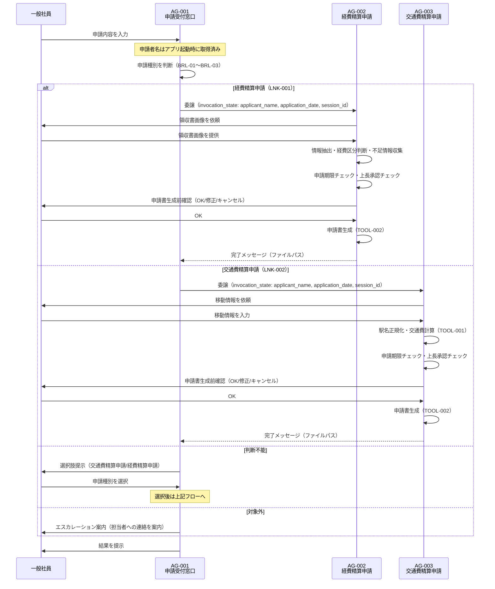

# マルチエージェント連携設計書

> **参照元（システム要件定義資料）:**
> - エージェント一覧.md（エージェント役割・責務・自律度の特定）
> - エージェント間連携定義.md（連携方式・連携ポリシー・連携フロー）
> - 会話フロー一覧.md（連携が発生する会話フロー・タイミング）
> - 機能要件一覧.md（連携が必要な機能の特定）
> - 自律度・権限定義.md（エージェントの権限境界・判断権限）
> - システム基本情報.md（エージェント構成・技術スタック）

> 文書ID：`SYS-MA-001`
> 文書名：マルチエージェント連携設計書
> 版数：`v1.0`
> 作成日：2026-05-17


---

## 1. 目的・適用範囲

### 1.1 目的

本設計書では、以下を定義します:
- エージェント間の委譲方式（Agent as Tools パターン）
- ルーティング方式（申請種別に基づく振り分けロジック）
- 通信契約（invocation_state によるエージェント間メッセージ）
- 協調パターン（階層型マルチエージェント）

本設計書では、以下は定義しません（別紙参照）:
- 詳細な例外処理（例外処理方針参照）
- セッション保持（セッション管理方針参照）
- 権限設計（自律度・権限定義参照）

### 1.2 適用範囲

**対象システム**: 経費・交通費精算申請支援システム

**対象エージェント**:
- AG-001: 申請受付窓口エージェント（オーケストレーター）
- AG-002: 経費精算申請エージェント（専門エージェント）
- AG-003: 交通費精算申請エージェント（専門エージェント）


---

## 2. 用語・前提

### 2.1 用語

| 用語 | 定義 |
|-----|------|
| オーケストレーション | AG-001 が申請種別を判断し、適切な専門エージェントへ処理を委譲する制御方式 |
| ルーティング | 申請内容に基づいて AG-002 または AG-003 のいずれかへ処理を振り分けること |
| 委譲（Delegation） | AG-001 が専門エージェントをツールとして呼び出し、申請書作成タスクを引き渡すこと |
| エージェント間メッセージ | AG-001 から専門エージェントへ渡す共有コンテキスト（申請者名・申請日・セッションID） |
| セッションID | 1回の申請処理を一意に識別するID。FileSessionManager によるセッション永続化に使用する |
| invocation_state | Strands SDK の ToolContext 経由でツール関数内からアクセスできる辞書。LLM のコンテキストウィンドウを消費しない。辞書リテラルで渡す（専用の Pydantic モデルは定義しない） |
| Agent as Tools | 専門エージェントを @tool デコレータでラップし、オーケストレーターのツールとして登録するパターン |

### 2.2 前提・制約

**同期/非同期の前提**:
- 全エージェント間連携は同期（リクエスト/レスポンス）方式

**外部I/Fの制約**:
- 外部システム連携なし（Amazon Bedrock は LLM 推論基盤として利用）

**運用・監査上の制約**:
- 循環呼び出し禁止
- 最大委譲深度：1（AG-001 → AG-002 または AG-003）

---

## 3. 連携アーキテクチャ（協調パターン）

### 3.1 採用する協調パターン

採用パターン：**階層型マルチエージェント（Supervisor/Orchestrator 型）**

実装方式：**Agent as Tools**（Strands SDK 標準パターン）

### 3.2 採用理由・非採用理由

**採用理由**:
- 申請種別（経費精算/交通費精算）が明確に分離されており、専門エージェントへの委譲が自然に対応する
- Strands SDK の Agent as Tools パターンにより、専門エージェントを @tool でラップするだけで実装できる
- オーケストレーターが申請種別判断に集中し、専門エージェントが業務処理に集中できる単一責任の分離が実現できる
- invocation_state により申請者名・申請日・セッションID を LLM コンテキスト非消費で安全に受け渡せる

**非採用理由（ピア型）**:
- 申請種別判断という明確な振り分けロジックが存在するため、ピア型の対等な協調は不要

### 3.3 連携の基本原則（設計ルール）

**単一責任**:
- AG-001 は申請種別判断と振り分けのみを担当し、申請書作成処理は行わない
- AG-002 は経費精算申請書作成のみを担当する
- AG-003 は交通費精算申請書作成のみを担当する

**委譲の粒度**:
- 委譲単位は「申請書作成タスク全体」とする（ステップ単位の細粒度委譲は行わない）
- 1回の申請処理で委譲先は1エージェントのみ（AG-002 または AG-003 の排他選択）

**"判断"と"実行"の分離**:
- 申請種別の判断（AG-001）と申請書作成の実行（AG-002/AG-003）を分離する
- 申請書生成前の承認判断（Human-in-the-Loop）は専門エージェント側で実施する

**冪等性・再実行可能性**:
- セッションIDによりセッションを一意に管理し、再開（Resume）に対応する
- 申請書生成は承認後に1回のみ実行する（重複生成防止）

---

## 4. エージェント連携構成

### 4.1 エージェント一覧（連携観点）

| AG-ID | エージェント名 | 役割（連携観点） | 入力 | 出力 | 依存先 |
|-------|--------------|----------------|------|------|-------|
| AG-001 | 申請受付窓口エージェント | 申請種別判断・専門エージェントへの委譲（オーケストレーター） | 申請者名、申請内容テキスト | 申請種別判断結果、委譲先エージェントの実行結果 | AG-002（ツール）, AG-003（ツール）, knowledge/ |
| AG-002 | 経費精算申請エージェント | 経費精算申請書作成（専門エージェント） | invocation_state（applicant_name・application_date・session_id）、領収書画像、社員回答 | 経費精算申請書ファイル（または完了メッセージ） | TOOL-002, knowledge/ |
| AG-003 | 交通費精算申請エージェント | 交通費精算申請書作成（専門エージェント） | invocation_state（applicant_name・application_date・session_id）、社員回答 | 交通費精算申請書ファイル（または完了メッセージ） | TOOL-001, TOOL-002, knowledge/ |


### 4.2 役割分類と責務

**司令塔（Orchestrator）: AG-001**:
- **責務**: 申請内容受付、申請種別判断（BRL-01〜BRL-03）、専門エージェントへの委譲、エスカレーション案内
- **権限境界**: 申請書作成処理は行わない。申請種別判断と振り分けのみ
- **備考**: 申請者名はアプリケーション起動時（対話ループ開始前）にmain.pyで取得し、AG-001の初期化パラメータとして渡される

**専門エージェント: AG-002, AG-003**:
- **責務**: 申請書作成に必要な情報収集、業務ルール適用（期限チェック・承認チェック）、申請書生成
- **依頼受付条件**: AG-001 から invocation_state 経由で申請者名（applicant_name）・申請日（application_date）・セッションID（session_id）を受け取った場合のみ実行


---

## 5. ルーティング設計（どのエージェントへ回すか）

### 5.1 ルーティング方式

採用方式：**LLM ベースの意図分類（ルールベース補完）**

AG-001 が申請内容テキストと申請ルール（ナレッジ）を参照し、LLM の推論により申請種別を判断する。判断不能時はユーザーに選択肢を提示する。

### 5.2 ルーティング判断基準表

| 条件（入力/状態） | ルーティング先 | 例 | 備考 |
|----------------|--------------|---|------|
| 申請内容が交通費精算申請に該当（BRL-01） | AG-003 | 「先日の出張の交通費を精算したい」 | LNK-002 |
| 申請内容が経費精算申請に該当（BRL-02） | AG-002 | 「領収書があるので経費精算したい」 | LNK-001 |
| 申請内容が両方に該当する可能性がある（BRL-03） | ユーザー選択後に AG-002 または AG-003 | 「精算したい」のみ | 選択肢提示（CF-001 Step 7） |
| 申請内容が対象外（BRL-05, JD-04） | エスカレーション案内（委譲なし） | 「有給申請したい」 | CF-001 Step 9 |


### 5.3 フォールバック方針

**判断不能時の扱い**:
- 「交通費精算申請」「経費精算申請」の2択をユーザーに提示し、ユーザーの選択を最終判断とする（CF-001 Step 7〜8）

**低信頼時の扱い**:
- LLM の判断信頼度が低い場合も同様に選択肢提示を行う（BRL-03 適用）

---

## 6. 委譲・協調設計（いつ・どう委譲するか）

### 6.1 タスク分割ルール

**分割単位**: 申請書作成タスク全体（1申請 = 1委譲）

**分割の上限**:
- 並列数: 1（同時に1エージェントのみ委譲）
- 深さ: 1（AG-001 → AG-002 または AG-003 の1段階のみ）

**依頼テンプレ（エージェント間メッセージ）**:
```
AgentMessage(
  申請者名（applicant_name）,
  申請日（application_date）,
  セッションID（session_id）
)
```
> ※ エージェント間メッセージで渡す業務コンテキストは上記3項目のみとする
> ※ 上記以外の情報（申請内容テキスト等）はエージェント間メッセージに含めない
> ※ invocation_state は辞書リテラルで渡す。専用の Pydantic モデルは定義しない
> ※ 具体的なフィールド名・型・バリデーション制約はデータモデル基本設計書で定義する


### 6.2 委譲条件（Delegation Policy）

| 条件 | 委譲先候補 | 優先順位 | 禁止条件 |
|-----|----------|---------|---------|
| 申請種別が「経費精算申請」として確定 | AG-002 | 1 | AG-003 への同時委譲禁止 |
| 申請種別が「交通費精算申請」として確定 | AG-003 | 1 | AG-002 への同時委譲禁止 |
| 申請種別が未確定 | なし（ユーザー選択待ち） | — | 委譲不可 |
| 申請内容が対象外 | なし（エスカレーション案内） | — | 委譲不可 |

### 6.3 並列・逐次の決定ルール

**並列可能条件**: なし（本システムでは並列委譲は行わない）

**逐次必須条件**: 申請種別確定後に1エージェントへ逐次委譲する

**排他対象**:
- AG-002 と AG-003 への同時委譲は禁止
- 1セッション内で複数の申請書作成タスクの同時実行は禁止

---

## 7. エージェント間通信設計（契約）

### 7.1 メッセージ種別

| 種別 | 目的 | 必須フィールド |
|-----|------|--------------|
| invocation_state | オーケストレーターから専門エージェントへの共有コンテキスト渡し | applicant_name（申請者名）、application_date（申請日）、session_id（セッションID） |


### 7.2 エージェント間メッセージスキーマ

**オーケストレーター（AG-001）→ 専門エージェント（AG-002/AG-003）**:
```
{
  申請者名（applicant_name）,
  申請日（application_date）,
  セッションID（session_id）
}
```

**専門エージェント（AG-002/AG-003）→ 子エージェント（ツール関数内）**:
```
{
  申請者名（applicant_name）,
  申請日（application_date）
  ※ セッションIDはファクトリ関数で消費済みのため除外
}
```
> ※ invocation_state は辞書リテラルで渡す。専用の Pydantic モデルは定義しない
> ※ 具体的な型・バリデーション制約はデータモデル基本設計書で定義する（本設計書はフィールド構成のみ確定する）


### 7.3 共有コンテキスト設計（連携観点）

**共有する情報**:
- 申請者名（applicant_name）：申請書への記載・セッション管理に使用
- 申請日（application_date）：申請書への記載・期限チェックに使用
- セッションID（session_id）：FileSessionManager によるセッション永続化に使用

**申請者情報の取得タイミング**:
- 申請者名はアプリケーション起動時（対話ループ開始前）に取得し、エージェントの初期化パラメータとして渡す
- 申請日はユーザーとの対話で収集するのではなく、システム日付（実行時の日付、YYYY-MM-DD形式）を自動取得する

**共有しない情報**:
- 申請内容テキスト（LLM の推論結果であり、専門エージェントには不要）
- 申請種別判断結果（専門エージェントは自身の役割を知っているため不要）
- 経費明細・移動情報（専門エージェントが対話収集するため不要）

**参照方法**:
- @tool(context=True) でデコレートしたツール関数内で tool_context.invocation_state から辞書として取得する

**更新ルール**:
- invocation_state はリクエスト単位で有効（セッションをまたがない）
- 専門エージェントは受け取った invocation_state を読み取り専用で使用する

**注意事項**:
- `session_id` はオーケストレーターから専門エージェントへの受け渡しには含めるが、専門エージェント内部では、セッションマネージャーの初期化に直接使用し、エージェントへの invocation_state には含めない
- `session_id` はツール関数の引数に含めない


---

## 8. 状態引き継ぎ（連携観点）

### 8.1 必須の状態情報（連携に必要）

| 状態キー | 用途 | 更新主体 | 保存期間 |
|---------|------|---------|---------|
| applicant_name | 申請書への申請者名記載、セッション識別 | AG-001（初期設定） | セッション内 |
| application_date | 申請書への申請日記載、申請期限チェック | AG-001（初期設定） | セッション内 |
| session_id | FileSessionManager によるセッション永続化・復元 | AG-001（生成）、各エージェント（参照） | セッション内 |


### 8.2 再開（Resume）設計

**中断からの再開条件**:
- セッションIDが存在し、FileSessionManager にセッションデータが保存されている場合

**再開時の優先順位**:
- 既存セッションが存在する場合は会話履歴を復元して継続する
- セッションが存在しない場合は新規セッションを開始する

---

## 9. 連携フロー定義（ユースケース別）

### 9.1 ユースケース一覧

| UC-ID | 名称 | 主担当（起点） | 参加エージェント | 備考 |
|-------|-----|--------------|----------------|------|
| UC-01 | 申請種別判断・案内 | AG-001 | AG-001 | CF-001 |
| UC-02 | 経費精算申請書作成 | AG-001 → AG-002 | AG-001, AG-002 | CF-001 → CF-002 |
| UC-03 | 交通費精算申請書作成 | AG-001 → AG-003 | AG-001, AG-003 | CF-001 → CF-003 |
| UC-04 | 申請種別選択肢提示 | AG-001 | AG-001 | CF-001 分岐 |
| UC-05 | 対象外申請エスカレーション | AG-001 | AG-001 | CF-001 分岐 |

### 9.2 連携フロー（Mermaid）



### 9.3 連携フロー（例外系の分岐ポイント）

**失敗しうるステップ**:
1. AG-001 → AG-002/AG-003 への委譲時（invocation_state の受け渡し失敗）
2. AG-002 での領収書画像読み取り失敗
3. AG-003 での運賃データ検索失敗（経路不存在）
4. AG-002/AG-003 での申請書生成失敗（TOOL-002 エラー）
5. AG-002/AG-003 での申請期限超過検出

**失敗時の戻り先**:
- 再試行: LoopControlHook による ReAct ループ内での自動再試行（最大10回）
- 再ルーティング: なし（委譲先の変更は行わない）
- エスカレーション: エラーメッセージを表示し、担当者への連絡を案内して業務終了

---

## 10. 依存関係・循環防止ルール

### 10.1 依存関係（DAG）

| From | To | 目的 | 循環禁止ルール |
|------|---|------|--------------|
| AG-001 | AG-002 | 経費精算申請書作成の委譲（LNK-001） | AG-002 から AG-001 への呼び出し禁止 |
| AG-001 | AG-003 | 交通費精算申請書作成の委譲（LNK-002） | AG-003 から AG-001 への呼び出し禁止 |
| AG-002 | TOOL-002 | 申請書生成ツール呼び出し | — |
| AG-003 | TOOL-001 | 交通費計算ツール呼び出し | — |
| AG-003 | TOOL-002 | 申請書生成ツール呼び出し | — |

### 10.2 循環防止・暴走防止

**最大委譲深さ**: 1（AG-001 → AG-002/AG-003 の1段階のみ）

**最大ループ回数**: 10回（ReAct ループ上限、LoopControlHook で制御）

**タスク再発行のクールダウン**: なし（同一セッション内での再委譲は禁止）

**監視指標**:
- LoopControlHook によるループ回数カウント
- エラーログへの委譲失敗記録


---

## 11. インタフェース境界（他成果物との切り分け）

### 11.1 本設計書の責務

- エージェント間の委譲方式（Agent as Tools）の定義
- ルーティング判断基準の定義
- invocation_state によるエージェント間メッセージの構成定義
- 連携フロー（正常系・例外系）の定義
- 循環防止・暴走防止ルールの定義

### 11.2 他成果物へ委譲する責務（参照）

- 実行制御（再試行、タイムアウト等）: 実行制御方針
- セッション管理: セッション管理方針
- 例外処理: 例外処理方針
- エスカレーション: 例外処理方針
- 権限／承認: 自律度・権限定義
- ガードレール: ガードレール処理方式設計
- ログ: ログ出力方式設計

---

## 12. 設計上の決定事項（Decision Log）

| ID | 決定事項 | 理由 | 影響範囲 | 代替案 |
|----|---------|------|---------|-------|
| DEC-001 | Agent as Tools パターンを採用 | Strands SDK 標準パターンであり、専門エージェントを @tool でラップするだけで実装できる | エージェント実装全体 | ピア型（採用せず：振り分けロジックが明確なため不要） |
| DEC-002 | invocation_state で申請者名・申請日・セッションIDのみを辞書リテラルで渡す | LLM コンテキスト非消費で安全に受け渡せる。申請内容テキストは専門エージェントには不要。専用Pydanticモデルは不要 | エージェント間通信 | システムプロンプトへの埋め込み（採用せず：コンテキスト消費が増加するため） |
| DEC-003 | 委譲深度を1に制限 | 本システムの業務要件上、2段階以上の委譲は不要。循環防止のため明示的に制限 | 連携アーキテクチャ | 多段委譲（採用せず：業務要件上不要） |

---

## 13. 未決事項・リスク

| ID | 未決事項/リスク | 影響 | 対応案 | 期限 |
|----|---------------|------|-------|------|
| RISK-001 | タイムアウト値が要件上未定義 | 長時間処理時の挙動が不明 | 基本設計フェーズで設定値を決定する | 基本設計フェーズ |

---

## 14. 変更履歴

| 日付 | 版 | 変更内容 | 変更者 |
|-----|---|---------|-------|
| 2026-05-17 | v1.0 | 初版作成 | - |

---
